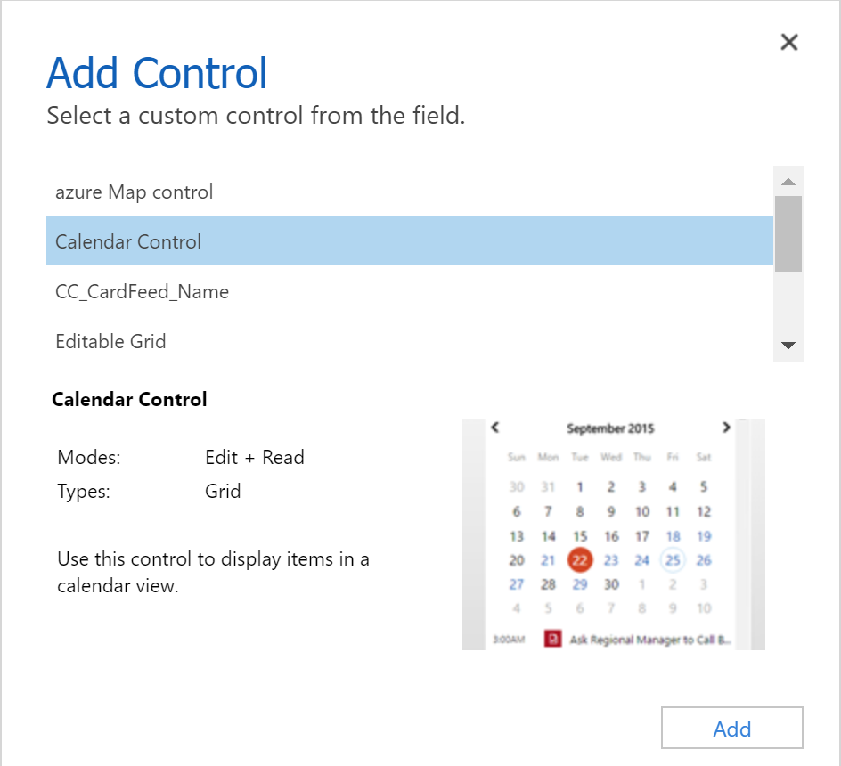

# Code components for model-driven apps

Power Apps component framework gives developers the ability to extend the visualizations in model-driven apps. Professional developers can create, debug, import, and add code components to model-driven apps using [Microsoft Power Platform CLI](get-powerapps-cli.md). You can add code components to columns, grids, and sub grids in model-driven apps. 

> [!IMPORTANT]
> Power Apps component framework is enabled for model-driven apps by default. See [Code components for canvas apps](component-framework-for-canvas-apps.md) to learn how to enable Power Apps component framework for canvas apps.

## Implementing code components

Before you start creating code components, make sure that you have installed all the prerequisites that are required to develop components using Power Apps component framework. 

The [create your first code component](implementing-controls-using-typescript.md) article demonstrates the step-by-step process to create code components.

## Add code components to model-driven apps

To add code components to a column or a table in model-driven apps, see [Add code components to model-driven apps](add-custom-controls-to-a-field-or-entity.md).

> [!div class="mx-imgBorder"] 
> 

> [!div class="mx-imgBorder"]
> 

## Update existing code components

Whenever you update the code components and want to see the changes in runtime, you need to bump the version property in the manifest file. It is recommended to always bump the version of the component whenever you make changes.

## See also

[Power Apps component framework overview](overview.md) 
[Create your first code component](implementing-controls-using-typescript.md) 
[Learn Power Apps component framework](/learn/paths/use-power-apps-component-framework)

[!INCLUDE[footer-include](../../includes/footer-banner.md)]