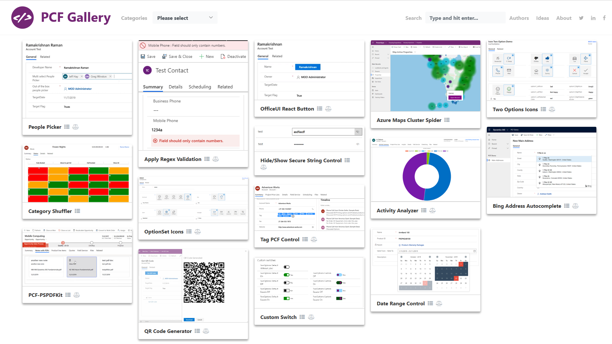
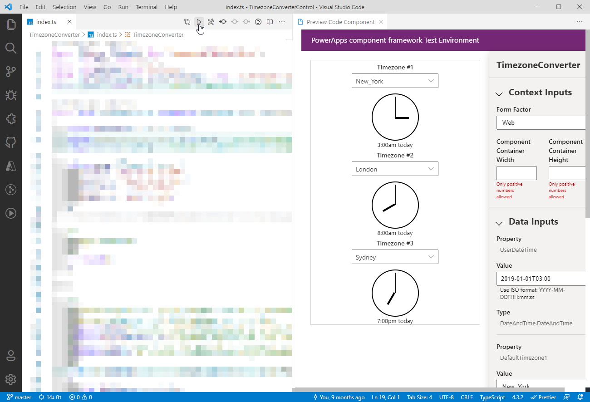

# Community resources for Power Apps component framework

The following is a list of some community resources created by the Power Apps community that you can use to create code components in model-driven and canvas apps using Power Apps component framework and Microsoft Power Platform CLI. 

> [!NOTE]            
> Resources created by the community are not supported by Microsoft. If you have questions or issues with community resources, contact the publisher of the resource. Before using these resources, you must ensure that these community resources meet the Power Apps component framework guidelines and should only be used for reference purpose. 

## Code components gallery

The Power Apps component framework gallery (<https://pcf.gallery/>) is a collection of code components created by the Power Apps community. It has a wide range of code components that may fit in for your business case. 

Make sure that you review the licensing terms and the source code before you download. See, [How to run the samples](use-sample-components.md) article on how to create a solution package and import into Microsoft Dataverse.

> [!WARNING]
> Code component run in the context of the end user who is using the component and can perform any action that may include accessing, capturing, and modifying the data. 

> [!div class="mx-imgBorder"]
> 

## Videos        

The following is the list of videos created by Power Apps community.

|Name|Description|
|------|-------|
|[Build your own code components](https://www.youtube.com/watch?v=S3Z_IUf1ncg)| Learn how to build code components in model-driven and canvas apps using the Power Apps component framework.| 
|[Code components for canvas apps](https://www.youtube.com/watch?v=bMSCkcb4xAQ&feature=emb_logo)| Learn how to develop and use code components in canvas apps.|
|[Develop code components](https://www.youtube.com/watch?v=FxWF-LCCB4g&feature=youtu.be)| This video shows the requirements for developing code components using Power Apps component framework and demonstrates a step-by-step approach for creating your first code component.|
|[Easier debugging with source maps and Fiddler](https://www.youtube.com/watch?v=Ov-m5FBUj9g&feature=youtu.be)|Learn how to debug minified production code using Fiddler and source maps.|
|[Getting started with code components](https://www.youtube.com/watch?v=ylhVZUlGgQw)| Introductory video on Power Apps component framework and basics of building code components.|
|[Power Apps component framework Academy: Getting started](https://www.youtube.com/watch?v=YJ9hrKxAhTU)| Introductory video on how to build your first code component.|
|[Power Apps component framework: Deep dive manifest file for dataset template](https://www.youtube.com/watch?v=TsTrYaOGaGo&feature=youtu.be)| Learn how to define a manifest file for dataset type code components.|
|[Power Apps component framework Academy: Deep dive manifest file for field template](https://www.youtube.com/watch?time_continue=522&v=w40zqSsYEy0)| Learn how to define a manifest file for field type code components.|
|[Power Apps component framework Academy: Dataset components](https://www.youtube.com/watch?v=OEiM97nTD0w)| Learn more detail about dataset components and how different methods of dataset API are used.|
|[Power Apps component framework Academy: Importing into your organization](https://www.youtube.com/watch?v=2uO2L2xTPkc)| Learn how to package and import code components into Dataverse.|
|[Power Apps component framework revolution](https://youtu.be/_SjEQ-7LK_Q)|Learn how component framework has enhanced the visualization in model-driven and canvas apps|
|[Power Apps component framework Academy: Using React and Office UI fabric](https://www.youtube.com/watch?v=e7JNgGlI3nE)| Learn how to use React and UI fabric in code components.|
|[Power Apps component framework Academy: Usage of additional frameworks](https://www.youtube.com/watch?v=cOPyyDdsEjQ)| Learn how to use additional frameworks in building code components.|
[Power Apps component framework Academy: Working with manifest file](https://www.youtube.com/watch?v=qbSpDVTxt7U&t=5s)| Introductory video on manifest file and various methods that need to be defined for developing code components in the manifest file.|
|[Power Apps component framework: What it is for Dynamics 365](https://youtu.be/3LnPaKtfKhw)|If you have ever lamented over the limitations of custom form components in Microsoft Dynamics 365, this tutorial will open your eyes to a whole new world of possibilities.|

## Blogs

The following is the list of blogs created by Power Apps community.

- [Add style to code component in Power Apps component framework](https://nishantrana.me/2019/06/06/how-to-add-style-to-custom-component-in-powerapps-component-framework/)
- [Beyond the Power Apps component framework](https://www.itaintboring.com/dynamics-crm/beyond-the-powerapps-component-framework)
- [Beyond the citizen developer: Why pros see promise in Microsoft's Power Apps component framework](https://msdynamicsworld.com/story/beyond-citizen-developer-why-pros-see-promise-microsofts-powerapps-component-framework)
- [Create code components](https://debajmecrm.com/2019/04/26/in-depth-end-end-walkthrough-develop-your-custom-controls-using-power-apps-component-framework-and-use-it-on-your-crm-interface/)
- [Dianamics PCF Lady (Multiple topics)](https://dianabirkelbach.wordpress.com/category/pcf/)
- [Editing the DOM with supported code components](https://www.magnetismsolutions.com/blog/adammurchison/2019/05/29/editing-the-dom-with-supported-dynamics-365-custom-controls)
- [How to configure Node.js and Typescript into your environment](https://capuanodanilo.com/2019/06/11/how-to-configure-node-js-and-typescript-into-your-environment-to-develop-powerapps-component-frameworks-pcf)
- [How to simulate desired events using bound properties](https://technomancy.com.au/2020/03/27/how-to-handle-events-and-reset-component-in-pcf/)
- [Localization of code components](https://dynamicsninja.blog/2020/01/21/pcf-localization)
- [Power Apps component framework – Frosting on the Cake](https://stevemordue.com/powerapps-component-framework-frosting-on-the-cake/)
- [Public availability of Power Apps component framework – An important milestone](https://crmindian.com/2019/04/24/public-availability-of-powerapps-component-framework-an-important-milestone-for-powerapps-and-d365/)
- [Work with code components using Power Apps component framework](https://powermaverick.dev/2019/05/18/create-custom-controls-using-powerapp-component-framework)
- [What happens when a web resource calls setVisible/setDisabled for that component](https://www.itaintboring.com/dynamics-crm/pcf-components-and-setvisible-setdisabled)
- [When do you call updateView method](https://dianabirkelbach.wordpress.com/2020/03/29/pcf-when-is-updateview-called)

## Tools

The [code component builder](https://www.xrmtoolbox.com/plugins/Maverick.PCF.Builder/) is a tool that enables you to build code components with ease where you do not need to write the CLI commands but still use the [Microsoft Power Platform CLI](/powerapps/developer/data-platform/powerapps-cli) under the hood. Most of the commands are consolidated, making it easier to build components. 

There are two versions of the code component builder. Both of them are called **PCF Builder** and are listed below:
1. [PCF Builder](https://www.xrmtoolbox.com/plugins/Maverick.PCF.Builder/) for XrmToolBox.
2. [PCF Builder](https://marketplace.visualstudio.com/items?itemName=danish-naglekar.pcf-builder) for Visual Studio Code.

[PCF Builder for XrmToolBox](https://www.xrmtoolbox.com/plugins/Maverick.PCF.Builder/) provides a graphical user interface that lets you create code components in visual manner using Microsoft Power Platform CLI.

> [!div class="mx-imgBorder"]
> 

[PCF Builder extension for Visual Studio Code](https://marketplace.visualstudio.com/items?itemName=danish-naglekar.pcf-builder) provides a guided experience that not only lets  you create code components but you can preview code component inside of Visual Studio Code.

> [!div class="mx-imgBorder"]
> 

[!INCLUDE[footer-include](../../includes/footer-banner.md)]
