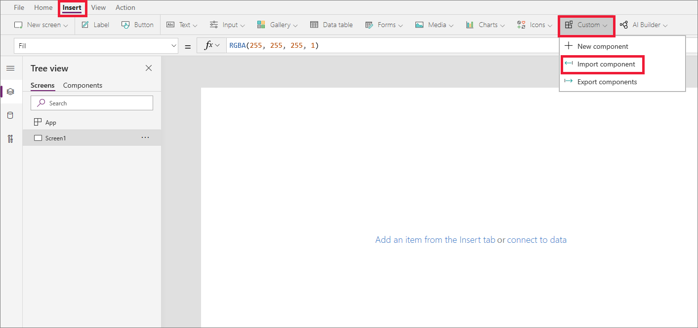
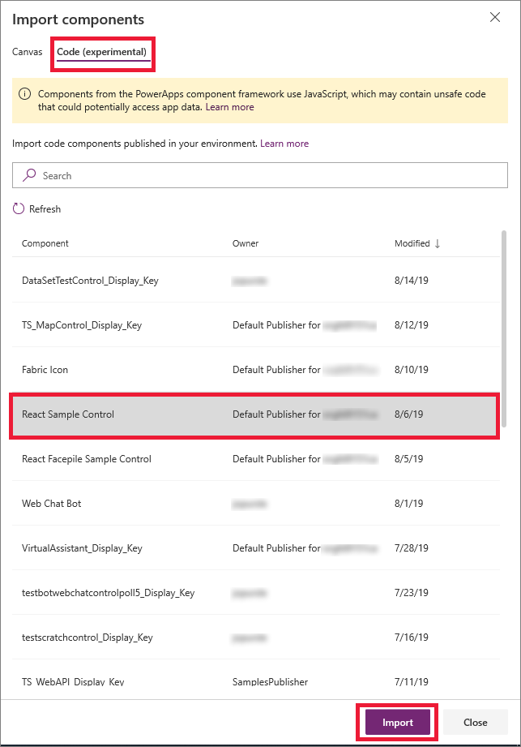

# PowerApps component framework for canvas apps

<!--[!IMPORTANT]
> This feature is still experimental and disabled by default. For more information, see [Experimental and preview features](../../maker/canvas-apps/working-with-experimental.md).-->

PowerApps component framework enables app makers to create code components to use in an app or across the apps. More information: [PowerApps component framework overview](overview.md) 

In this public preview, PowerApps component framework enables app makers to create code components, debug, import, and add them to canvas apps using the PowerApps CLI tooling. Only specific APIs are supported in this public preview. We recommend you to check each API to determine whether it supports canvas apps. 

> [!WARNING]
> Code components contain code that may not be generated by Microsoft and can potentially access security tokens and data. When adding code components to an app, make sure that the code component solutions are from a trusted source.

## Prerequisites

System Administrator privileges are required to enable the PowerApps component feature in the environment.

> [!IMPORTANT]
> By default, PowerApps component framework is enabled for model-driven apps.

## Enable PowerApps component framework feature

To add code components to an app, you need to enable the PowerApps component framework feature in each environment where you want to use them. To enable an environment to use code components inside its apps:

1. Sign in to [PowerApps](https://powerapps.microsoft.com/).

2. Select the **Settings** icon and then select **Admin Center**.
    
     

3. Select the **Environments** tab in the left pane and select the environment where you want to enable this feature, select the ellipsis (**...**), and then select **Settings**.

4. Under the **Products** tab, select **Features**.

   

5. From the list of available features, set the switch to **On** under **PowerApps component framework for canvas apps** and click **Save**.

6. Now, open the app where you want to add the code component and navigate to **File** > **Settings** and select **Advanced settings**.

   
   
7. Turn the **Components** switch to **On** under the **Experimental feature** section.

## Implementing code components

After you enable the PowerApps component framework feature in your environment, you can start implementing the logic for code components. The [implement sample component](implementing-controls-using-typescript.md) topic demonstrates the step-by-step process to create code components implementing the custom logic and manifest file, running the debugging process, creating a solution zip file, and importing the solution into Common Data Service.

> [!NOTE]
> Implementing code components is the same for both model-driven apps and canvas apps (public preview). The only difference is adding the code components. 

## Add components to a canvas app

> [!NOTE]
> To add code components to a field or an entity for model-driven apps, see [Add code components to model-driven apps](add-custom-controls-to-a-field-or-entity.md)

To add code components to a canvas app:

1. Navigate to PowerApps Studio.
2. Create a new canvas app or edit an existing app to which you want to add the code component.

   > [!IMPORTANT]
   > Make sure the solution zip file is already [imported](https://docs.microsoft.com/powerapps/maker/common-data-service/import-update-export-solutions) into Common Data Service before you proceed to the next step.

3. Go to **Insert** > **Custom** > **Import component**. 
 
    

4. Select the **Code (experimental)** tab, add a component from the list, and then select **Import**. This adds the sample component in the **Custom** menu.

    

5. Navigate to **Custom** and select the component to add it to the app.

   

## Delete a code component 

To delete a code component from a canvas app, select the code component that you want to delete and then select the **Delete** button on the menu. When the code component is deleted from the app, all the code component elements are deleted from the app and the app package. 

## Update existing code components

When you update the code components, we specify the *version* attribute in the manifest file, so the latest changes get reflected in the runtime. For canvas apps, when you update the existing code components, you don't need to update the *version* attribute. By design, the canvas apps pick up the latest code component and display it in runtime. Only a single version of the same component can exist in canvas apps.

> [!NOTE]
> Existing code components are updated only when the app is closed or reopened in PowerApps Studio. When you reopen the app, it asks you to update the code components. Simply deleting the code components or adding the code component back into the app doesn't update the components.

## See also

[PowerApps component framework overview](overview.md) 
[Implement sample component](implementing-controls-using-typescript.md)

