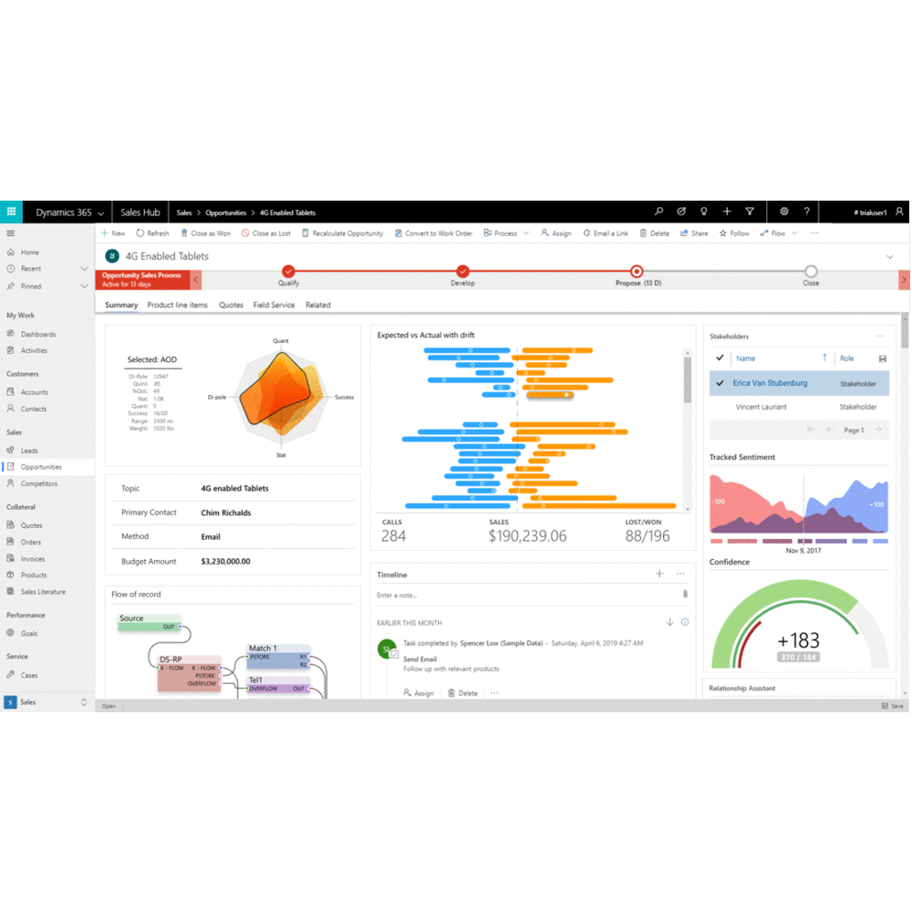

# What are code components

Code components are a type of solution component, which means they can be included in a solution file and imported into different environments. More information: [Package and distribute extensions using solutions](/dynamics365/customer-engagement/developer/package-distribute-extensions-use-solutions).

[!INCLUDE[cc-terminology](../data-platform/includes/cc-terminology.md)]

> [!div class="mx-imgBorder"] 
> 

Code components can be including into a solution and then imported into Microsoft Dataverse environment. Once the solution containing code components is imported, system administrators and system customizers can configure columns, subgrids, views, and dashboard subgrids to use in place of default components. You can add these code components to both **model-driven and canvas apps**. 

Code components consist of three elements:

- [Manifest](#manifest)
- [Component implementation](#component-implementation)
- [Resources](#resources)

> [!NOTE]
> The definition and implementation of code components using Power Apps component framework is same for both model-driven and canvas apps. The only difference between both is the configuration part. 

## Manifest

Manifest is the metadata file that defines a component. It is an XML document that describes:

- The name of the component.
- The kind of data that can be configured, either a `field` or a `dataset`.
- Any properties that can be configured in the application when the component is added.
- A list of resource files that the component needs. 

When a user configures a code component, the data in the manifest file filters the available components so that only valid components for the context are available for configuration. The properties defined in the manifest file for a component are rendered as configuration columns so that the user configuring the component can specify the values. These property values are then available to the component  at runtime. More information: [Manifest schema reference](manifest-schema-reference/index.md)

## Component implementation

Code components are implemented using TypeScript. Each code component must include an object that implements the methods described in the code component interface. The CLI will auto-generate an `index.ts` file that includes stubbed implementations for these methods. This file is auto-generated via CLI tooling with main stub methods.

The object implements the following methods:

- [init](reference/control/init.md) (Required)
- [updateView](reference/control/updateview.md) (Required)
- [getOutputs](reference/control/getoutputs.md) (Optional)
- [destroy](reference/control/destroy.md) (Required)

These methods control the lifecycle of the code component.

### Page load

When the page loads, the application requires an object to work. Using the data from the manifest file, the code gets the object by calling:

```js
var obj =  new <"namespace on manifest">.<"constructor on manifest">();
```

If the namespace and constructor values from the manifest are `SampleNameSpace` and `LinearInputComponent` respectively, the code to instantiate the object would be this:

```js
var controlObj = new SampleNameSpace.LinearInputComponent();
```

When the page is ready, it initializes the component by calling the [init](reference/control/init.md) method with a set of parameters.

```js
controlObj.init(context,notifyOutputChanged,state,container);
```

|Parameter|Description|
|---|---|
|context| Contains all the information about how the component is configured and all the parameters that can be used within the component along with the [Power Apps component framework APIs](reference/index.md). For example, the `context.parameters.<"property name from manifest">` can be used to access the input property.|
|notifyOutputChanged |Alerts the framework whenever the code component has new outputs ready to be retrieved asynchronously.|
|state|Contains component data from the previous page load in the current session if the component explicitly stored it earlier using the [setControlState](reference/mode/setcontrolstate.md) method.|
|container|An HTML div element to which developers and app makers can append the HTML elements for the UI that defines the component.|

### User changes data

When a user interacts with your components to change data, your component must call the method passed in as *notifyOutputChanged* parameter in the [init](reference/control/init.md) method. When you use this method, the platform then responds by calling the [getOutputs](reference/control/getoutputs.md) method. The [getOutputs](reference/control/getoutputs.md) method returns values that have the changes made by the user. For a `field` component, this would typically be the new value for the component.

### App changes data

If the platform changes the data, it calls out the [updateView](reference/control/updateview.md) method of the component and passes the new context object as a parameter. This method should be implemented to update the values displayed in the component.

### Page close

Whenever a user steps away from the page, the code component loses the scope and all the memory allocated in that page for the objects is cleared. However, some methods, based on the browser implementation mechanism, might stay and consume memory. Typically, these are event handlers. If the user wants to store this information, they should implement the [setControlState](reference/mode/setcontrolstate.md) method so that the information is given next time within the same session.

Developers should implement the [destroy](reference/control/destroy.md) method, which is called when the page closes, to remove any cleanup code such as event handlers.

## Resources

Each code component should have a resource file to construct its visualization. You can define a resource file in the manifest. The resource node in the manifest file refers to the resources that the component requires to implement its visualization. More information: [resources element](manifest-schema-reference/resources.md)

### Related topics

[Create and build a code component](create-custom-controls-using-pcf.md)


[!INCLUDE[footer-include](../../includes/footer-banner.md)]