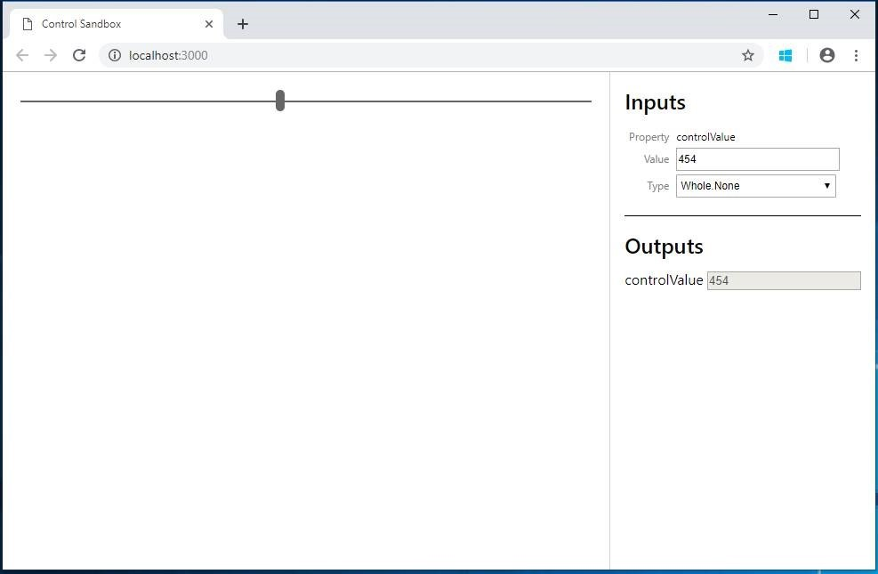

# Debug custom components

Once you are done implementing your custom control logic, run the following command to start the debugging process
`npm start`

> [!NOTE]
> Currently, you can only visualize your field control, but dataset support is coming soon.

> [!div class="mx-imgBorder"]
> 

As show in the image above, the browse window will open with 3 sections. Your control will be rendered in the left pane while the right pane consists of **Inputs** and **Outputs** sections

  - **Inputs** section is an interactive UI that displays all properties and their types/type-groups defined in the manifest.xml. It allows you to key in mock data for each property. 
  - **Outputs** section renders the output whenever a control's `getOutputs` method gets called.  
 
> [!NOTE]
> If you want to modify the `manifest.xml` or create additional properties, you will need to restart the debug process before they appear in the inputs section.

As you are inputting mock data, you can use the browser’s debugging capabilities to observe the control behavior. Each browser provides you with a debugging tool to help you debug your code natively in the browser. Typically, you can activate debugging in your browser by pressing the **F12** key to display the native developer tool used for debugging.

For example, on **Microsoft Edge**,

- Press **F12** to open inspector.
- Click on your control
- On top bar, go to **Debugger**, and then start searching for the control name described in the Manifest file in the search bar. For example, type your control name like `Hello World Control`.

     > [!div class="mx-imgBorder"]
     > 

> [!NOTE]
> It is always a good practice to set breakpoints on the control's life cycle methods like `init` and `updateView`

You can also interact with the control locally in real time and observe elements in the DOM by setting a breakpoint in the sources tab as follows

> [!div class="mx-imgBorder"]
> 

> [!div class="mx-imgBorder"]
> 

## Fiddler AutoResponder

Use the Fiddler AutoResponder to quickly debug your custom components. Install [Fiddler](https://www.telerik.com/download/fiddler) and follow the steps to configure [AutoResponder](https://docs.microsoft.com/en-us/dynamics365/customer-engagement/developer/streamline-javascript-development-fiddler-autoresponder)

### Related topics

[PowerApps component framework API Reference](reference/index.md) 
[PowerApps component framework Overview](overview.md)