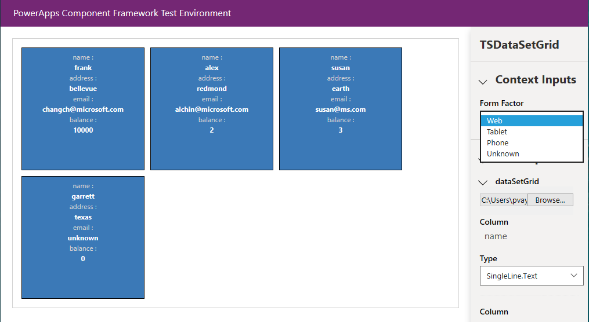
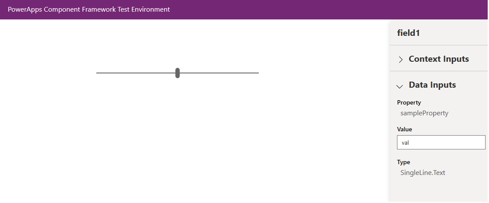
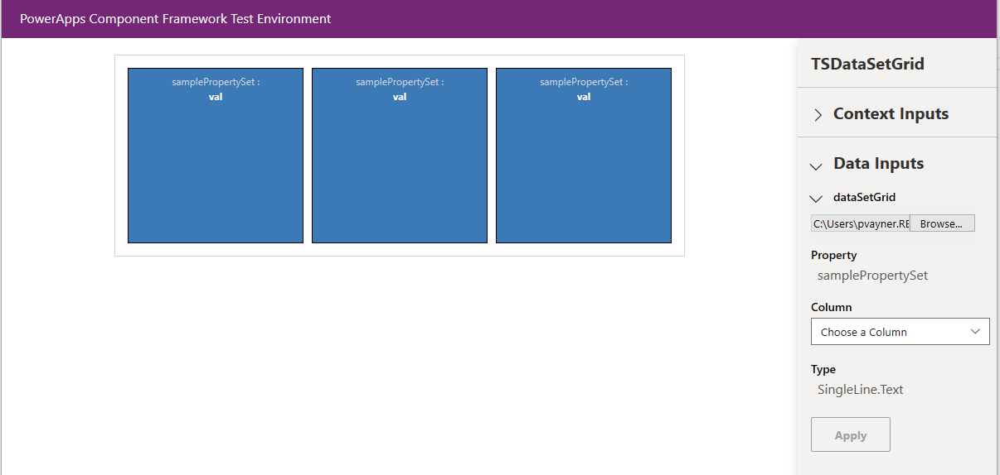
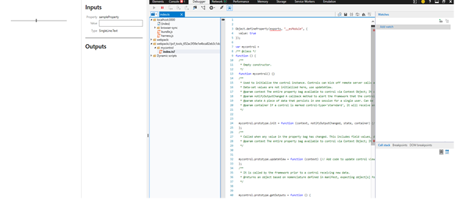
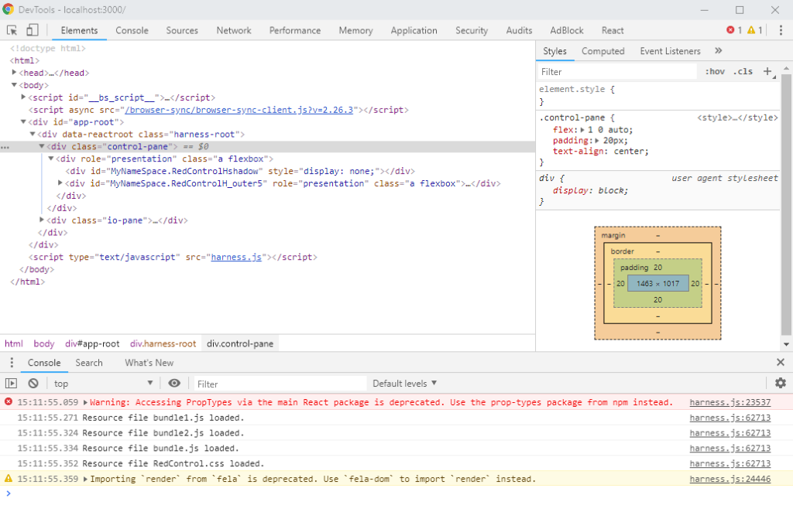

# Debug code components

After implementing the code component logic, you can start testing and debugging the code component using the `npm start` command. This command builds the code component and opens it in the local test harness.

[!INCLUDE[cc-terminology](../data-platform/includes/cc-terminology.md)]

> [!div class="mx-imgBorder"]
> 

As the image above shows, the browser window opens with four sections. The code component is rendered in the left pane while the right pane has **Context Inputs**, **Data Inputs**, and **Outputs** sections.

- **Context Inputs** provides a way to specify the form factor and test the code component with each form factor (web, tablet, phone). This is helpful when the code component is dependent on a particular form factor capability.
- **Data Inputs** is an interactive UI that displays all the properties and their [types](manifest-schema-reference/types.md) or [type-groups](manifest-schema-reference/type-group.md) defined in the [manifest](manifest-schema-reference/manifest.md) file. It allows you to key in the mock data for each property. 
- **Outputs** render the output whenever a component's [getOutputs](reference/control/getoutputs.md) method gets called.  

     > [!div class="mx-imgBorder"]
     > 

> [!NOTE]
> If you want to modify the `ControlManifest.Input.xml` file or create additional properties, you need to restart the debug process before they appear in the inputs section.

## Test code components with mock data

- For *field* type components, you can input value and type for every property defined in your **ControlManifest.Input.xml** as shown here:

   > [!div class="mx-imgBorder"]
   > 

- For *dataset* type components, you can load a CSV file with test data. You manually create or export in .csv format directly from your environment. Once a valid CSV file is available, it can be loaded as shown here:

   > [!div class="mx-imgBorder"]
   > 

- After loading a CSV file, bind each property defined in the **ControlManifest.Input.xml** to a column in the CSV file. This is done by picking the column for each property as shown here:

    > [!div class="mx-imgBorder"]
    > 

- If you don't have any properties defined in the **ControlManifest.Input.xml** file, then all the columns get automatically loaded into the test harness.

   > [!div class="mx-imgBorder"]
   > 

## Watch mode in test harness

The test harness supports the `watch` mode, which you can take advantage of for Power Apps component framework projects. To enable `watch` mode, start the test harness using the command `npm start watch`. In `watch` mode, the changes made to any of the following component assets are automatically reflected in the test harness without having to restart it:

1.    `index.ts` file.
2.    `ControlManifest.Input.xml` file.
3.    Imported libraries in `index.ts`.
4.    All the resources listed in the manifest file.

## Debug code components using native browsers

You can use the browser's debugging capabilities to observe the component behavior. Each browser provides you with a debugging tool to help you debug your code natively in the browser. 

Typically, you can activate debugging in your browser by pressing the **F12** key to display the native developer tool used for debugging.

For example, on **Microsoft Edge**:

- Press **F12** to open the inspector.
- Select your component.
- On the top bar, go to **Debugger** and then search for the component name described in the manifest file in the search bar. For example, type your component name like `Hello World component`.

     > [!div class="mx-imgBorder"]
     > 

> [!NOTE]
> It is always a good practice to set breakpoints on the component's lifecycle methods like [init](reference/control/init.md) and [updateView](reference/control/updateview.md).

You can also interact with the component locally in real time and observe elements in the DOM by setting a breakpoint in the *Sources* tab as shown here:

> [!div class="mx-imgBorder"]
> 

## Fiddler AutoResponder

Use the Fiddler AutoResponder to debug your code components quickly. Install [Fiddler](https://www.telerik.com/download/fiddler) and follow the steps to configure [AutoResponder](/dynamics365/customer-engagement/developer/streamline-javascript-development-fiddler-autoresponder).

### Related topics

[Power Apps component framework API reference](reference/index.md) 
[Power Apps component framework overview](overview.md)

[!INCLUDE[footer-include](../../includes/footer-banner.md)]
