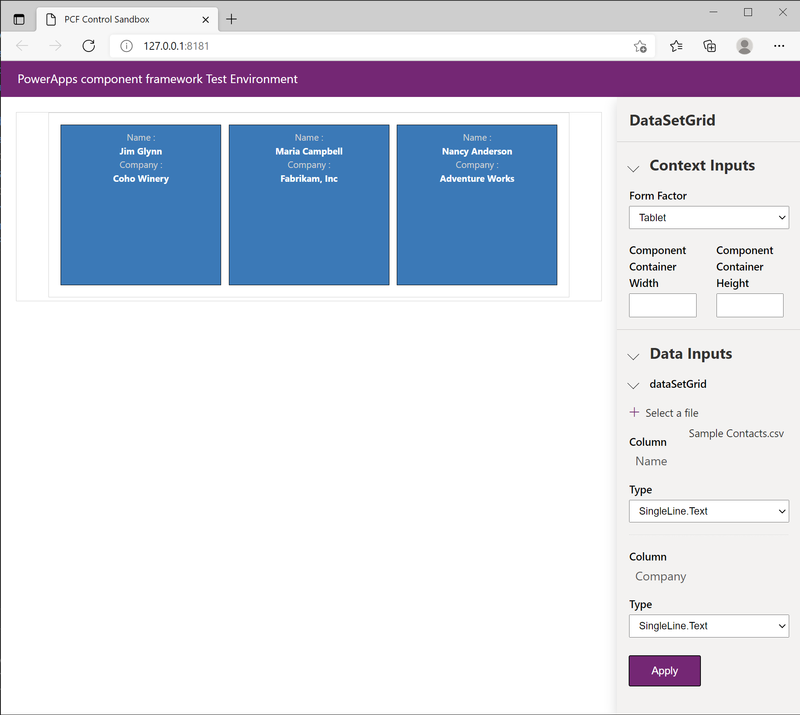
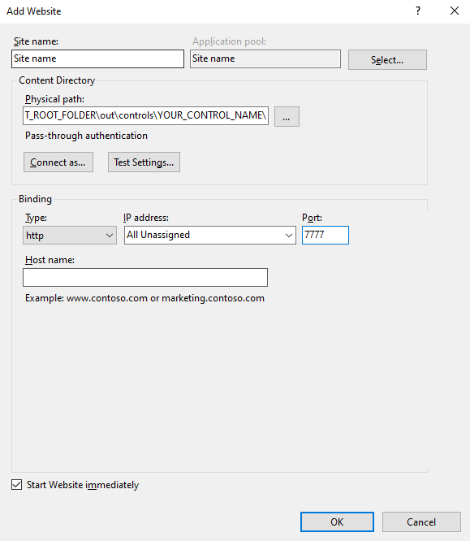
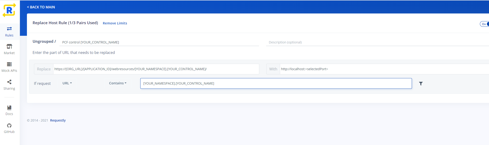

# Debug code components

This article provides information on how to debug your code component logic while it's being developed. Writing unit tests for your code is considered good practice so that the logic can be tested independently from the Power Apps component framework runtime.

This article shows how to debug your code components using the test harness and after deploying to Microsoft Dataverse:

- [Debug code components](#debug-code-components)
  - [Debugging using the browser test harness](#debugging-using-the-browser-test-harness)
    - [Test code components with mock data](#test-code-components-with-mock-data)
    - [Common limitations when using the test harness](#common-limitations-when-using-the-test-harness)
  - [Using browser developer tools to debug your code component](#using-browser-developer-tools-to-debug-your-code-component)
    - [Bundling using web pack](#bundling-using-webpack)
    - [Using developer tools with code components](#using-developer-tools-with-code-components)
    - [ES5 vs ES6](#es5-vs-es6)
  - [Debugging after deploying into Microsoft Dataverse](#debugging-after-deploying-into-microsoft-dataverse)
    - [Using Fiddler](#using-fiddler)
    - [Using Requestly](#using-requestly)


[!INCLUDE[cc-terminology](../data-platform/includes/cc-terminology.md)]

## Debugging using the browser test harness

While you're implementing the code component logic, using `npm start` or `npm start watch` builds the code component and open the local test harness in a new browser window. This test harness is part of Microsoft Power Platform CLI and hence is the same irrespective of if you plan to use your code component in model-driven apps, canvas apps, or portals. More information: [Create your first component](implementing-controls-using-typescript.md).

> [!NOTE]
> Before you can use `npm start` you need to check if npm is installed in your machine.

The following image shows what Visual Studio Code looks like when you use the `npm start watch` for the `DataSetGrid` sample:

> [!div class="mx-imgBorder"] 
> 

Launching the test harness in `watch` mode enables you to quickly see the changes in action. Changes made to any of the following component assets are automatically reflected in the test harness without having to restart it:

1. `index.ts` file.
1. Imported modules in `index.ts` (excluding node_modules).
1. All of the resources listed in the `ControlManifest.Input.xml` file, for example, `css/DataSetGrid.css` or `strings/DataSetGrid.1033.resx`

If you make changes to any of these files, you'll see a `Change detected` message and the browser reloads with the updated code.

> [!div class="mx-imgBorder"] 
> 

The following image shows the test harness once it's opened in a new browser window:

> [!div class="mx-imgBorder"] 
> 

As the image above shows, the browser window opens to display four areas. The code component is rendered in the left pane while the right pane has three sections that depend on the type of component being debugged:

- **Context Inputs** is shown for all code component types:

  - **Form Factor**: Provides a way to specify the form factor and test the code component with each form factor (web, tablet, phone). Form factor is helpful when the code component changes its layout depending on where the component is loaded. You can detect the form factor in the code using [`context.client.getFormFactor()`](reference\client\getformfactor.md).
  - **Component Container Width & Height**: Initially, the width and height are empty. This places your code component inside a container `div` that has no width or height CSS style set. If you provide a width or height, the container `div` has its dimensions constrained so that you can see how your code component adapts to the space available. You need to carefully test your code components behavior inside Power Apps once deployed since the exact behavior is different to that of the test harness. Additionally, your component needs to make a call to `context.mode.trackContainerResize(true)` if it wants to receive `context.mode.allocatedHeight` `context.mode.allocatedWidth` in the `updateView` method, however the test harness always provides the height and width irrespective of this call.
    More information: [trackContainerResize](reference\mode\trackcontainerresize.md).

  > [!NOTE]
  > When using the test harness, `allocatedWidth` and `allocatedHeight` will be provided as text rather than numeric values.

- **Data Inputs** is an interactive UI that displays all the properties and their [types](manifest-schema-reference/types.md) or [type-groups](manifest-schema-reference/type-group.md) defined in the [manifest](manifest-schema-reference/manifest.md) file. The contents of this area are dependent on the properties and datasets defined in the `ControlManifest.Input.xml` and allows providing mock data for test purposes.

- **Outputs** render the output whenever a component's [getOutputs](reference/control/getoutputs.md) method gets called.

> [!NOTE]
> If you want to modify the `ControlManifest.Input.xml` file, you will need to restart the debug process before any additional properties or datasets appear in the inputs section. You can do this by using `Ctrl + c` on the running process at the command line and then running `npm start watch` again.

> [!IMPORTANT]
> Using `npm start` and `npm start watch` builds your code component optimized for development and debugging. This code would not normally be deployed to Microsoft Dataverse. More information: [Code Components Application Lifecycle Management](code-components-alm.md).

### Test code components with mock data

- For components with [`property`](reference\property.md) elements in the `ControlManifest.Input.xml`, the **Data Inputs** section shows an input box for each value.

  > [!div class="mx-imgBorder"] 
  > 

- For _dataset_ type components, you can load a CSV file with test data for each [data-set](manifest-schema-reference\data-set.md) element. You manually create or export in .csv format directly from your environment. After loading a CSV file, you can bind each [property-set](manifest-schema-reference\property-set.md) defined in the `ControlManifest.Input.xml` to a column in the CSV file. The following screenshot shows how this binding is done by picking the column for each property:

  > [!div class="mx-imgBorder"] 
  > 

- If you don't have any properties defined in the `ControlManifest.Input.xml` file, then all the columns get automatically loaded into the test harness. The following screenshot shows how you can assign the data type to the code component for each column in the source CSV:

  > [!div class="mx-imgBorder"] 
  > 

> [!NOTE]
> When loading a CSV sample dataset you must select **Apply** before the data is loaded. If the dataset has property-set elements defined, then each must be mapped to a column in the CSV before you can select **Apply**. These settings are not remembered and must be set every time a code change is made, after the test harness re-loads.

### Common limitations when using the test harness

While the test harness is suitable for testing simple code components, the following scenarios might mean that the test harness can't be used to test a more complex code component:

1. The [updatedProperties](reference\updatedproperties.md) array isn't populated when properties are changed via the test harness **Data Inputs** section.
1. Using features listed in the `feature-usage` section of the `ControlManifest.Input.xml`. For example, calling the `context.WebApi.*` methods throw an exception from within the test harness.
1. Use of the [paging](reference/paging.md), [sorting](reference/sortstatus.md), and [filtering](reference/filtering.md) APIs on datasets throw an exception from within the test harness.
1. Use of complex datatype bindings that provide more metadata such as choices and lookups. For choice columns, the test harness gives you three simple choices with minimal metadata.
1. Model-driven apps specifics such as field level security, read-only behavior, dataset selection API, and integration with the model-driven apps command bar.
1. Other context APIs such as [Navigation](reference/navigation.md) and [Utility](reference/utility.md) methods.

To test these scenarios, you'll need to first deploy your code component and test using the technique described in [Debugging after deploying to Dataverse using Fiddler](#debugging-after-deploying-into-microsoft-dataverse)

## Using browser developer tools to debug your code component

Modern browsers have a built-in set of developer tools that allow you to inspect the HTML, CSS, and JavaScript loaded on the current page. You can access these developer tools using the keyboard shortcut `Ctrl`+`Shift`+`I`. Using the `F12` key is also a common keyboard shortcut to open the developer tools however this shortcut doesn't work inside Power Apps Studio due to it being already used for the **Download App** keyboard shortcut.

### Bundling using webpack

When you write code components using TypeScript, your code probably looks different from the JavaScript that is emitted into the bundled code component output. When you run `npm start` or `npm start watch`, the `pcf-scripts` module (added to the `packages.json` by running [pac pcf init](/power-platform/developer/cli/reference/pcf#pac-pcf-init)) uses web pack to build multiple TypeScript files into a single `bundle.js` inside the `out` folder. This folder also contains any other resources (for example, `html`/`css`) referenced by your `ControlManifest.Input.xml` including the manifest itself, but named instead as just `ControlManifest.xml`.

When you use modern TypeScript language features such as import/export or async/await that the targeted standard of JavaScript (for example, ES5), doesn't support, the build process transpiles the TypeScript into JavaScript without using these language features. The source maps that are output as part of the development build, provide the information to the developer tools so that breakpoint locations in your TypeScript can be mapped to the corresponding line of JavaScript. Equally, when an exception occurs or you step through the code, you can see the original TypeScript line rather than the underlying transpiled JavaScript.

Another feature of bundling is that when you use `npm install` to include an external module, the build process adds the required module into your code component's `bundle.js` using the contents of the associated `node_modules` directory. For this reason, any external modules used must be packaged in such a way that they can be bundled. More information: [Best practices: Module imports](code-components-best-practices.md#module-imports).

> [!NOTE]
> The source maps will only be output when you run the build-in development mode and will result in a much larger file than your production build. For this reason, it is not recommended to deploy your code component after building for development purposes. More information: [Application Lifecycle Management (ALM)](code-components-alm.md).

### Using developer tools with code components

This section describes how to debug your code component inside the Microsoft Edge developer tools:

1. Load your code component into a browser session using either:

   1. The test harness using `npm start watch`.
   1. A local development build of your code component loaded into a model-driven, canvas app, or portal browser session. You don't need to deploy a development build of your code component to Dataverse server, but instead, you can use Fiddler Auto Responders as described in [Debugging after deployment into Microsoft Dataverse using Fiddler](#debugging-after-deploying-into-microsoft-dataverse).

1. Select `Ctrl` + `Shift` + `I` to open the developer tools.
1. Select the **Sources** tab inside the developer tools panel.
1. Use `Ctrl` + `P` to show the **Open File** command pallet. You can also select **Open File** from the **ellipsis** menu.
1. Enter the name of your control (which is the name of the control you used in [pac pcf init](/power-platform/developer/cli/reference/pcf#pac-pcf-init)).
1. Select the file in the matches listed that is similar to:
   `webpack://pcf_tools_652ac3f36e1e4bca82eb3c1dc44e6fad/./DataSetGrid/index.ts`

   > [!div class="mx-imgBorder"] 
   > 

1. Locate the `updateView` function and place a breakpoint on the first line.
1. Make a change to the properties that are bound to your code component. In the test harness, changing properties can be done using the properties panel, or inside Power Apps, you can make a change to a bound property or dataset. Changing properties triggers a call to `updateView`.
1. You'll now see your breakpoint hit, and you can inspect the code.

   > [!div class="mx-imgBorder"] 
   > 

1. You can also inspect the HTML elements and CSS created by the component using the **Elements** tab. If you have a specific set of interactions that you're interested in (root container element), you can place a breakpoint on the HTML Dom element using the **Context Menu** (while the root element is selected) > **Break on** > **subtree modifications**

    > [!div class="mx-imgBorder"] 
    > 

### ES5 vs ES6

Currently, by default, code components are configured to transpile into ES5 JavaScript so that older browsers are supported. You can change the target to ES6 if you don't need to support older browsers by setting the `target` in your projects `tsconfig.json` to `ES6`:

```json
{
  "extends": "./node_modules/pcf-scripts/tsconfig_base.json",
  "compilerOptions": {
    "target": "ES6",
    "typeRoots": ["node_modules/@types"]
  }
}
```

> [!NOTE]
> At this time source maps are generated from TypeScript transpiled output for each TypeScript file rather than from the source. If ES5 is targeted, then your source maps will be harder to read due to the ES6 language features (such as classes) being removed. Until support for ES6 is added, even if you need to output ES5, you can update your `tsconfig.json` to target ES6 while developing so that the source maps are closer to the original TypeScript. If you need to output ES5, remember to set it back before building your code component for production deployment.

## Debugging after deploying into Microsoft Dataverse

To fully test the logic inside the context of a model-driven app, canvas app, or portal you can first deploy and configure your code component to Microsoft Dataverse and then use either [Fiddler](https://www.telerik.com/download/fiddler)'s Auto Responder feature or use [requestly](https://requestly.io/). In both cases, you'll load a development build of your code component (built locally) into the browser without having to continuously deploy changes as you debug your code. Debugging this way allows you to debug against a nondevelopment downstream environment without having to first deploy a development build.

First ensure your component is deployed and configured in Microsoft Dataverse. Ideally, you should only publish production builds of code components into Microsoft Dataverse. For larger code components, publishing a development build might result in the error [Web resource size is too large](issues-and-workarounds.md#web-resource-size-is-too-large). Since we're going to redirect the code component's `bundle.js` to a locally built version, you can update your `.pcfproj` file to always build in production mode when using [pac pcf push](/power-platform/developer/cli/reference/pcf#pac-pcf-push) by setting the property `PcfBuildMode` to production.

```XML
<PropertyGroup>
  <Name>ReactStandardControl</Name>
  <ProjectGuid>0df84c56-2f55-4a80-ac9f-85b7a14bf378</ProjectGuid>
  <OutputPath>$(MSBuildThisFileDirectory)out\controls</OutputPath>
  <PcfBuildMode>production</PcfBuildMode>
</PropertyGroup>
```

### Using Fiddler

To debug your code component using Fiddler:

1. Download and install [Fiddler Classic](https://www.telerik.com/download/fiddler)
1. Open Fiddler and from the menu bar, go to **Tools**, and then select **Options**.
1. Select the **HTTPS** tab in the dialog box and check the **Capture HTTPS CONNECTS** and **Decrypt HTTPS traffic** checkboxes so that the HTTPS traffic is captured and then decrypted.

   > [!div class="mx-imgBorder"] 
   > 

1. Select **OK** to close the dialog box.

   > [!NOTE]
   >
   > - If it is the first time you are enabling this setting, Fiddler will prompt you to install a certificate. Install the certificate and restart Fiddler so that the new settings take effect.
   > - If you have run Fiddler in the past and get a `NET::ERR_CERT_AUTHORITY_INVALID` error, in the **HTTPS** tab, select the **Actions** button and choose **Reset All Certificates**. This will also present multiple prompts for the new certificates to be installed.

1. In the right-hand panel, select the **AutoResponder** tab.
1. Ensure that **Enable Rules** and **Unmatched requests passthrough** are checked.
1. Select **Add Rule** and enter first:

   ```
   REGEX:(.*?)((?'folder'css|html)(%252f|\/))?YOUR_NAMESPACE\.YOUR_CONTROL_NAME[\.\/](?'fname'[^?]*\.*)(.*?)$
   ```

   where:

   - **YOUR_NAMESPACE** - the namespace you provided to [pac pcf init](/power-platform/developer/cli/reference/pcf#pac-pcf-init) as contained in the `control.namespace` attribute of the `ControlManifest.Input.xml`
   - **YOUR_CONTROL_NAME** - the component name you provided to [pac pcf init](/power-platform/developer/cli/reference/pcf#pac-pcf-init) and set in the `control.constructor` attribute of the `ControlManifest.Input.xml`

   This rule aims to match requests for the code component's `bundle.js` and related resources (`css`/`html`) in such a way that it works for both model-driven, and canvas apps, both in Power Apps Studio and Player.

   An example of this rule looks like the following:

   > [!div class="mx-imgBorder"] 
   > 

   If you want a simpler **AutoResponder** rule approach, see [Script web resource development using Fiddler Auto Responder](../model-driven-apps/streamline-javascript-development-fiddler-autoresponder.md).

1. Enter a string like this for the path to respond with:

   ```
   C:\COMPONENT_ROOT_FOLDER\out\controls\YOUR_CONTROL_NAME\${folder}\${fname}
   ```

   For example, if your code component root folder is `C:\src\PowerApps-Samples\component-framework\DataSetGrid` and the component name is `DataSetGrid`, the path would be:

   ```
   C:\src\PowerApps-Samples\component-framework\DataSetGrid\out\controls\DataSetGrid\${folder}\${fname}
   ```

1. Select **Save**.
1. Open the **Filters** tab and check **Use Filters**. In the **Response Headers** section, check **Set response header** and provide the following:

   Header: `Access-Control-Allow-Origin`

   Value: `*`

   > [!div class="mx-imgBorder"] 
   > 

   > [!IMPORTANT]
   > This step is only necessary when debugging code components after they are deployed to canvas apps because the resources are stored in blob storage rather than underneath the `powerapp.com` domain. As such, any requests to these resources will require cross-domain access when loaded by the browser. Only enable this `Access-Control-Allow-Origin` filter rule when you are debugging since it will modify headers of other sites that you visit.

1. Now that you have the **AutoResponder** rules running you'll need to first clear the cache in the browser and reload the page containing the code component. This can easily be done by opening developer tools (`Ctrl + Shift + I`), right-clicking the **Refresh** > **Empty cache and hard refresh**.

   > [!div class="mx-imgBorder"] 
   > 

1. Once you have your code component loaded from your local machine, you can make changes to the code (while `npm start watch` is running) and refresh the browser to load the newly built versions. Fiddler's Auto Responder will automatically add a cache-control header so that it will not be cached by the browser so a simple refresh will reload the resources without having to clear the cache each time.

### Using requestly

To debug your code component using Requestly:

1. Enable Internet Information Services (IIS) on your machine.

   1. Open **Control Panel** and select **Programs and Features** > **Turn Windows** features on or off.
   1. Enable Internet Information Services.
   1. Expand the Internet Information Services and verify that the web server components listed in the next section are enabled.
   1. Select **OK**.

1. Setup ISS

   1. Open IIS on your machine.
   1. In right side panel **Connections**, expand tree and right-click on **Sites**.
   1. Add website.
   1. Set **Site** name.
   1. Set **Physical path** to your custom component folder, for example, `C:\COMPONENT_ROOT_FOLDER\out\controls\YOUR_CONTROL_NAME\`
   1. Set **Port** (any number, for instance,  **7777**).
   1. Select **OK**. Selected folder is now hosted on `http://localhost:<SELECTED_PORT>`

   > [!div class="mx-imgBorder"] 
   > 

1. Download and install [Requestly](https://requestly.io)

1. Follow onboarding to the tool.

1. Open rules (navigate to https://app.requestly.io/rules).

1. Add "Replace Host" rule:

   1. Set name of the rule.
   1. Set "Replace" field with `https://[ORG_URL]/[APPLICATION_ID]/webresources/[YOUR_NAMESPACE].[YOUR_CONTROL_NAME]/`
   1. Set "With" with `http://localhost:<SELECTED_PORT>`
   1. Set "If request" with "URL" "Contains" `[YOUR_NAMESPACE].[YOUR_CONTROL_NAME]`
   1. Save the rule and enable it.

   > [!div class="mx-imgBorder"] 
   > 

1. Now you need to clear the cache in the browser and reload the page containing the code component. You can clear the cache in the browser and reload the page by opening developer tools (`Ctrl + Shift + I`), right-clicking the **Refresh** > **Empty cache and hard refresh**.

   > [!div class="mx-imgBorder"] 
   > 

1. Once you have your code component loaded from your local machine, you can make changes to the code (while `npm start watch` is running) and refresh the browser to load the newly built versions. Requestly automatically adds a cache-control header so that it isn't cached by the browser so a simple refresh will reload the resources without having to clear the cache each time.

### Related articles

[Power Apps component framework API reference](reference/index.md)<br/>
[Power Apps component framework overview](overview.md)<br/>
[Application Lifecycle Management (ALM)](code-components-alm.md)<br/>
[Create your first component](implementing-controls-using-typescript.md)

[!INCLUDE[footer-include](../../includes/footer-banner.md)]
