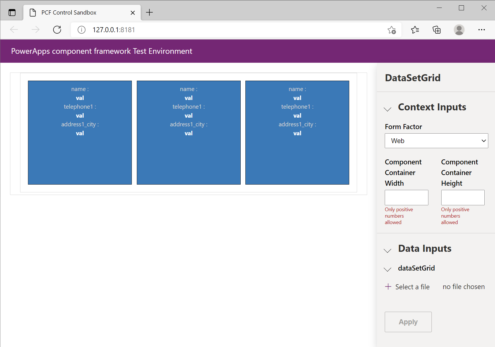
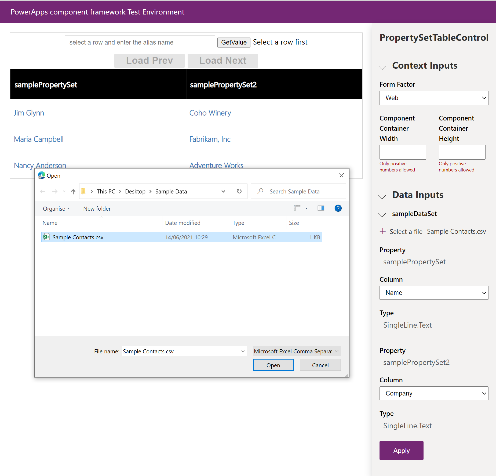

# Debug custom components

Once you are done implementing your custom control logic, get started with testing and debugging using `npm start` command. This will build your custom component and open it in the local test harness.

> [!div class="mx-imgBorder"]
> 

As show in the image above, the browser window will open with 4 sections. Your control will be rendered in the left pane while the right pane consists of **Context Inputs**, **Data Inputs** and **Outputs** sections

  - **Context Inputs** section provides you a way to specify the form factor and test your custom component with each one (web, tablet, phone). This is especially helpful when the custom component is dependent on a particular form factor capability. In the coming releases you will also have the ability to specify the height and width.
  - **Data Inputs** section is an interactive UI that displays all properties and their types/type-groups defined in the manifest.xml. It allows you to key in mock data for each property. 
  - **Outputs** section renders the output whenever a control's `getOutputs` method gets called.  

> [!div class="mx-imgBorder"]
> 

> [!NOTE]
> If you want to modify the `manifest.xml` or create additional properties, you will need to restart the debug process before they appear in the inputs section.

# Test custom components with Mock data
- For field controls you can input a value and a type for every property defined in your ControlManifest.Input.xml. 
- For datasets you can load a CSV file with test data. It can be manually created or exported in csv format directly from your environment. Once a valid csv file is available, it can be loaded it as shown below:

> [!div class="mx-imgBorder"]
> 

- After loading  a csv file, please bind each property defined in your ControlManifest.Input.xml to a column in the csv. This is done by picking the column for each property as shown below:

> [!div class="mx-imgBorder"]
> 

- If you dont have any properties defined in your ControlManifest.Input.xml then all columns will automatically be loaded into the harness.

> [!div class="mx-imgBorder"]
> 

# Debug custom components
You can use the browser’s debugging capabilities to observe the control behavior. Each browser provides you with a debugging tool to help you debug your code natively in the browser. Typically, you can activate debugging in your browser by pressing the **F12** key to display the native developer tool used for debugging.

For example, on **Microsoft Edge**,

- Press **F12** to open inspector.
- Click on your control
- On top bar, go to **Debugger**, and then start searching for the control name described in the Manifest file in the search bar. For example, type your control name like `Hello World Control`.

     > [!div class="mx-imgBorder"]
     > 

> [!NOTE]
> It is always a good practice to set breakpoints on the control's life cycle methods like `init` and `updateView`

You can also interact with the control locally in real time and observe elements in the DOM by setting a breakpoint in the sources tab as follows

> [!div class="mx-imgBorder"]
> 

## Fiddler AutoResponder

Use the Fiddler AutoResponder to quickly debug your custom components. Install [Fiddler](https://www.telerik.com/download/fiddler) and follow the steps to configure [AutoResponder](https://docs.microsoft.com/dynamics365/customer-engagement/developer/streamline-javascript-development-fiddler-autoresponder)

### Related topics

[PowerApps component framework API Reference](reference/index.md) 
[PowerApps component framework Overview](overview.md)
