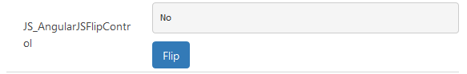

# Implementing Flip component

This sample shows how to use third-party libraries to create components in Power Apps component framework.  The flip sample component is implemented based on angular.js, angular-ui, angular-animate, angular-sanitize, bootstrap. The code may not reveal the best practices for the mentioned third-party libraries. 

[!INCLUDE[cc-terminology](../../data-platform/includes/cc-terminology.md)]

> [!div class="mx-imgBorder"]
> 

## Available for 

Model-driven and canvas apps 

## Code

You can download the complete sample component from [here](https://github.com/microsoft/PowerApps-Samples/tree/master/component-framework/AngularJSFlipControl).

This sample provides examples on how to add dependencies for third-party libraries, showcasing how to perform data-binding between Power Apps component framework, component model and third-party inner data model in bi-direction.

The flip component sample consists of a label and a button. When you click on the button, the text on the label toggles.

- When the component is loaded, the label shows the text based on the bind column value. The `context.parameters.[property_name].attributes` contains the associated definitions.
- For Yes/No columns, `context.parameters.[property_name].Options` will include both true and false value. 
- Selecting on the Flip button, the label will update the value using **notifyOutputEvents** method, [getOutputs](../reference/control/getoutputs.md) method will be called asynchronously and will flow to Power Apps component framework. 
- ClientAPI updates the bind column value, and the updated value flows to the component label. You can also use `ClientAPI` to update a column value to trigger control's [updateView](../reference/control/updateview.md) method. The component then updates the third-party model and the label gets updated.

### Related topics

[Download sample components](https://github.com/microsoft/PowerApps-Samples/tree/master/component-framework) 
[How to use the sample components](../use-sample-components.md) 
[Power Apps component framework manifest schema reference](../manifest-schema-reference/index.md) 
[Power Apps component framework API reference](../reference/index.md) 
[Power Apps component framework overview](../overview.md)

[!INCLUDE[footer-include](../../../includes/footer-banner.md)]