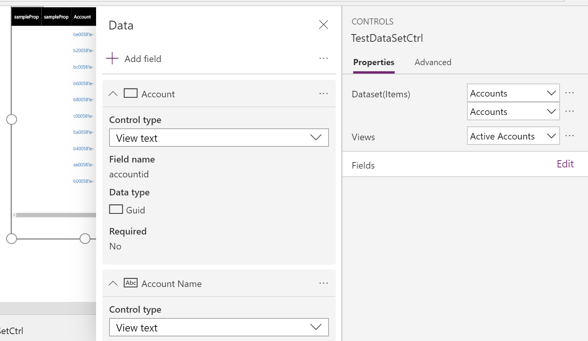

# Implementing data-set component for canvas apps

This sample shows how to create a dataset component for canvas apps. The dataset component also showcases how to use the dataset API methods to get column metadata, record data, page through data, and handle navigation. 

 You can download the sample component from [here](https://github.com/microsoft/PowerApps-Samples/tree/master/component-framework/TS_PropertSetTableControl).

> [!div class="mx-imgBorder"]
> 

## Available for 

Model-driven apps and canvas apps (public preview).

> [!NOTE]
> Some of the dataset API methods are still not supported in canvas apps. See, [individual API documentation] for availability details.
> See, [Dataset component for model-driven apps](data-set-grid-control.md) to learn more about how dataset type components are implemented in model-driven apps.

## Manifest 

```xml
<?xml version="1.0" encoding="UTF-8" standalone="yes"?>
<manifest>
  <control namespace="PcfSample" constructor="TestDataSetCtrl" version="0.0.6" display-name-key="TestDataSetCtrl" description-key="TestDataSetCtrl description" control-type="standard" api-version="1.2.1">
    <data-set name="simpleTableGrid" display-name-key="Dataset_Display_Key">
      <property-set name="samplePropertySet" display-name-key="Property_Display_Key" description-key="Property_Desc_Key" of-type="SingleLine.Text" usage="bound" required="true"/>
      <property-set name="samplePropertySet2" display-name-key="Property_Display_Key2" description-key="Property_Desc_Key2" of-type="SingleLine.Text" usage="bound" required="true"/>
    </data-set>
    <resources>
      <code path="bundle.js" order="1"/>
      <css path="css/TestDataSetCtrl.css" order="1"/>
      <resx path="strings/TestDataSetCtrl.1033.resx" version="1.0.0"/>
    </resources>
    <built-by name="pac" version="1.1.6"/>
  </control>
</manifest>
```

## Code 

```TypeScript
import { IInputs, IOutputs } from "./generated/ManifestTypes";
import DataSetInterfaces = ComponentFramework.PropertyHelper.DataSetApi;
type DataSet = ComponentFramework.PropertyTypes.DataSet;

// Define const here
const RowRecordId: string = "rowRecId";

// Style name of Load More Button
const LoadPageButton_Disabled_Style = "LoadPageButton_Disabled_Style";
export class TestDataSetCtrl implements ComponentFramework.StandardControl<IInputs, IOutputs> {
// Cached context object for the latest updateView
private contextObj: ComponentFramework.Context<IInputs>;
// Div element created as part of this control's main container
private mainContainer: HTMLDivElement;
// Table element created as part of this control's table
private dataTable: HTMLTableElement;
// Button element created as part of this control
private loadNextPageButton: HTMLButtonElement;
private loadPreviousPageButton: HTMLButtonElement;
private columns: DataSetInterfaces.Column[];
private currentSorting: any;
private viewInfoBox: HTMLDivElement;
private displayPropertySetCheckbox: HTMLButtonElement;

/**
 * Empty constructor.
 */
constructor() {

}

/**
 * Used to initialize the control instance. Controls can kick off remote server calls and other initialization actions here.
 * Data-set values are not initialized here, use updateView.
 * @param context The entire property bag available to control via Context Object; It contains values as set up by the customizer mapped to property names defined in the manifest, as well as utility functions.
 * @param notifyOutputChanged A callback method to alert the framework that the control has new outputs ready to be retrieved asynchronously.
 * @param state A piece of data that persists in one session for a single user. Can be set at any point in a controls life cycle by calling 'setControlState' in the Mode interface.
 * @param container If a control is marked control-type='starndard', it will receive an empty div element within which it can render its content.
 */
public init(context: ComponentFramework.Context<IInputs>, notifyOutputChanged: () => void, state: ComponentFramework.Dictionary, container: HTMLDivElement) {
	// Need to track container resize so that control could get the available width. The available height won't be provided even this is true
	context.mode.trackContainerResize(true);

	// Create main table container div.
	this.mainContainer = document.createElement("div");
	this.mainContainer.classList.add("SimpleTable_MainContainer_Style");
	this.mainContainer.id = "SimpleTableMainContainer";
	// Create data table container div.
	this.dataTable = document.createElement("table");
	this.dataTable.classList.add("SimpleTable_Table_Style");

	// Create data table container div.
	this.loadNextPageButton = document.createElement("button");
	this.loadNextPageButton.setAttribute("type", "button");
	this.loadNextPageButton.innerText = context.resources.getString("PCF_TSTableGrid_LoadMore_ButtonLabel");
	this.loadNextPageButton.classList.add(LoadPageButton_Disabled_Style);
	this.loadNextPageButton.classList.add("LoadMoreButton_Style");
	this.loadNextPageButton.addEventListener("click", this.onLoadMoreButtonClick.bind(this));

	this.loadPreviousPageButton = document.createElement("button");
	this.loadPreviousPageButton.setAttribute("type", "button");
	this.loadPreviousPageButton.innerText = context.resources.getString("PCF_TSTableGrid_LoadPrevious_ButtonLabel");
	this.loadPreviousPageButton.classList.add(LoadPageButton_Disabled_Style);
	this.loadPreviousPageButton.classList.add("LoadMoreButton_Style");
	this.loadPreviousPageButton.addEventListener("click", this.onLoadPreviousButtonClick.bind(this));

	// Adding the main table and loadNextPage button created to the container DIV.
	this.mainContainer.appendChild(this.loadPreviousPageButton);
	this.mainContainer.appendChild(this.loadNextPageButton);
	this.mainContainer.appendChild(this.dataTable);
	container.appendChild(this.mainContainer);
}
/**
 * Called when any value in the property bag has changed. This includes field values, data-sets, global values such as container height and width, offline status, control metadata values such as label, visible, etc.
 * @param context The entire property bag available to control via Context Object; It contains values as set up by the customizer mapped to names defined in the manifest, as well as utility functions
 */
public updateView(context: ComponentFramework.Context<IInputs>): void {
	this.contextObj = context;
	this.toggleLoadMoreButtonWhenNeeded(context.parameters.simpleTableGrid);
	this.toggleLoadPreviousButtonWhenNeeded(context.parameters.simpleTableGrid);
	
	if (!context.parameters.simpleTableGrid.loading) {

		// Get sorted columns on View
		let columnsOnView = this.getSortedColumnsOnView(context);
		this.columns = columnsOnView;
		if (!columnsOnView || columnsOnView.length === 0) {
			return;
		}

		let columnWidthDistribution = this.getColumnWidthDistribution(context, columnsOnView);

		while (this.dataTable.firstChild) {
			this.dataTable.removeChild(this.dataTable.firstChild);
		}

		this.dataTable.appendChild(this.createTableHeader(columnsOnView, columnWidthDistribution));
		this.dataTable.appendChild(this.createTableBody(columnsOnView, columnWidthDistribution, context.parameters.simpleTableGrid));

		this.dataTable.parentElement!.style.height = (context.mode.allocatedHeight - 50) + "px";
	}
}

/**
 * It is called by the framework prior to a control receiving new data.
 * @returns an object based on nomenclature defined in manifest, expecting object[s] for property marked as “bound” or “output”
 */
public getOutputs(): IOutputs {
	return {};
}

/**
	 * Called when the control is to be removed from the DOM tree. Controls should use this call for cleanup.
 * i.e. cancelling any pending remote calls, removing listeners, etc.
 */
public destroy(): void {
}

/**
 * Get sorted columns on view
 * @param context
 * @return sorted columns object on View
 */
private getSortedColumnsOnView(context: ComponentFramework.Context<IInputs>): DataSetInterfaces.Column[] {
	if (!context.parameters.simpleTableGrid.columns) {
		return [];
	}

	let columns = context.parameters.simpleTableGrid.columns;

	return columns;
}

/**
 * Get column width distribution
 * @param context context object of this cycle
 * @param columnsOnView columns array on the configured view
 * @returns column width distribution
 */
private getColumnWidthDistribution(context: ComponentFramework.Context<IInputs>, columnsOnView: DataSetInterfaces.Column[]): string[] {

	let widthDistribution: string[] = [];

	// Considering need to remove border & padding length
	let totalWidth: number = context.mode.allocatedWidth;
	let widthSum = 0;

	columnsOnView.forEach(function (columnItem) {
		widthSum += columnItem.visualSizeFactor;
	});

	let remainWidth: number = totalWidth;

	columnsOnView.forEach(function (item, index) {
		let widthPerCell = "";
		if (index !== columnsOnView.length - 1) {
			let cellWidth = Math.round((item.visualSizeFactor / widthSum) * totalWidth);
			remainWidth = remainWidth - cellWidth;
			widthPerCell = cellWidth + "px";
		}
		else {
			widthPerCell = remainWidth + "px";
		}
		widthDistribution.push(widthPerCell);
	});

	return widthDistribution;

}
private createTableHeader(columnsOnView: DataSetInterfaces.Column[], widthDistribution: string[]): HTMLTableSectionElement {

	let tableHeader: HTMLTableSectionElement = document.createElement("thead");
	let tableHeaderRow: HTMLTableRowElement = document.createElement("tr");
	tableHeaderRow.classList.add("SimpleTable_TableRow_Style");
	const _this = this;
	columnsOnView.forEach(function (columnItem, index) {
		let tableHeaderCell = document.createElement("th");
		tableHeaderCell.classList.add("SimpleTable_TableHeader_Style");
		let innerDiv = document.createElement("div");
		innerDiv.classList.add("SimpleTable_TableCellInnerDiv_Style");
		innerDiv.style.maxWidth = widthDistribution[index];
		let columnDisplayName: string;
		if (columnItem.order < 0) {
			columnDisplayName = columnItem.displayName + "(propertySet)";
		} else {
			columnDisplayName = columnItem.displayName;
		}
		innerDiv.innerText = columnDisplayName;

		tableHeaderCell.appendChild(innerDiv);
		tableHeaderRow.appendChild(tableHeaderCell);
	});

	tableHeader.appendChild(tableHeaderRow);
	return tableHeader;
}
private createSearchBar(context: ComponentFramework.Context<IInputs>) {
	let container = document.createElement("div");
	let input = document.createElement("input");
	input.id = "searchBar";
	let button = document.createElement("button");
	button.innerHTML = "Search"
	button.addEventListener("click", (() => {
		let conditionsArray: DataSetInterfaces.ConditionExpression[] = [];
		let searchString = input.value;
		for (let i = 0; i < this.columns.length; i++) {
			const column = this.columns[i];
			if (!column.isHidden && column.dataType === "SingleLine.Text") {
				const condition: DataSetInterfaces.ConditionExpression = {
					attributeName: column.alias,
					conditionOperator: 6,
					value: searchString,
				};
				conditionsArray.push(condition);
			}
		}
		this.contextObj.parameters.simpleTableGrid.filtering.setFilter({
			conditions: conditionsArray,
			filterOperator: 1,
		});
		this.contextObj.parameters.simpleTableGrid.refresh();
	}).bind(this));
	container.appendChild(input);
	container.appendChild(button);
	return container;
}
private createTableBody(columnsOnView: DataSetInterfaces.Column[], widthDistribution: string[], gridParam: DataSet): HTMLTableSectionElement {
	let tableBody: HTMLTableSectionElement = document.createElement("tbody");
	if (gridParam.sortedRecordIds.length > 0) {
		for (let currentRecordId of gridParam.sortedRecordIds) {
			let tableRecordRow: HTMLTableRowElement = document.createElement("tr");
			tableRecordRow.classList.add("SimpleTable_TableRow_Style");
			tableRecordRow.addEventListener("click", this.onRowClick.bind(this));

			// Set the recordId on the row dom
			tableRecordRow.setAttribute(RowRecordId, gridParam.records[currentRecordId].getRecordId());
			columnsOnView.forEach(function (columnItem, index) {
				let tableRecordCell = document.createElement("td");
				tableRecordCell.classList.add("SimpleTable_TableCell_Style");
				let innerDiv = document.createElement("div");
				innerDiv.classList.add("SimpleTable_TableCellInnerDiv_Style");
				innerDiv.style.maxWidth = widthDistribution[index];
				innerDiv.innerText = gridParam.records[currentRecordId].getFormattedValue(columnItem.name);
				tableRecordCell.appendChild(innerDiv);
				tableRecordRow.appendChild(tableRecordCell);
			});
			tableBody.appendChild(tableRecordRow);
		}
	} 
	else {
	 let tableRecordRow: HTMLTableRowElement = document.createElement("tr");
	 let tableRecordCell: HTMLTableCellElement = document.createElement("td");
	 tableRecordCell.classList.add("No_Record_Style");
	 tableRecordCell.colSpan = columnsOnView.length;
	 tableRecordCell.innerText = this.contextObj.resources.getString("PCF_TSTableGrid_No_Record_Found");
	 tableRecordRow.appendChild(tableRecordCell)
	 tableBody.appendChild(tableRecordRow);
	 }
	 return tableBody;
}

/**
 * Row Click Event handler for the associated row when being clicked
 * @param event
 */
private onRowClick(event: Event): void {
	let rowRecordId = (event.currentTarget as HTMLTableRowElement).getAttribute(RowRecordId);
	if (rowRecordId) {
		const record = this.contextObj.parameters.simpleTableGrid.records[rowRecordId];
		this.contextObj.parameters.simpleTableGrid.openDatasetItem(record.getNamedReference());
	}
}

/**
 * Toggle 'LoadMore' button when needed
 */
private toggleLoadMoreButtonWhenNeeded(gridParam: DataSet): void {

	if (gridParam.paging.hasNextPage) {
		this.loadNextPageButton.disabled = false;
	} else if (!gridParam.paging.hasNextPage) {
		this.loadNextPageButton.disabled = true;
	}

}

/**
 * Toggle 'LoadMore' button when needed
 */
private toggleLoadPreviousButtonWhenNeeded(gridParam: DataSet): void {

	if (gridParam.paging.hasPreviousPage) {
		this.loadPreviousPageButton.disabled = false;
	} else if (!gridParam.paging.hasPreviousPage) {
		this.loadPreviousPageButton.disabled = true;
	}

}

/**
 * 'LoadMore' Button Event handler when load more button clicks
 * @param event
 */
private onLoadMoreButtonClick(event: Event): void {
	this.contextObj.parameters.simpleTableGrid.paging.loadNextPage();
	this.toggleLoadMoreButtonWhenNeeded(this.contextObj.parameters.simpleTableGrid);
	this.toggleLoadPreviousButtonWhenNeeded(this.contextObj.parameters.simpleTableGrid);
}

/**
 * 'LoadPrevous' Button Event handler when load more button clicks
 * @param event
 */
private onLoadPreviousButtonClick(event: Event): void {
	this.contextObj.parameters.simpleTableGrid.paging.loadPreviousPage();
	this.toggleLoadPreviousButtonWhenNeeded(this.contextObj.parameters.simpleTableGrid);
	this.toggleLoadMoreButtonWhenNeeded(this.contextObj.parameters.simpleTableGrid);
}
}
```

## Resources

```css
 .PcfSample\.TestDataSetCtrl table.SimpleTable_Table_Style{
    border-spacing:0;
    text-align:left;
    width:100%;
    margin:0 auto;
    overflow: auto;
    height: 94%;
    display: block;
}
.PcfSample\.TestDataSetCtrl div.SimpleTable_TableCellInnerDiv_Style{
    word-wrap:break-word;
    overflow: hidden;
    text-overflow: ellipsis;
    line-height:1.5rem;
    max-height:1.5rem;
}
.PcfSample\.TestDataSetCtrl th.SimpleTable_TableHeader_Style{
    height:3rem;
    font-family:"Segoe UI Regular","Segoe UI", Arial, Sans-Serif;
    font-size:1rem;
    line-height:1.384;
    background-color:rgb(0, 0, 0);
    color: #fff;
    text-align:left;
    padding:0.5rem;
    border-left:.1rem solid rgba(255,255,255,.1);
    vertical-align: middle;
    width: 100vw;
}
.PcfSample\.TestDataSetCtrl tr.SimpleTable_TableRow_Style{
    height:3.5rem;
    background-color:#fff;
    color:#333
}
.PcfSample\.TestDataSetCtrl tr.SimpleTable_TableRow_Style:hover{
    cursor:pointer;
    border: solid thin rgb(59, 121, 183);
    background:rgba(160,160,160,.15);
}
.PcfSample\.TestDataSetCtrl td.SimpleTable_TableCell_Style {
    font-size:1rem;
    line-height:1.467;
    padding:0 .5rem;
    vertical-align: middle;
    width: 100vw;
    font-weight: bold;
    font-family: "Segoe UI Light";
    color: rgb(59, 121, 183);
}
.PcfSample\.TestDataSetCtrl td.No_Record_Style {
    text-align: center;
    padding: 20px;
}
.PcfSample\.TestDataSetCtrl table.SimpleIncrement_Button_Style {
	text-decoration: none;
    display: inline-block;
    font-size: 14px;
    margin: 4px 6px;
    cursor: pointer;
	color: white;
    border-radius: 10px;
	background-color: black;
    border: none;
    padding: 5px;
    text-align: center;
}
.PcfSample\.TestDataSetCtrl input.SimpleIncrement_Input_Error_Style{
	color: red;
}
.PcfSample\.TestDataSetCtrl button.LoadPageButton_Disabled_Style{
    background-color:#e5e5e5;
}
.PcfSample\.TestDataSetCtrl button.LoadPageButton_Style{
    background-color:#0099ff;
    font-size:1.3rem;
    font-weight:bold;
    text-align:center;
    width:100px;
    border:none;
	padding: 5px;
	margin: 5px;
}
```

```XML
<xsd:schema id="root" xmlns="" xmlns:xsd="http://www.w3.org/2001/XMLSchema" xmlns:msdata="urn:schemas-microsoft-com:xml-msdata">
    <xsd:import namespace="http://www.w3.org/XML/1998/namespace" />
    <xsd:element name="root" msdata:IsDataSet="true">
      <xsd:complexType>
        <xsd:choice maxOccurs="unbounded">
          <xsd:element name="metadata">
            <xsd:complexType>
              <xsd:sequence>
                <xsd:element name="value" type="xsd:string" minOccurs="0" />
              </xsd:sequence>
              <xsd:attribute name="name" use="required" type="xsd:string" />
              <xsd:attribute name="type" type="xsd:string" />
              <xsd:attribute name="mimetype" type="xsd:string" />
              <xsd:attribute ref="xml:space" />
            </xsd:complexType>
          </xsd:element>
          <xsd:element name="assembly">
            <xsd:complexType>
              <xsd:attribute name="alias" type="xsd:string" />
              <xsd:attribute name="name" type="xsd:string" />
            </xsd:complexType>
          </xsd:element>
          <xsd:element name="data">
            <xsd:complexType>
              <xsd:sequence>
                <xsd:element name="value" type="xsd:string" minOccurs="0" msdata:Ordinal="1" />
                <xsd:element name="comment" type="xsd:string" minOccurs="0" msdata:Ordinal="2" />
              </xsd:sequence>
              <xsd:attribute name="name" type="xsd:string" use="required" msdata:Ordinal="1" />
              <xsd:attribute name="type" type="xsd:string" msdata:Ordinal="3" />
              <xsd:attribute name="mimetype" type="xsd:string" msdata:Ordinal="4" />
              <xsd:attribute ref="xml:space" />
            </xsd:complexType>
          </xsd:element>
          <xsd:element name="resheader">
            <xsd:complexType>
              <xsd:sequence>
                <xsd:element name="value" type="xsd:string" minOccurs="0" msdata:Ordinal="1" />
              </xsd:sequence>
              <xsd:attribute name="name" type="xsd:string" use="required" />
            </xsd:complexType>
          </xsd:element>
        </xsd:choice>
      </xsd:complexType>
    </xsd:element>
  </xsd:schema>
  <resheader name="resmimetype">
    <value>text/microsoft-resx</value>
  </resheader>
  <resheader name="version">
    <value>2.0</value>
  </resheader>
  <resheader name="reader">
    <value>System.Resources.ResXResourceReader, System.Windows.Forms, Version=4.0.0.0, Culture=neutral, PublicKeyToken=b77a5c561934e089</value>
  </resheader>
  <resheader name="writer">
    <value>System.Resources.ResXResourceWriter, System.Windows.Forms, Version=4.0.0.0, Culture=neutral, PublicKeyToken=b77a5c561934e089</value>
  </resheader>
  <data name="PCF_TSTableGrid_LoadMore_ButtonLabel" xml:space="preserve">
    <value>Next</value>
    <comment>Label for TSTableGrid's Load More Paging Button</comment>
  </data>
  <data name="PCF_TSTableGrid_LoadPrevious_ButtonLabel" xml:space="preserve">
    <value>Previous</value>
    <comment>Label for TSTableGrid's Load More Paging Button</comment>
  </data>
  <data name="PCF_TSTableGrid_No_Record_Found" xml:space="preserve">
    <value>No records found.</value>
    <comment>No records found if no records</comment>
  </data>
  <data name="Dataset_Display_Key" xml:space="preserve">
    <value>Dataset</value>
    <comment>Dataset</comment>
  </data>
  <data name="Property_Display_Key" xml:space="preserve">
    <value>Sample Property Set</value>
    <comment>Sample Property Set</comment>
  </data>
  <data name="Property_Desc_Key" xml:space="preserve">
    <value>This is a sample property set allows to retrieve a data field using alias.</value>
    <comment>Sample Property Set</comment>
  </data>
    <data name="Property_Display_Key2" xml:space="preserve">
    <value>Sample Property Set 2</value>
    <comment>Sample Property Set 22</comment>
  </data>
  <data name="Property_Desc_Key2" xml:space="preserve">
    <value>This is a sample property set 2 allows to retrieve a data field using alias.</value>
    <comment>Sample Property Set 2</comment>
  </data>
</root>
```

In this sample, the column information is extracted using the  `context.parameters.[dataset_property_name].columns`. It’s an array type. The ways to access them are the same for both canvas and model-driven apps.

### Record binding

- The sorted record Ids information can be extracted using `context.parameters.[dataset_property_name].sortedRecordIds`.
- Get all the records information using `context.parameters.[dataset_property_name].records`.
- Get each record object using `context.parameters.[dataset_property_name].records[record_Id]`
- Formatted value could be retrieved using `getFormattedValue` method.

### Load more pages of data

The `context.parameters.[dataset_property_name].paging` method provides paging functionality. The `Load Next` button is shown if it has next page data. Users can go back to the previous pages using the `Load Prev` button. 

### PropertySets

In this sample component, two property sets are defined in its manifest, `samplePropertySet` and `samplePropertySet2`. Users can see two empty columns before adding any column fields to the component. These are the property-set columns, which can be used to access columns defined in the corresponding property using the expression input. For a property-set, the corresponding column order will be 0.

> [!div class="mx-imgBorder"]
> 

> [!div class="mx-imgBorder"]
> 

### Navigation

Data record navigation can be done with a few extra configurations in the canvas app. Component’s `OnSelect` property is bound to `context.parameters.[dataset_property_name].openDatasetItem(entityReference)`. User can also use the `context.navigation.openForm` to achieve the same result.

Using this API along with the `dataset_property_name_selected property`, the user can update the page context with the selected records. This works with canvas’s `UpdateContext` and `Navigate` function.
 
### Sizing

This sample also showcases how the component listens to the container resize. The `trackContainerResize` method should be called within the `init` method so that the `mode.allocatedWidth` and `mode.allocatedHeight` will be provided each time when the `updateView` is being called. If this method is not called initially, they don't have `allocatedWidth` and `allocatedHeight` values provided. If the `allocatedHeight` is –1, that means there is no limit on height. The component should adjust its height based on the provided width.

## Dataset API methods that aren't supported in canvas apps (public preview)

**Filter & SortStatus**

In this preview for canvas apps, only a limited set of [filtering](../reference/filtering.md) and [sortStatus](../reference/sortstatus.md) methods are supported. Filter and sort can be applied to dataset on primary type columns except for the GUID. Filter and sorting can be applied in the same way as in model-driven apps. To retrieve the dataset with filtering and sorting information, call the methods in `context.parameters.[dataset_property_name].filtering` and `context.parameters.[dataset_property_name].sorting`, then invoke the `context.parameters.[dataset_property_name].refresh()`.

**View**

In model-driven apps, views are required for dataset components to get the column's information. In canvas apps, views are used as a filter. It’s up to the app maker to decide which columns to be added for each of the component. A view can be selected after a source is selected for the dataset component. This is applicable only when you choose Common Data Service as a source. Selecting a view applies the view’s filter to the source. The view name and view id can be retrieved using the `context.parameters.[dataset_property_name].getTitle()` and `context.parameters.[dataset_property_name].getViewId()` methods.


### Related topics

[Download sample components](https://go.microsoft.com/fwlink/?linkid=2088525)<br/>
[How to use the sample components](../use-sample-components.md)<br/>
[Power Apps component framework API reference](../reference/index.md)<br/>
[Power Apps component framework manifest schema reference](../manifest-schema-reference/index.md)
