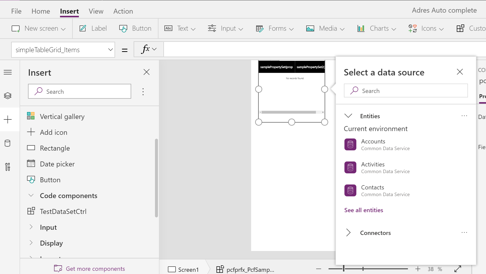
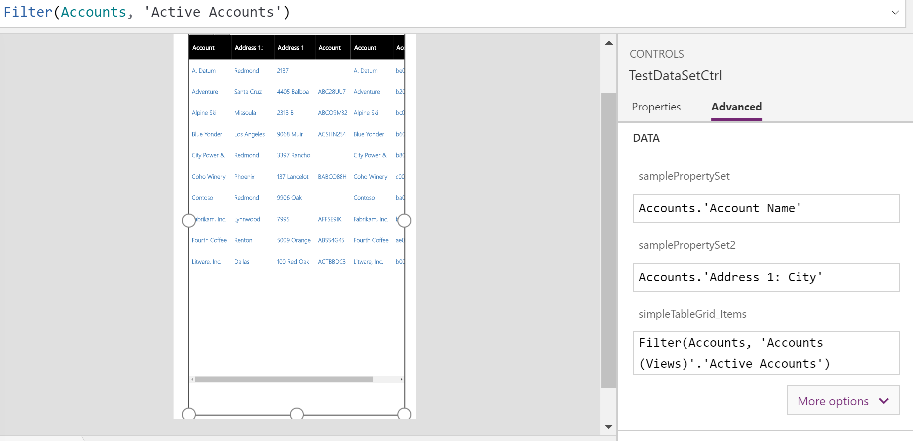

# Implementing dataset component for canvas apps

This sample shows how to create a dataset component for canvas apps. The dataset component also showcases how to use the dataset API methods to get column metadata, record data, page through data, and handle navigation. 

[!INCLUDE[cc-terminology](../../data-platform/includes/cc-terminology.md)]

> [!div class="mx-imgBorder"]
> 

## Available for 

Canvas apps.

## Code

You can download the complete sample component from [here](https://github.com/microsoft/PowerApps-Samples/tree/master/component-framework/PropertySetTableControl).

> [!NOTE]
> Some of the dataset API methods are still not supported in canvas apps. See, [individual API documentation](../reference/index.md) for availability details.
> See, [Dataset component for model-driven apps](data-set-grid-control.md) to learn more about how dataset type components are implemented in model-driven apps.

In this sample, the column information is extracted using the  `context.parameters.[dataset_property_name].columns`. It's an array type. The ways to access them are the same for both canvas and model-driven apps.

You can define multiple datasets in the manifest. The first dataset in the manifest is as the primary dataset. When you configure the multi dataset component, the primary dataset property always has name `Items`. All nonprimary dataset properties will have a `_Items` suffix after the dataset name. 

Certain features in the authoring panel only apply to the primary dataset properties, such as data source selector, field selector, and view selector. To configure a nonprimary dataset property, the maker needs to first import the data source to the app, then set the property value to that secondary data source. Property-set should be used for accessing columns in a nonprimary dataset property. 

### Record binding

- The sorted record IDs information can be extracted using `context.parameters.[dataset_property_name].sortedRecordIds`.
- Get all the records information using `context.parameters.[dataset_property_name].records`.
- Get each record object using `context.parameters.[dataset_property_name].records[record_Id]`
- Formatted value could be retrieved using `getFormattedValue` method.

### Load more pages of data

The `context.parameters.[dataset_property_name].paging` method provides paging functionality. The `Load Next` button is shown if it has next page data. Users can go back to the previous pages using the `Load Prev` button. 

### Property sets

Property-set is used to access individual column values for particular columns in the record. For example, map control can use the longitude and latitude in the data-set to show the location pings in the map. In this sample component, two property sets are defined in the manifest, `samplePropertySet` and `samplePropertySet2`. Users see two empty columns when the component is added to canvas app before any column names is configured. For a property-set, the corresponding columns are added in the beginning and order is 0. 

> [!div class="mx-imgBorder"]
> 

### Sizing

This sample also showcases how the component listens to the container resize. The `trackContainerResize` method should be called within the `init` method so that the `mode.allocatedWidth` and `mode.allocatedHeight` is provided each time when the `updateView` is being called. If this method isn't called initially, they don't have `allocatedWidth` and `allocatedHeight` values provided. If the `allocatedHeight` is –1, that means there's no limit on height. The component should adjust its height based on the provided width.

## Dataset API methods that aren't supported in canvas apps

**Filter & SortStatus**

In this preview for canvas apps, only a limited set of [filtering](../reference/filtering.md) and [sortStatus](../reference/sortstatus.md) methods are supported. Filter and sort can be applied to dataset on primary type columns except for the GUID. Filter and sorting can be applied in the same way as in model-driven apps. To retrieve the dataset with filtering and sorting information, call the methods in `context.parameters.[dataset_property_name].filtering` and `context.parameters.[dataset_property_name].sorting`, then invoke the `context.parameters.[dataset_property_name].refresh()`.

**View**

Views are applicable only when you choose Microsoft Dataverse as a source. In model-driven apps, views are required for dataset components to get the column's information. In canvas apps, views are used as a filter. It's up to the app maker to decide which columns to be added for each of the component. A view can be selected after a source is selected for the dataset component. Selecting a view applies the view's filter to the source. The view name and view ID can be retrieved using the `context.parameters.[dataset_property_name].getTitle()` and `context.parameters.[dataset_property_name].getViewId()` methods.

### Related articles

[Download sample components](https://github.com/microsoft/PowerApps-Samples/tree/master/component-framework) 
[How to use the sample components](../use-sample-components.md) 
[Power Apps component framework API reference](../reference/index.md) 
[Power Apps component framework manifest schema reference](../manifest-schema-reference/index.md)

[!INCLUDE[footer-include](../../../includes/footer-banner.md)]
