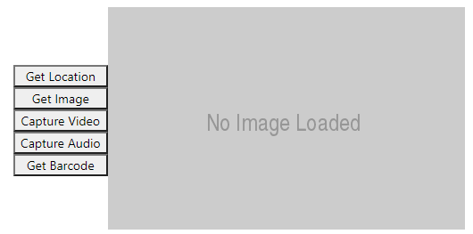

# Implementing a Device API component

This sample component showcases Device API capabilities of the Power Apps control framework.

> [!div class="mx-imgBorder"]
> 

> [!IMPORTANT]
> If you want to use the device API methods, you need to declare the usage of these method in the [feature-usage](../manifest-schema-reference/feature-usage.md) node in the manifest file.

## Available for

Model-driven and canvas apps

## Code

You can download the complete sample component from [here](https://github.com/microsoft/PowerApps-Samples/tree/master/component-framework/DeviceApiControl).

### Related articles
[Download sample components](https://github.com/microsoft/PowerApps-Samples/tree/master/component-framework) 
[How to use the sample components](../use-sample-components.md) 
[Image upload component](./image-upload-control.md) 
[Device API](../reference/device.md) 
[Power Apps component framework API reference](../reference/index.md) 
[Power Apps component framework manifest schema reference](../manifest-schema-reference/index.md)

[!INCLUDE[footer-include](../../../includes/footer-banner.md)]
