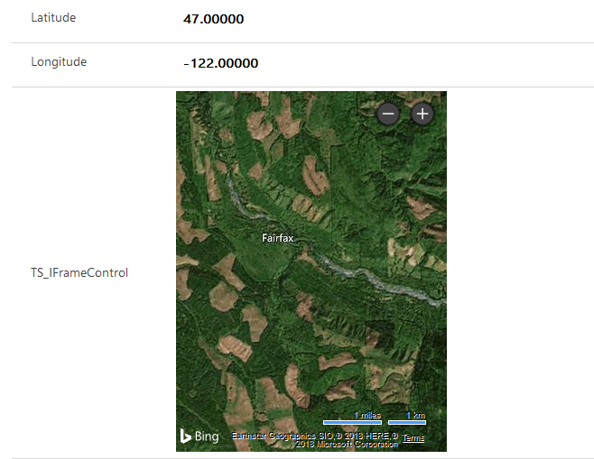

# Implementing a IFRAME component

This sample describes how to bind a code component to different columns on the form and use the value of these columns as input properties to the component. 

[!INCLUDE[cc-terminology](../../data-platform/includes/cc-terminology.md)]

> [!div class="mx-imgBorder"]
> 

## Available for 

Model-driven and canvas apps 

## Code

You can download the complete sample component from [here](https://github.com/microsoft/PowerApps-Samples/tree/master/component-framework/IFrameControl).

> [!NOTE]
> Power Apps component framework does not yet support composite columns, so you will not be able to bind this component to the out of the box latitude and longitude address columns. You need to bind the code component to a different floating-point field.

This sample component renders an `IFRAME` which displays `Bing Maps URL`. The component is bound to two floating point columns on the form, which are passed as parameters to the component and injected into the `IFRAME URL` to update the Bing Map to the latitude and longitude of the provided inputs.  

Update the `Manifest` file to include binding to two additional columns on the form.  
This change informs the Power Apps component framework that these bound columns need to be passed to the component during initialization and whenever one of the values is updated.
  
```xml

<property name="latitudeValue" display-name-key="Bing_Maps_Latitude_Value" description-key="latitude" of-type="FP" usage="bound" required="true" />  
<property name="longitudeValue" display-name-key="Bing_Maps_Longitude_Value" description-key="longitude" of-type="FP" usage="bound" required="true" />  
```

Additional bound properties may be required or not. This will be enforced during the component configuration when the component is being bound to the form. This can be configured by setting the `required` attribute of the property node in the component manifest. Set the value to false if you don't want to require the component property be bound to a field. 
 
`ComponentFramework.d.ts` needs to be updated to add two columns to `IInputs` interface. This is the format the Power Apps component framework passes the field values. Adding these values to the `IInputs` interface allows your TypeScript file to reference the values and compile successfully.  

```TypeScript
    export interface IInputs 
    { latitudeValue: ComponentFramework.PropertyTypes.NumberProperty;  
        longitudeValue: ComponentFramework.PropertyTypes.NumberProperty;  
    }  
 ```

The initial rendering generates an `IFRAME` element and appends it to the controls container. This `IFRAME` is used to display the **Bing Map**. The url of the `IFRAME` is set to a `Bing Map URL` and includes the bound columns (latitudeValue and longitudeValue) in the url to center the map at the provided location. 

The [updateView](../reference/control/updateview.md) method is invoked whenever one of these columns are updated on the form. This method updates the url of the **Bing Map** IFRAME to use the new latitude and longitude values passed to the component. To view this component in run time, bind the component to a field on the form like any other code component.

### Related topics

[Download sample components](https://github.com/microsoft/PowerApps-Samples/tree/master/component-framework)<br/>
[How to use the sample components](../use-sample-components.md)<br/>
[Power Apps component framework manifest schema reference](../manifest-schema-reference/index.md)<br />
[Power Apps component framework API reference](../reference/index.md)<br />
[Power Apps component framework overview](../overview.md)


[!INCLUDE[footer-include](../../../includes/footer-banner.md)]