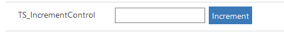

# Implementing increment component

This sample component shows how to bind data with Power Apps component framework and error handling. This component renders as a textbox with an `Increment` button in the runtime. The text box shows the current value and the `Increment` button is clickable. Whenever you click on the button, the value within the textbox is increased by 1. The increment value can be changed to any number you wish.

[!INCLUDE[cc-terminology](../../data-platform/includes/cc-terminology.md)]

To implement this component, the first thing you need to define the [Manifest](../manifest-schema-reference/manifest.md) file, and then implement the custom logic in TypeScript. 

> [!div class="mx-imgBorder"]
> 

## Available for 

Model-driven and canvas apps 

## Code 

You can download the complete sample component from [here](https://github.com/microsoft/PowerApps-Samples/tree/master/component-framework/IncrementControl).

When you click on the button, the value in the text box is increased by 1. The updated value will flow to Power Apps component framework through `notifyOutputChanged` method.

> [!NOTE]
> You can change the increment value when you are configuring the component to the field on the form.

Edit the value in the text box, and if it is a valid integer, then it updates the value to Power Apps component framework. You can continuously click the `Increment` button and update it. If it’s an invalid integer, an error message pops out.

### Related topics

[Download sample components](https://github.com/microsoft/PowerApps-Samples/tree/master/component-framework) 
[How to use the sample components](../use-sample-components.md) 
[Power Apps component framework API reference](../reference/index.md) 
[Power Apps component framework manifest schema reference](../manifest-schema-reference/index.md)

[!INCLUDE[footer-include](../../../includes/footer-banner.md)]