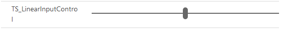

# Implementing linear input component

This sample component changes the user experience of interacting with numeric types on the form. Instead of typing in the numbers, the linear input component provides a linear slider using which the value of the attribute can be set on the form.  

[!INCLUDE[cc-terminology](../../data-platform/includes/cc-terminology.md)]

To implement this component, first you need to define the [Manifest](../manifest-schema-reference/manifest.md) file, and them implement the custom logic in TypeScript. 

> [!div class="mx-imgBorder"]
> 

## Available for 

Model-driven and canvas apps 

## Code 

You can download the complete sample component from [here](https://github.com/microsoft/PowerApps-Samples/tree/master/component-framework/LinearInputControl).


In this sample, a [type-group](../manifest-schema-reference/type-group.md) is defined and named it as `numbers` which includes decimal, whole, floating and currency value types into that group in the manifest. This group is used to bind the component property.

An input element of type `range` with `min` and `max` value set to 1 and 1000, respectively is created. A label element is created which shows the value that is relative to the position of the slider. Attach a function `refreshData` to the `eventlistener` on the input of the component. Create a local variable for saving the [context](../reference/context.md) and `notifyOutputChanged`. Assign the context and notifyOutputChanged from the parameters that are passed as part of the init function.

Implement the logic for the `refreshData` function. As you can see in the sample, we take the value from the `inputElement` and set the value of the component, `innerHTML` property of the `labelElement` and then call the `notifyOutputChanged` so that the changes are cascaded up above the framework layer.

```TypeScript
public refreshData(context: ComponentFramework.IPropBag<InputsOutputs.IInputBag>) 
{ 
   this._value = (this.inputElement.value as any)as number; 
   this.labelElement.innerHTML = this.inputElement.value; 
   this._notifyOutputChanged(); 
} 
```

In the `updateView` method, we get the value of the attribute from the context.parameters and then set it to the value variable which stores the component value and also the input elements in the component. 

```TypeScript

public updateView(context: ComponentFramework.IPropBag<InputsOutputs.IInputBag>): void 
 { 
    this._value = context.parameters.controlValue.raw; 
    this._context = context; 
    this.inputElement.setAttribute("value",context.parameters.controlValue.formatted ? context.parameters.controlValue.formatted : ""); 
    this.labelElement.innerHTML = context.parameters.controlValue.formatted ? context.parameters.controlValue.formatted : ""; 
   } 
 ```

### Related topics

[Download sample components](https://github.com/microsoft/PowerApps-Samples/tree/master/component-framework)<br/>
[How to use the sample components](../use-sample-components.md)<br/>
[Power Apps component framework API reference](../reference/index.md)<br/>
[Power Apps component framework manifest schema reference](../manifest-schema-reference/index.md)


[!INCLUDE[footer-include](../../../includes/footer-banner.md)]