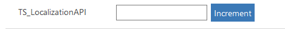

# Implementing localization API component

This sample showcases how localization is done for code components. In this sample, we use the [Increment component](increment-control.md) to localize the text that is displayed on the increment button based on the user’s selected language. 

[!INCLUDE[cc-terminology](../../data-platform/includes/cc-terminology.md)]

Power Apps component framework uses the concept of implementing String(resx) web resources that is used to manage the localized strings shown on any user interface. More information: [String(Resx) Web resources](/dynamics365/customer-engagement/developer/resx-web-resources). 
> [!div class="mx-imgBorder"]
> 

## Available for 

Model-driven and canvas apps 

## Code

You can download the complete sample component from [here](https://github.com/microsoft/PowerApps-Samples/tree/master/component-framework/LocalizationAPIControl).

To localize an existing project, all you need to do is to create additional resource(resx) files, one each for a specific language as mentioned in the string web resources and include them as part of the control’s manifest file under the [resources](../reference/resources.md) node.  

Power Apps component framework identifies the user’s language and returns the strings from that language-specific resource file when you try to access the string using `context.resources.getString` method.

In this sample, two languages `Spanish` and `Finnish` with the language codes 3082 and 1035 respectively defined. We made a copy of the `Increment component` sample and renamed it to `Localization API`. All the corresponding files including the files in the subfolders are renamed accordingly.

In the strings folder under `TS_LocalizationAPI`, two additional resx files with the suffixes corresponding to Spanish and Finnish as 3082 and 1035 are added. The new files created should have their file names ending as `{filename}.3082.resx` and `{filename}.1035.resx` because the framework relies on this naming convention to identify which resource file should be picked for reading the strings for the user.

Ensure that the keys used for strings in all these resource files share the same name across all the languages. Now, when the component is rendered on the UI, we see in the code that we retrieve the value to be displayed on the button using `context.resources.getString("PCF_LocalizationSample_ButtonLabel")`.

When this line of code is executed, the Power Apps component framework automatically identifies the language of the user and picks up the value for the button label using the key provided in the corresponding language file we defined. Below is the text you see for each of the 3 languages we support for this sample component.
  
|LanguageCode |Value Displayed |
|---|---|
|3082 |Incremento |
|1033 |Increment |
|1035 |lisäys | 

### Related topics

[Download sample components](https://github.com/microsoft/PowerApps-Samples/tree/master/component-framework) 
[How to use the sample components](../use-sample-components.md) 
[Power Apps component framework API reference](../reference/index.md) 
[Power Apps component framework manifest schema reference](../manifest-schema-reference/index.md)

[!INCLUDE[footer-include](../../../includes/footer-banner.md)]