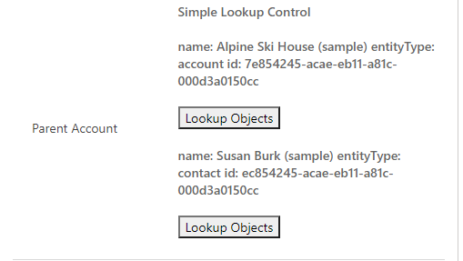

# Implementing simple lookup component

This sample component demonstrates how to leverage the `Lookup.Simple` type on properties of the `field` components. It allows the code component bound to two different simple lookup columns, and for the user to change the currently selected record through the `lookupObjects` API.

> [!NOTE]
> Currently, only `Lookup.Simple` is supported only on model-driven apps.

[!INCLUDE[cc-terminology](../../data-platform/includes/cc-terminology.md)]

> [!div class="mx-imgBorder"]
> 

## Available for

Model-driven apps

## Code 

You can download the complete sample component from [here](https://github.com/microsoft/PowerApps-Samples/tree/master/component-framework/LookupSimpleControl)

In the manifest, two properties of type `Lookup.Simple` are defined. When you add this code component to a column in a model-driven app, it must be placed on the column of type `Lookup.Simple`. The first property defined in the manifest is automatically bound to the primary lookup associated with the column. The second property can be bound to any other simple lookup available in the application. 

This code component renders two text columns with associated `Lookup Objects` buttons in the runtime. Each text column displays the name, entityType, and ID associated with the currently selected record to which the lookup property is bound. Selecting the `Lookup Objects` button triggers the lookupObjects API, and a panel opens up that allows the user to select a new record. Once selected, the component's text column will update to display the newly selected record.

You'll notice that each of the `Lookup Objects` buttons have the same `onClick` call back to the `performLookupObjects` method defined in the code component. This method is responsible for setting the parameters for the call to `lookupObjects`, making the call, updating the component's selected records for either bound property, then making the call to `notifyOutputChanged` to alert the framework that there has been a change in the data of the component.

In `getOutputs`, the component sends back the newly selected record to consume and update. In `updateView`, the component uses the raw value of both lookup properties to display the currently selected lookups for both bound properties.

### Related topics

[Download sample components](https://github.com/microsoft/PowerApps-Samples/tree/master/component-framework) 
[How to use the sample components](../use-sample-components.md) 
[Power Apps component framework API reference](../reference/index.md) 
[Power Apps component framework manifest schema reference](../manifest-schema-reference/index.md)

[!INCLUDE[footer-include](../../../includes/footer-banner.md)]