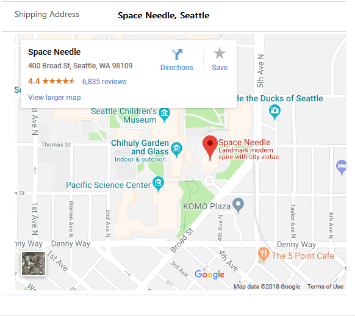

# Implementing map component

This sample component changes the user experience of interacting with address fields on the form. Along with the text values of the address, this component provides the ability to visually identify a particular address on a map without navigating to another tab or screen. 

[!INCLUDE[cc-terminology](../../data-platform/includes/cc-terminology.md)]

> [!div class="mx-imgBorder"]
> 

## Available for 

Model-driven and canvas apps 

## Code 

You can download the complete sample component from [here](https://github.com/microsoft/PowerApps-Samples/tree/master/component-framework/MapControl).

In the manifest file, we defined property of type `Single line of Text`. We use this to bind it to the address field on the form.  

> [!NOTE]
> You can use any of the map API’s that are available in the market. In this example, we are going to show how to do it with the Google Map API. 
You need to create an API key for the component to access the Google Map API. Follow the instructions(https://developers.google.com/maps/documentation/embed/get-api-key to generate one).

Create a variable name `MAPS_API_KEY` that can be accessed in the context of the component.
Google Map API allows you only to render the maps inside an `IFRAME`. So, you need to create an `IFRAME` element that is going to render the map using the URL we generate. 
By default, we are setting the map to be hidden and display it only when the address value exists on the form.

`buildMapUrl` and `renderMap` (you can even merge them into one) takes the address string and embeds it onto the map URL by encoding the address string and then sets the IFRAME element’s src element to the URL respectively. Also, call the **notifyOutputChanged** method to ensure we notify the component that the rendering has changed. 
 
```TypeScript
 public renderMap(mapUrl: string) {
    if (mapUrl) {
      this._iFrameElement.setAttribute("src", mapUrl);
      this._iFrameElement.setAttribute("class", "mapVisibleStyle");
    } else {
      this._iFrameElement.setAttribute("class", "mapHiddenStyle");
    }
    this._notifyOutputChanged();
  }
```

Ensure you call the `renderMap` function inside the [updateView](../reference/control/updateview.md) function to ensure the control is refreshed every time the view is updated. 

### Related topics

[Download sample components](https://github.com/microsoft/PowerApps-Samples/tree/master/component-framework)<br/>
[How to use the sample components](../use-sample-components.md)<br/>
[Power Apps component framework API reference](../reference/index.md)<br/>
[Power Apps component framework manifest schema reference](../manifest-schema-reference/index.md)

[!INCLUDE[footer-include](../../../includes/footer-banner.md)]