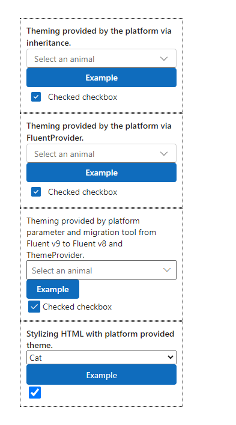

# Implementing a modern theming API component

This sample component showcases a variety of use cases for utilizing the modern theming API capabilities to style your component based on the current theme used in your app. The imported components will adhere to the default Power Apps modern theme initially, until the you have [enabled modern controls and themes for your app](../../../powerapps/maker/canvas-apps/controls/modern-controls/overview-modern-controls.md#enable-modern-controls-and-themes-for-your-app) and [applied a modern theme](../../../maker/canvas-apps/controls/modern-controls/modern-theming#apply-modern-theme).

> [!div class="mx-imgBorder"] > 

## Available for

Canvas apps

## Code

The sample component illustrates four different examples consuming the Power Apps modern theming API.

- Fluent v9 sample with automatic application of the current modern theme: [Automatic Modern Theming](../../component-framework/fluent-modern-theming.md#automatic-modern-theming) 
- Fluent v8 sample styling itself by creating its own v8 ThemeProvider based on the v9 theme tokens passed via the PCF context parameters: [Modern Theming for Fluent UI v8 controls](../../component-framework/fluent-modern-theming.md#modern-theming-for-fluent-ui-v8-controls) 
- Non-Fluent sample that applies styling to its HTML elements by directly referencing v9 theme tokens passed via the PCF context parameters: [Modern Theming for non-Fluent UI controls](../../component-framework/fluent-modern-theming.md#modern-theming-for-non-fluent-ui-controls) 
- Fluent v9 sample creating its own custom v9 FluentProvider modifying the theme passed via the PCF context parameters. [Modern Theming via PCF context parameters](../../component-framework/fluent-modern-theming.md#modern-theming-via-pcf-context-parameters) 

You can download the complete sample component from [here](https://github.com/microsoft/PowerApps-Samples/tree/master/component-framework/FluentThemingAPIControl).

### Related topics

[Download sample components](https://github.com/microsoft/PowerApps-Samples/tree/master/component-framework) 
[How to use the sample components](../use-sample-components.md) 
[Power Apps component framework API reference](../reference/index.md) 
[Style components with modern theming (Preview)](../../component-framework/fluent-modern-theming.md) 
[Theming (Power Apps component framework API reference) | Microsoft Docs](../../../powerapps/developer/component-framework/reference/theming)
[Use modern themes in canvas apps (preview)](../../../maker/canvas-apps/controls/modern-controls/modern-theming)
[Overview of mdoern controls and themes (preview)](../../..//maker/canvas-apps/controls/modern-controls/overview-modern-controls)

[!INCLUDE[footer-include](../../../includes/footer-banner.md)]
