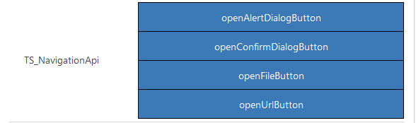

# Implementing Navigation API component

This sample component explores the various methods available as part of the Power Apps component framework navigation API. In this sample, you create a series of buttons that call into the respective methods of the navigation API that matches with the value displayed. 

[!INCLUDE[cc-terminology](../../data-platform/includes/cc-terminology.md)]

> [!div class="mx-imgBorder"]
> 

## Available for 

Model-driven apps

## Code 

You can download the complete sample component from [here](https://github.com/microsoft/PowerApps-Samples/tree/master/component-framework/NavigationAPIControl).

The `openAlertDialog` method provides the capability to display an alert dialog containing a message and a button. You can also implement callback methods when the alert dialog is closed or if an error is encountered when loading the dialog.
  
In this sample when you select on the `openAlertDialogButton` an alert dialog pops up and sets the value of it to `Alert dialog closed` when the dialog is closed either using the `OK` button or the `X` button.

> [!NOTE]
> This is similar to calling the [Xrm.Navigation.openAlertDialog](../../model-driven-apps/clientapi/reference/Xrm-Navigation/openAlertDialog.md) method in ClientAPI.  

The `openConfirmDialog` method provides the ability to display an alert dialog containing a message and two buttons. You can use this method to implement different logic based on the button clicked. You can implement the success callback which is called when the dialog is closed by clicking either of the buttons.
  
This sample shows you a confirm dialog when you select on the `openConfirmDialogButton` and sets the value of it to `Ok` or `Cancel`, or `X` depending on the button that was clicked.

> [!NOTE]
> This is similar to calling the [Xrm.Navigation.openConfirmDialog](../../model-driven-apps/clientapi/reference/Xrm-Navigation/openConfirmDialog.md) method in ClientAPI.
  
The `openFile` method provides the ability to open a file. You'd need to pass in the file object which has the filename, content, mimetype, and the filesize. You can also pass in the optional parameter of the mode you want to open the file as 1 or 2, 1 being the default which opens the file in read or open mode.
  
This sample opens a file named `SampleDemo.txt` in save mode on clicking the `openFileButton`.

> [!NOTE]
> This is similar to calling the [Xrm.Navigation.openFile](../../model-driven-apps/clientapi/reference/Xrm-Navigation/openFile.md) method in ClientAPI.

The `openUrl` method opens a URL. You need to pass the URL as a string to the method and also pass the optional parameters of height, width, and openInNewWindow as true if you want the URL to be opened in a new window.
  
This sample opens a new window and loads the microsoft.com home page on clicking the `openUrlButton`.

> [!NOTE]
> This is similar to calling the [Xrm.Navigation.openUrl](../../model-driven-apps/clientapi/reference/Xrm-Navigation/openUrl.md) method in ClientAPI.

### Related articles

[Download sample components](https://github.com/microsoft/PowerApps-Samples/tree/master/component-framework) 
[How to use the sample components](../use-sample-components.md) 
[Power Apps component framework API reference](../reference/index.md) 
[Power Apps component framework manifest schema reference](../manifest-schema-reference/index.md)

[!INCLUDE[footer-include](../../../includes/footer-banner.md)]
