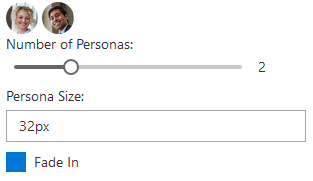

# Implementing the FacePile component

This sample shows how to use React to create components using Power Apps component framework.  The facepile sample component is implemented based on React and the Office UI Fabric React components. The code may not reveal the best practices for the mentioned third-party libraries. 

[!INCLUDE[cc-terminology](../../data-platform/includes/cc-terminology.md)]

> [!div class="mx-imgBorder"]
> 

## Available for 

Model-driven and canvas apps 

## Code

You can download the complete sample component from [here](https://github.com/microsoft/PowerApps-Samples/tree/master/component-framework/ReactStandardControl).

> [!IMPORTANT]
> Although the Power Apps host applications work on top of React, the version of React you bundle will not communicate with the host version, nor is it dependent on that version. A new copy of React (or any third-party library you bundle with your component) will be loaded into the host page for every instance of that control, so be mindful of how large you are making your page(s) as you add components. We will have a solution to this issue in a future release.

This sample provides examples on how to add dependencies for third-party libraries and Office UI Fabric, showcasing how to utilize the Office UI Fabric components for React for UI and perform bi-directional data-binding between the Power Apps component framework and the React state model.

The component sample consists of three Office UI Fabric components: a facepile, a slider, a check box, and a drop-down list. When you move the slider, the number of faces in the facepile changes. The check box components whether the faces fade in and out or simply appear or disappear, and the options in the drop-down list control the size of the faces. If there is no value set, the number of faces defaults to 3.

- When the component is loaded, the slider is set to the bound attribute value. The `context.parameters.[property_name].attributes` property contains the associated metadata.
- An event handler is passed in the React component's props; this will allow the React component to notify the host Power Apps component framework control that a value has changed. The event handler then determines if a call to the **notifyOutputEvents** method is necessary.
- Sliding the slider will cause React to update the bound value and call the passed in event handler. Inside that handler, if a call is made to the **notifyOutputEvents** method, then the control's [getOutputs](../reference/control/getoutputs.md) method will be called asynchronously and will flow to the Power Apps component framework. 
- The framework host updates the bound attribute value, and the updated value flows to the component, triggering the control's [updateView](../reference/control/updateview.md) method. The control then renders again the React component with the new value.

### Related topics

[Download sample components](https://github.com/microsoft/PowerApps-Samples/tree/master/component-framework) 
[How to use the sample components](../use-sample-components.md) 
[Power Apps component framework manifest schema reference](../manifest-schema-reference/index.md) 
[Power Apps component framework API reference](../reference/index.md) 
[Power Apps component framework overview](../overview.md)

[!INCLUDE[footer-include](../../../includes/footer-banner.md)]