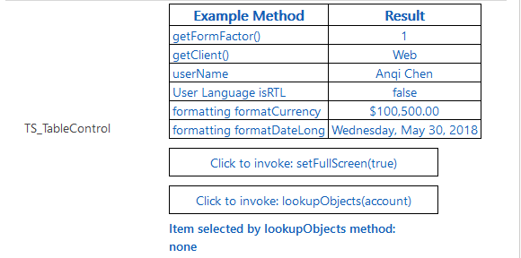

# Implementing table component

This sample component renders a table with two columns. The left column shows the name of the API method or property, and the right column shows the value returned by the API. You can open this component on the different type of devices or modify your language or user settings to see the values adjust correctly in the table. 

[!INCLUDE[cc-terminology](../../data-platform/includes/cc-terminology.md)]

> [!div class="mx-imgBorder"]
> 

## Available for 

Model-driven apps

> [!NOTE]
> When you debug the table component using the command `npm start`, the component is not rendered in the test harness. This is because the component uses the `context.utils.getEntityMetadata`  method which is not supported by Microsoft Power Platform CLI tooling yet.

## Code

You can download the complete sample component from [here](https://github.com/microsoft/PowerApps-Samples/tree/master/component-framework/TableControl).

This sample provides examples on how to use methods from the `Client`, `UserSettings`, `Utility`, `Formatting` interfaces.

This component also showcases two utility functions, `setFullScreen` and `lookupObjects`. These functions are invoked by clicking the button rendered as part of the code component. The `setFullScreen` button toggles the component in and out of full screen mode. The `lookupObjects` button opens a lookup dialog, and then inject the selected record as text into div.

In this sample, we render an HTML button and attach an `onClick` event handler `onLookupObjectsButtonClick` to the button. On click of this button, we invoke `context.utils.lookupObjects()` method and pass as a parameter an array of entity names. 

This method returns a `Promise` object, representing the completion or failure of the call to the lookup dialog. If the p`Promise` is resolved successfully, the lookup object which the user selected is passed as a parameter into the callback method and can be referenced as `data.id`, `data.name`, `data.entityType`.

The callback method injects this information as HTML into a div rendered on the code component to showcase the selected results to the user. If the `Promise` is rejected, the error callback method is invoked where your component can handle the error scenario accordingly.

### Related topics

[Download sample components](https://github.com/microsoft/PowerApps-Samples/tree/master/component-framework) 
[How to use the sample components](../use-sample-components.md) 
[Power Apps component framework API reference](../reference/index.md) 
[Power Apps component framework manifest schema reference](../manifest-schema-reference/index.md)

[!INCLUDE[footer-include](../../../includes/footer-banner.md)]