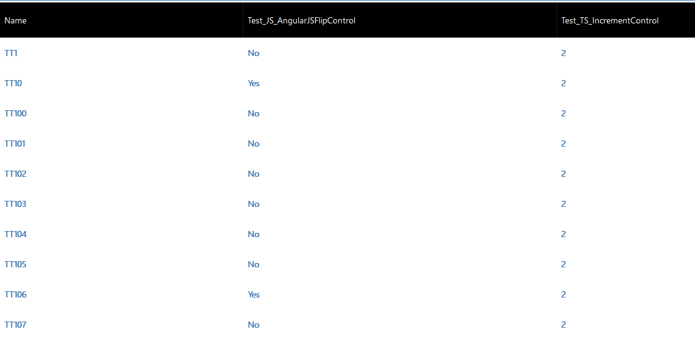

# Implementing table grid component

This sample showcases how to create a simple dataset component, view’s column metadata binding, record binding, more records from paging and record navigation to form.
The component header columns and internal record values are bound to the existing views. 

[!INCLUDE[cc-terminology](../../data-platform/includes/cc-terminology.md)]

> [!div class="mx-imgBorder"]
> 

## Available for 

Model-driven apps  

## Code 

You can download the complete sample component from [here](https://github.com/microsoft/PowerApps-Samples/tree/master/component-framework/TableGrid).

Column Header bind to the View :

View column info lies at `context.parameters.[dataset_property_name].columns`. It’s an array type.

Record binding :

- The sorted record Ids are at `context.parameters.[dataset_property_name].sortedRecordIds`
- All records info is at `context.parameters.[dataset_property_name].records` 
- For each record object, `context.parameters.[dataset_property_name].records[record_Id]` 
- Formatted value could be retrieved at `getFormattedValue` 

Load more page of data if needed :

`context.parameters.[dataset_property_name].paging` will provide paging functionality like `hasNextPage` and `loadNextPage` data. The `Load More` button is shown if it has next page data.

This sample also showcases how the component listens to the container resize. 

The `trackContainerResize` method should be called within [init](../reference/control/init.md) method so that the `mode.allocatedWidth` and `mode.allocatedHeight` will be provided each time [updateView](../reference/control/updateview.md) being called. If this method is not being called initially, then they don't have `allocatedWidth` and `allocatedHeight` provided.

If the allocatedHeight is –1, that means there is no limit on height. The component should adjust its height based on the provided width.

### Related topics

[Download sample components](https://github.com/microsoft/PowerApps-Samples/tree/master/component-framework) 
[How to use the sample components](../use-sample-components.md) 
[Power Apps component framework API reference](../reference/index.md) 
[Power Apps component framework manifest schema reference](../manifest-schema-reference/index.md)

[!INCLUDE[footer-include](../../../includes/footer-banner.md)]