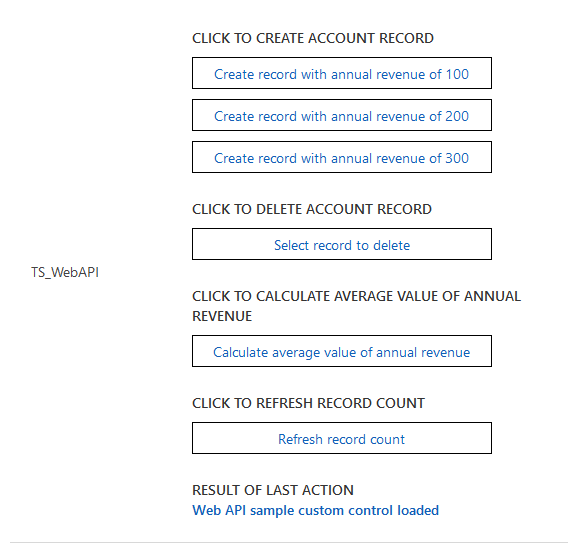

# Implementing Web API component

The web API component is designed to perform create, retrieve, update and delete actions. The component renders four buttons, which can be clicked to invoke different web API actions. The result of the web API call is injected into a HTML div element at the bottom of the code component. 

[!INCLUDE[cc-terminology](../../data-platform/includes/cc-terminology.md)]

> [!div class="mx-imgBorder"]
> 

## Available for 

Model-driven apps

## Code 

You can download the complete sample component from [here](https://github.com/microsoft/PowerApps-Samples/tree/master/component-framework/WebAPIControl).

By default, in the sample, the component is configured to perform the create, retrieve, update actions on the `Account` entity and set the name and revenue fields in the web API examples.

To change the default configuration to any entity or field, update the below configuration values as shown  

 ```TypeScript
  private static _entityName:string = "account";  
  private static _requiredAttributeName: string = "name";  
  private static _requiredAttributeValue: string = "Web API code component (Sample)";  
  private static _currencyAttributeName: string = "revenue";  
 ```

The `createRecord` method renders three buttons, which allows you to create an account record with the revenue field set to different values (100, 200, 300).

When you click one of the create buttons, the button’s `onClick` event handler checks the value of the button clicked and use the web API action to create an account record with the revenue field set to the button’s value. The name field of the account record will be set to `Web API code component (Sample)` with a random `int` appended to the end of the string. The callback method from the web API call injects the result of the web API call (success or failure) into the custom control’s result div.  
 
The `deleteRecord` method renders a button which opens a lookup dialog when clicked. The lookup dialog allows you to select the account record you want to delete. Once an account record is selected from the lookup dialog, it is passed to the `deleteRecord` to delete the record from the database. The callback method from the web API call injects the result of the web API call (success or failure) into the custom control’s result div.  

The FetchXML `retrieveMultiple` method renders a button in the code component. `onClick` of this button, FetchXML is generated and passed to the `retrieveMultiple` function to calculate the average value of the revenue field for all the accounts records. The callback method from the web API call injects the result of the web API call (success or failure) into the custom control’s result div.  

The OData `retrieveMultiple` method renders a button in the code component. `onClick` of this button, OData string is generated and passed to the `retrieveMultiple` function to retrieve all account records with a name field that is like ‘code component Web API (Sample)’, which is true for all account records created by this code component example.  

On successful retrieve of the records, the code component has logic to count how many account records have the revenue field set to 100, 200 or 300, and display this count into an OData status container div on the code component.  The callback method from the web API call injects the result of the web API call (success or failure) into the custom control’s result div.  

### Related topics

[Download sample components](https://github.com/microsoft/PowerApps-Samples/tree/master/component-framework)<br/>
[How to use the sample components](../use-sample-components.md)<br/>
[Power Apps component framework API reference](../reference/index.md)<br/>
[Power Apps component framework manifest schema reference](../manifest-schema-reference/index.md)


[!INCLUDE[footer-include](../../../includes/footer-banner.md)]