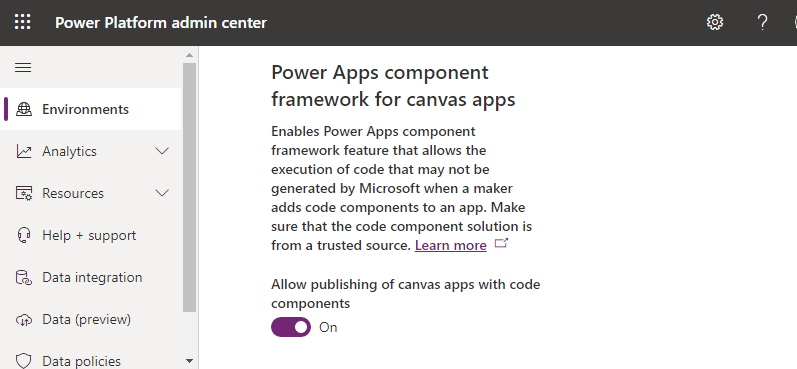

# Tutorial: Creating a canvas app dataset component

In this tutorial, you will create a canvas app dataset code component, deploy, add to a screen, and test the component using Visual Studio Code. The code component displays a paged, scrollable dataset grid that provides sortable and filterable columns. It also allow highlighting of specific rows by configuring an indicator column. This is a common request from app makers and can be complex to implement using native canvas app components. Code components in general can be written to work on both canvas apps and model-driven apps; however this component is written to specifically target use within canvas apps.

In addition to these requirements, you also ensure the code component follows the best practice guidance:

1. Use of [Microsoft Fluent UI](code-components-best-practices.md#use-microsoft-fluent-ui-react) 
1. Allow localization of the code component labels at both design and runtime.
1. Renders at the width and height provided by the parent canvas app screen.
1. Consider allowing the app maker to customize the user interface using input properties and external app elements as far as possible.

> [!div class="mx-imgBorder"]
> 

Before you start, ensure you have installed all of the [Prerequisites](implementing-controls-using-typescript.md#prerequisites).

[!INCLUDE[cc-terminology](../data-platform/includes/cc-terminology.md)]

#### Create a new `pcfproj` project

1. Create a new folder to use for your code component. For example, `C:\repos\CanvasGrid`.

1. Open **Visual Studio Code** and then **File** > **Open Folder**  and select the `CanvasGrid` folder. If you have added the Windows explorer extensions during installation of Visual Studio Code, you can use the **Open with Code** context menu option inside the folder. You can also load any folder into Visual Studio Code using `code .` at the command prompt when the current directory is set to that location.

1. Inside a new Visual Studio Code PowerShell terminal (**Terminal** > **New Terminal**) use the following command to create a new code component project:

   ```shell
   pac pcf init --namespace SampleNamespace --name CanvasGrid --template dataset
   ```

   or using the short form:

   ```shell
   pac pcf init -ns SampleNamespace -n CanvasGrid -t dataset
   ```

1. This adds a new `pcfproj` and related files to the current folder, including a `packages.json` that defines the required modules needed. To install the required modules, use:

   ```CLI
   npm install
   ```

   > [!NOTE]
   >
   > If you receive the message `The term 'npm' is not recognized as the name of a cmdlet, function, script file, or operable program.`, make sure you have installed all the prerequisites, specifically [node.js](https://nodejs.org/en/download/) (LTS version is recommended).

   > [!div class="mx-imgBorder"]
   > 

The template includes an `index.ts` file along with various configuration files. This is the starting point of your code component and contains the lifecycle methods described in [Component implementation](control-implementation-library.md).


#### Install Microsoft Fluent UI

You will be using Microsoft Fluent UI and React for creating UI, so you must install these as dependencies. Use the following at the terminal:

```shell
npm install react react-dom @fluentui/react
```

This adds the modules to the `packages.json` and install them into the `node_modules` folder. You will not commit `node_modules` into source control since all the required modules can be restored using `npm install`.

One of the advantages of Microsoft Fluent UI is that it provides a consistent and highly [accessible](code-components-best-practices.md#check-accessibility) UI.

#### Configuring `eslint`

The template used by `pac pcf init` installs the `eslint` module to your project and configures it by adding an `.eslintrc.json` file. `Eslint` now requires configuring for TypeScript and React coding styles. More information: [Linting - Best practices and guidance for code components](code-components-best-practices.md#linting).

## Defining the dataset properties

The `CanvasGrid\ControlManifest.Input.xml` file defines the metadata describing the behavior of the code component. The [control](manifest-schema-reference/control.md) attributes already has the namespace and name of the component. You must define the records that the code component can be bound to, by adding the following inside the `control` element, replacing the existing `data-set` element:

```xml
<data-set name="records" display-name-key="Records_Dataset_Display">
      <property-set name="HighlightIndicator" display-name-key="HighlightIndicator_Disp" description-key="HighlightIndicator_Desc" of-type="SingleLine.Text" usage="bound" required="true" />
</data-set>
```

The records [data-set](manifest-schema-reference\data-set.md) will be bound to a data source when the code component is added to a canvas app. The [property-set](manifest-schema-reference\property-set.md) indicates that the user must configure one of the columns of that dataset to be used as the row highlight indicator.

> [!TIP]
> You can specify multiple data-set elements. This could be useful if you wanted to search one dataset but show a list of records using a second.

### Defining the input and output properties

In addition to the dataset, you can provide the following **input** properties:

- `HighlightValue` - Allows the app maker to provide a value to be compared against the column defined as the `HighlightIndicator` `propert-set`. When the values are equal, the row should be highlighted.
- `HighlightColor` - Allow the app maker to provide a color to highlight rows using.

> [!TIP]
> It is recommended to provide input properties for styling of common aspects of your code components when creating code components for use in canvas apps.

In addition to the input properties, an **output** property named `FilteredRecordCount` will be updated (and triggers the `OnChange` event) when the rows count is changed because of a filter action applied inside the code component. This is helpful when you want to show a `No Rows Found` message inside the parent app.

> [!NOTE]
> In the future, code components will support custom events so that you can define a specific event rather than using the generic `OnChange` event.

To define these three properties, add the following to the `CanvasGrid\ControlManifest.Input.xml` file, below the `data-set` element:

```xml
<property name="FilteredRecordCount" display-name-key="FilteredRecordCount_Disp" description-key="FilteredRecordCount_Desc" of-type="Whole.None" usage="output" />
<property name="HighlightValue" display-name-key="HighlightValue_Disp" description-key="HighlightValue_Desc" of-type="SingleLine.Text" usage="input" required="true"/>
<property name="HighlightColor" display-name-key="HighlightColor_Disp" description-key="HighlightColor_Desc" of-type="SingleLine.Text" usage="input" required="true"/>
```

**Save** this file, and then at the command-line, use:

```shell
npm run build
```
After the component is built, you see that:

1. An automatically generated file  `CanvasGrid\generated\ManifestTypes.d.ts` is added to your project. This is generated as part of the build process from the `ControlManifest.Input.xml` and provides the types for interacting with the input/output properties.

2. The build output is added to the `out` folder. The `bundle.js` is the transpiled JavaScript that runs inside the browser, and the `ControlManifest.xml` is a reformatted version of the `ControlManifest.Input.xml` file that is used during deployment. 

   > [!NOTE]
   > Do not modify the `generated` and `out` folder contents directly, they will be overwritten as part of the build process.

## Grid Fluent UI React component

When the code component uses React, there must be a single root component that is rendered within the `updateView` method. Inside the `CanvasGrid` folder, add a new TypeScript file, named `Grid.tsx`. Add the following content:

```react
import { DetailsList } from '@fluentui/react/lib/components/DetailsList/DetailsList';
import {
    ConstrainMode,
    DetailsListLayoutMode,
    IColumn,
    IDetailsHeaderProps,
} from '@fluentui/react/lib/components/DetailsList/DetailsList.types';
import { Overlay } from '@fluentui/react/lib/components/Overlay/Overlay';
import { ScrollablePane } from '@fluentui/react/lib/components/ScrollablePane/ScrollablePane';
import { ScrollbarVisibility } from '@fluentui/react/lib/components/ScrollablePane/ScrollablePane.types';
import { Stack } from '@fluentui/react/lib/components/Stack/Stack';
import { Sticky } from '@fluentui/react/lib/components/Sticky/Sticky';
import { StickyPositionType } from '@fluentui/react/lib/components/Sticky/Sticky.types';
import { IObjectWithKey } from '@fluentui/react/lib/Selection';
import { IRenderFunction } from '@fluentui/react/lib/Utilities';
import * as React from 'react';

type DataSet = ComponentFramework.PropertyHelper.DataSetApi.EntityRecord & IObjectWithKey;

export class GridProps {
    width?: number;
    height?: number;
    columns: ComponentFramework.PropertyHelper.DataSetApi.Column[];
    records: Record<string, ComponentFramework.PropertyHelper.DataSetApi.EntityRecord>;
    sortedRecordIds: string[];
    hasNextPage: boolean;
    hasPreviousPage: boolean;
    totalResultCount: number;
    currentPage: number;
    sorting: ComponentFramework.PropertyHelper.DataSetApi.SortStatus[];
    filtering: ComponentFramework.PropertyHelper.DataSetApi.FilterExpression;
    resources: ComponentFramework.Resources;
    itemsLoading: boolean;
    highlightValue: string | null;
    highlightColor: string | null;
}

const onRenderDetailsHeader: IRenderFunction<IDetailsHeaderProps> = (props, defaultRender) => {
    if (props && defaultRender) {
        return (
            <Sticky stickyPosition={StickyPositionType.Header} isScrollSynced>
                {defaultRender({
                    ...props,
                })}
            </Sticky>
        );
    }
    return null;
};

const onRenderItemColumn = (
    item?: ComponentFramework.PropertyHelper.DataSetApi.EntityRecord,
    index?: number,
    column?: IColumn,
) => {
    if (column && column.fieldName && item) {
        return <>{item?.getFormattedValue(column.fieldName)}</>;
    }
    return <></>;
};

export const Grid = React.memo((props: GridProps) => {
    const {
        records,
        sortedRecordIds,
        columns,
        width,
        height,
        hasNextPage,
        hasPreviousPage,
        sorting,
        filtering,
        currentPage,
        itemsLoading,
    } = props;

    const [isComponentLoading, setIsLoading] = React.useState<boolean>(false);

    const items: (DataSet | undefined)[] = React.useMemo(() => {
        setIsLoading(false);

        const sortedRecords: (DataSet | undefined)[] = sortedRecordIds.map((id) => {
            const record = records[id];
            return record;
        });

        return sortedRecords;
    }, [records, sortedRecordIds, hasNextPage, setIsLoading]);

    const gridColumns = React.useMemo(() => {
        return columns
            .filter((col) => !col.isHidden && col.order >= 0)
            .sort((a, b) => a.order - b.order)
            .map((col) => {
                const sortOn = sorting && sorting.find((s) => s.name === col.name);
                const filtered =
                    filtering && filtering.conditions && filtering.conditions.find((f) => f.attributeName == col.name);
                return {
                    key: col.name,
                    name: col.displayName,
                    fieldName: col.name,
                    isSorted: sortOn != null,
                    isSortedDescending: sortOn?.sortDirection === 1,
                    isResizable: true,
                    isFiltered: filtered != null,
                    data: col,
                } as IColumn;
            });
    }, [columns, sorting]);

    const rootContainerStyle: React.CSSProperties = React.useMemo(() => {
        return {
            height: height,
            width: width,
        };
    }, [width, height]);

    return (
        <Stack verticalFill grow style={rootContainerStyle}>
            <Stack.Item grow style={{ position: 'relative', backgroundColor: 'white' }}>
                <ScrollablePane scrollbarVisibility={ScrollbarVisibility.auto}>
                    <DetailsList
                        columns={gridColumns}
                        onRenderItemColumn={onRenderItemColumn}
                        onRenderDetailsHeader={onRenderDetailsHeader}
                        items={items}
                        setKey={`set${currentPage}`} // Ensures that the selection is reset when paging
                        initialFocusedIndex={0}
                        checkButtonAriaLabel="select row"
                        layoutMode={DetailsListLayoutMode.fixedColumns}
                        constrainMode={ConstrainMode.unconstrained}
                    ></DetailsList>
                </ScrollablePane>
                {(itemsLoading || isComponentLoading) && <Overlay />}
            </Stack.Item>
        </Stack>
    );
});

Grid.displayName = 'Grid';
```

> [!NOTE]
> The file has the extension `tsx` which is a TypeScript file that supports XML style syntax used by React. It is compiled into standard JavaScript by the build process. 

From the above code, you see that:

1. The line `const { ... } = props;` is called 'destructuring', where you extract the columns (fields) required to render from the props, rather than prefixing them with `props.` each time they are used.

2. You import the Fluent UI components using path-based imports so that your bundle size will be smaller. Instead of:

   ```typescript
   import { DetailsList, Stack } from '@fluentui/react';
   ```

   You'll use:

   ```typescript
   import { DetailsList } from '@fluentui/react/lib/components/DetailsList/DetailsList';
   import { Stack } from '@fluentui/react/lib/components/Stack/Stack';
   ```

   An alternative would be to use [tree-shaking.](code-components-best-practices.md#use-path-based-imports-from-fluent-to-reduce-bundle-size) 

3. This is a React functional component, but equally it could be a class component. This is entirely based on your preferred coding style. Class components and functional components can be mixed in the same project. Both function and class components use the `tsx` XML style syntax used by React.

4. You can use  `React.memo` to wrap your functional component so that it will not render unless any of the input props have changed. 

5. `React.useMemo` is used to ensure that the item array created is only mutated when the input props `options` or `configuration` have change. This is a best practice of function components that reduces unnecessary renders of the child components.

6. The `DetailsList` in a `Stack`  is wrapped because later you will add a footer element with the paging controls.

7. The Fluent UI `Sticky` component is used to wrap the header columns (using `onRenderDetailsHeader`) so that they remain visible when scrolling the grid.

8. `setKey` is passed to the `DetailsList` along with `initialFocusedIndex` so that when the current page changes, the scroll position and selection will be reset.

9. The function `onRenderItemColumn` is used to render the cell contents. It accepts row item, which you use [getFormattedValue](reference\entityrecord\getformattedvalue.md) on to return the display value of the column. The [getValue](reference\entityrecord\getvalue.md) method returns a value that you could use to provide an alternative rendering. The advantage of `getFormattedValue` is that it contains a formatted string for columns of non-string types such as dates and lookups.

10. The `gridColumns` block is mapping the object shape of the columns provided by the dataset context, onto the shape expected by the `DetailsList` columns prop. Since this is wrapped in the `useMemo` React hook, the output will only change when the `columns` or `sorting` props change. You can display the sort and filter icons on the columns where the sorting and filtering details provided by the code component context matches the column being mapped. The columns are sorted using the [`column.order`](reference\column.md#order) property to ensure they are in the correct order on the grid as defined by the app maker.

11. You are maintaining an internal state for `isComponentLoading` in our React component. This is because when the user selects sorting and filtering actions, you can grey out the grid as a visual cue until the `sortedRecordIds` are updated and the state is reset. There is an additional input prop called `itemsLoading` which is mapped to the [dataset.loading](reference\dataset.md#loading) property provided by the dataset context. Both flags are used to control the visual loading cue that is implemented using the Fluent UI `Overlay` component.

Replace the existing imports with the following to the header of `index.ts`:

```typescript
import { initializeIcons } from "@fluentui/react/lib/Icons";
import * as React from "react";
import * as ReactDOM from "react-dom";
import { IInputs, IOutputs } from "./generated/ManifestTypes";
import { Grid } from "./Grid";

initializeIcons(undefined, { disableWarnings: true });
```

> [!NOTE]
> The import of `initializeIcons` is required because you are using the Fluent UI icon set. You call `initializeIcons` to load the icons inside the test harness - inside canvas apps they are already initialized. 

Add the following class fields underneath `export class GridCanvas`:

```typescript
notifyOutputChanged: () => void;
container: HTMLDivElement;
context: ComponentFramework.Context<IInputs>;
sortedRecordsIds: string[] = [];
resources: ComponentFramework.Resources;
isTestHarness: boolean;
records: {
    [id: string]: ComponentFramework.PropertyHelper.DataSetApi.EntityRecord;
};
currentPage = 1;
filteredRecordCount?: number;
```

Add the following to `init`:

```typescript
this.notifyOutputChanged = notifyOutputChanged;
this.container = container;
this.context = context;
this.context.mode.trackContainerResize(true);
this.resources = this.context.resources;
this.isTestHarness = document.getElementById('control-dimensions') !== null;
```

The `init` function is called when the code component is first initialized on an app screen. You store a reference to the following:

- `notifyOutputChanged` - This is the callback provided that you call to notify the canvas app that one of the properties has changed.

- `container` - This is the DOM element that you add your code component UI to.

- `resources` - Used to retrieve localized strings in the current user's language.

The [trackContainerResize(true)](reference\mode\trackcontainerresize.md) is used so that `updateView` will be called when the code component changes size.

> [!NOTE]
> Currently there is no way to determine if the code component is running inside the test harness. You need to detect if the control-dimensions div is present as an indicator.

Add the following to `updateView`:

```typescript
const dataset = context.parameters.records;
const paging = context.parameters.records.paging;
const datasetChanged = context.updatedProperties.indexOf('dataset') > -1;
const resetPaging =
      datasetChanged && !dataset.loading && !dataset.paging.hasPreviousPage && this.currentPage !== 1;

if (resetPaging) {
    this.currentPage = 1;
}
if (resetPaging || datasetChanged || this.isTestHarness) {
    this.records = dataset.records;
    this.sortedRecordsIds = dataset.sortedRecordIds;
}

// The test harness provides width/height as strings
const allocatedWidth = parseInt(context.mode.allocatedWidth as unknown as string);
const allocatedHeight = parseInt(context.mode.allocatedHeight as unknown as string);

ReactDOM.render(
    React.createElement(Grid, {
        width: allocatedWidth,
        height: allocatedHeight,
        columns: dataset.columns,
        records: this.records,
        sortedRecordIds: this.sortedRecordsIds,
        hasNextPage: paging.hasNextPage,
        hasPreviousPage: paging.hasPreviousPage,
        currentPage: this.currentPage,
        totalResultCount: paging.totalResultCount,
        sorting: dataset.sorting,
        filtering: dataset.filtering && dataset.filtering.getFilter(),
        resources: this.resources,
        itemsLoading: dataset.loading,
        highlightValue: this.context.parameters.HighlightValue.raw,
        highlightColor: this.context.parameters.HighlightColor.raw,
    }),
    this.container,
);
```

You can see that:

1. You call `React.createElement`, passing the reference to the DOM container you received inside the `init` function.
2. The `Grid` component is defined inside `Grid.tsx` and is imported at the top of the file.
3. The `allocatedWidth` and `allocatedHeight` will be provided by the parent context whenever they change (for example, the app resizes the code component or you enter full screen mode) since you made a call to [trackContainerResize(true)](reference\mode\trackcontainerresize.md) inside the `init` function. 
4. You can detect when there are new rows to display when the [updatedProperties](reference\updatedproperties.md) array contains the `dataset` string. 
5. In the test harness, the `updatedProperties` array is not populated, so you can use the `isTestHarness` flag you set in the `init` function to short-circuit the logic that sets the `sortedRecordId` and `records`. You maintain a reference to the current values until they change, so that you do not mutate these when passed to the child component unless a re-render of the data is required.
6. Since the code component maintains the state of which page you are displaying, the page number is reset when the parent context resets the records to the first page. You know when you are back on the first page when `hasPreviousPage` is false.

Lastly, you need to tidy up when the code component is destroyed:

```typescript
public destroy(): void {
    ReactDOM.unmountComponentAtNode(this.container);
}
```

You can use `npm start watch` to see the simple grid inside the test harness. You need to set the width and height to see the code component grid that is populated using the sample three records. You can then export a set of records into a CSV file from Dataverse and then load into the test harness using  **Data Inputs** > **Records panel**:

> [!div class="mx-imgBorder"]
> 

> [!NOTE]
> There is only a single column shown in the test harness irrespective of the columns you provide in the CSV file loaded. This is because the test harness only shows property-set when there is one defined. If no `property-set` are defined, then the columns will be populated with all of the columns in the loaded CSV file.

### Adding row selection

Although the Fluent UI `DetailsList` allows selecting records by default, the selected records are not linked to the output of the code component. You need the `Selected` and `SelectedItems` properties to reflect the chosen records inside a canvas app, so that related components can be updated. In this example, you allow selecting of only a single item at a time so `SelectedItems` will only ever contain a single record.

Add the following to the imports inside `Grid.tsx`

```typescript
import { useConst } from "@fluentui/react-hooks/lib/useConst";
import { useForceUpdate } from '@fluentui/react-hooks/lib/useForceUpdate';
import { Selection } from '@fluentui/react/lib/Selection';
import { SelectionMode } from '@fluentui/react/lib/Utilities';
```

To the `GridProps` interface inside `Grid.tsx`, add the following:

```typescript
setSelectedRecords: (ids: string[]) => void;
```

Inside the `Grid.tsx` function component (just below `export const Grid = React.memo((props: GridProps) => {`), update the destructuring of the props to add the new prop `setSelectedRecords` following:

```typescript
const {
    ...
    setSelectedRecords,
} = props;
```

And then add the following:

```typescript
const forceUpdate = useForceUpdate();
const onSelectionChanged = React.useCallback(() => {
    const items = selection.getItems() as DataSet[];
    const selected = selection.getSelectedIndices().map((index: number) => {
        const item: DataSet | undefined = items[index];
        return item && items[index].getRecordId();
    });

    setSelectedRecords(selected);
    forceUpdate();
}, [forceUpdate]);

const selection: Selection = useConst(() => {
    return new Selection({
        selectionMode: SelectionMode.single,
        onSelectionChanged: onSelectionChanged,
    });
});
```

The `useCallback` and `useConst` hooks are used to ensure that these values do not mutate between renders and cause unnecessary child component rendering. The `useForceUpdate` hook is used to ensure that when selection is updated, the component is re-rendered to reflect the updated selection count.

The selection object created to maintain the state of the selection is then passed into the `DetailsList` component:

```typescript
<DetailsList
    ...
    selection={selection}
```

You need to define the new `setSelectedRecords` callback inside `index.ts` and pass it to the `Grid` component. At the top of `CanvasGrid` class inside `index.ts`, add the following:

```typescript
setSelectedRecords = (ids: string[]): void => {
    this.context.parameters.records.setSelectedRecordIds(ids);
};
```

> [!NOTE] 
> The method is defined as an 'arrow function' to bind it to the current `this` instance of the code component.

The call to [setSelectedRecordIds](reference\dataset\setselectedrecordids.md) informs the canvas app that the selection has changed so that other components referencing `SelectedItems` and `Selected` will be updated.

Finally, add the new callback to the input props of the Grid component in the `updateView` method:

```typescript
ReactDOM.render(
    React.createElement(Grid, {
        ...
        setSelectedRecords: this.setSelectedRecords,
    }),
```

### Invoking the `OnSelect` event

There is a pattern in canvas apps where if a gallery or grid has an item selection invoked (for example, selecting a chevron icon) it raises the `OnSelect` event. You can implement this pattern using the [openDatasetItem](reference\dataset\opendatasetitem.md) method of the dataset. 

As before, you add an additional callback prop on the `Grid` component by adding the following to the `GridProps` interface inside `Grid.tsx`:

```typescript
export class GridProps {
    ...
    onNavigate: (item?: ComponentFramework.PropertyHelper.DataSetApi.EntityRecord) => void;
}
```

Again, you must add the new prop to the destructuring of the props:

```typescript
const {
    ...
    onNavigate,
} = props;
```

The `DetailList` has a callback prop called `onItemInvoked` which in-turn you pass your callback to:

```react
<DetailsList
    ...
    onItemInvoked={onNavigate}
```

Add the `onNavigate` method to the `index.ts` just below the `setSelectedRecords` method:

```typescript
onNavigate = (item?: ComponentFramework.PropertyHelper.DataSetApi.EntityRecord): void => {
    if (item) {
        this.context.parameters.records.openDatasetItem(item.getNamedReference());
    }
};
```

This simply invokes the `openDatasetItem` method on the dataset record so that the code component will raise the `OnSelect` event. The method is defined as an 'arrow function' to bind it to the current `this` instance of the code component.

You need to pass this callback into the `Grid` component props inside the `updateView` method:

```typescript
ReactDOM.render(
    React.createElement(Grid, {
        ...
        onNavigate: this.onNavigate,
    }),
```

When you save all files, the test harness will reload. If you use `Ctrl` + `Shift` + `I` (or `F12`) and use **Open File** (`Ctrl` + `P`) searching for `index.ts`, you can place a breakpoint inside the `onNavigate` method. Double-clicking on a row or (or highlighting it with the cursor keys and pressing `Enter`) will cause the breakpoint to be hit because the `DetailsList` invokes the `onNavigate` callback.

> [!div class="mx-imgBorder"]
> 

There is a reference to `_this` because the function is defined as an arrow function and has been transpiled into a JavaScript closure to capture the instance of `this`.

## Adding Localization

Before you go any further, you need to add resource strings to our code component so that you can use localized strings for messages such as paging, sorting, and filtering. Add a new file `CanvasGrid\strings\CanvasGrid.1033.resx` with the following contents:

```xml
<?xml version="1.0" encoding="utf-8"?>
<root>
  <xsd:schema id="root" xmlns="" xmlns:xsd="http://www.w3.org/2001/XMLSchema" xmlns:msdata="urn:schemas-microsoft-com:xml-msdata">
    <xsd:import namespace="http://www.w3.org/XML/1998/namespace"/>
    <xsd:element name="root" msdata:IsDataSet="true">
      <xsd:complexType>
        <xsd:choice maxOccurs="unbounded">
          <xsd:element name="metadata">
            <xsd:complexType>
              <xsd:sequence>
                <xsd:element name="value" type="xsd:string" minOccurs="0"/>
              </xsd:sequence>
              <xsd:attribute name="name" use="required" type="xsd:string"/>
              <xsd:attribute name="type" type="xsd:string"/>
              <xsd:attribute name="mimetype" type="xsd:string"/>
              <xsd:attribute ref="xml:space"/>
            </xsd:complexType>
          </xsd:element>
          <xsd:element name="assembly">
            <xsd:complexType>
              <xsd:attribute name="alias" type="xsd:string"/>
              <xsd:attribute name="name" type="xsd:string"/>
            </xsd:complexType>
          </xsd:element>
          <xsd:element name="data">
            <xsd:complexType>
              <xsd:sequence>
                <xsd:element name="value" type="xsd:string" minOccurs="0" msdata:Ordinal="1"/>
                <xsd:element name="comment" type="xsd:string" minOccurs="0" msdata:Ordinal="2"/>
              </xsd:sequence>
              <xsd:attribute name="name" type="xsd:string" use="required" msdata:Ordinal="1"/>
              <xsd:attribute name="type" type="xsd:string" msdata:Ordinal="3"/>
              <xsd:attribute name="mimetype" type="xsd:string" msdata:Ordinal="4"/>
              <xsd:attribute ref="xml:space"/>
            </xsd:complexType>
          </xsd:element>
          <xsd:element name="resheader">
            <xsd:complexType>
              <xsd:sequence>
                <xsd:element name="value" type="xsd:string" minOccurs="0" msdata:Ordinal="1"/>
              </xsd:sequence>
              <xsd:attribute name="name" type="xsd:string" use="required"/>
            </xsd:complexType>
          </xsd:element>
        </xsd:choice>
      </xsd:complexType>
    </xsd:element>
  </xsd:schema>
  <resheader name="resmimetype">
    <value>text/microsoft-resx</value>
  </resheader>
  <resheader name="version">
    <value>2.0</value>
  </resheader>
  <resheader name="reader">
    <value>System.Resources.ResXResourceReader, System.Windows.Forms, Version=4.0.0.0, Culture=neutral, PublicKeyToken=b77a5c561934e089</value>
  </resheader>
  <resheader name="writer">
    <value>System.Resources.ResXResourceWriter, System.Windows.Forms, Version=4.0.0.0, Culture=neutral, PublicKeyToken=b77a5c561934e089</value>
  </resheader>
  <data name="Records_Dataset_Display" xml:space="preserve">
    <value>Records</value>
  </data>
  <data name="FilteredRecordCount_Disp" xml:space="preserve">
    <value>Filtered Record Count</value>
  </data>
  <data name="FilteredRecordCount_Desc" xml:space="preserve">
    <value>The number of records after filtering</value>
  </data>
  <data name="HighlightValue_Disp" xml:space="preserve">
    <value>Highlight Value</value>
  </data>
  <data name="HighlightValue_Desc" xml:space="preserve">
    <value>The value to indicate a row should be highlighted</value>
  </data>
  <data name="HighlightColor_Disp" xml:space="preserve">
    <value>Highlight Color</value>
  </data>
  <data name="HighlightColor_Desc" xml:space="preserve">
    <value>The color to highlight a row using</value>
  </data>
  <data name="HighlightIndicator_Disp" xml:space="preserve">
    <value>Hightlight Indicator Field</value>
  </data>
  <data name="HighlightIndicator_Desc" xml:space="preserve">
    <value>Set to the name of the field to compare against the Highlight Value</value>
  </data>
   <data name="Label_Grid_Footer" xml:space="preserve">
    <value>Page {0} ({1} Selected)</value>
  </data>
  <data name="Label_SortAZ" xml:space="preserve">
    <value>A to Z</value>
  </data>
  <data name="Label_SortZA" xml:space="preserve">
    <value>Z to A</value>
  </data>
  <data name="Label_DoesNotContainData" xml:space="preserve">
    <value>Does not contain data</value>
  </data>
  <data name="Label_ShowFullScreen" xml:space="preserve">
    <value>Show Full Screen</value>
  </data>
</root>
```

> [!TIP]
> It's not recommended to edit `resx` files directly, instead you can use either Visual Studio's resource editor, or an extension for Visual Studio Code.

You have resource strings for the `input`/`output` properties and the `dataset` and associated `property-set`. These will be used in Power Apps Studio at design time based on the maker's browser language. You can also add label strings that can be retrieved at runtime using [getString](reference\resources\getstring.md). More information:  [Implementing localization API component](sample-controls\localization-api-control.md).

This new resource file should be added to the `ControlManifest.Input.xml` file inside the `resources` element:

```xml
<resx path="strings/CanvasGrid.1033.resx" version="1.0.0" />
```

### Adding column sorting and filtering

If you want to allow the user to sort and filter using grid column headers. The Fluent UI `DetailList` provides an easy way of adding context menus to the column headers.

First, you add to the `GridProps` interface inside `Grid.tsx` to provide callback functions for sorting and filtering:

```typescript
export class GridProps {
    ...
    onSort: (name: string, desc: boolean) => void;
    onFilter: (name: string, filtered: boolean) => void;
}
```

Then, add these new props along with the `resources` reference (so you can retrieve localized labels for sorting and filtering), to the props destructuring:

```typescript
const {
    ...
    onSort,
    onFilter,
    resources,
} = props;
```

You need to add some imports to the top of `Grid.tsx` so that you can use the `ContextualMenu` component provided by Fluent UI. You can use path-based imports to reduce the size of the bundle.

```typescript
import { DirectionalHint, IContextualMenuProps } from '@fluentui/react/lib/components/ContextualMenu/ContextualMenu.types';
import { ContextualMenu } from '@fluentui/react/lib/components/ContextualMenu/ContextualMenu';
```

Now add the context menu rendering functionality to `Grid.tsx` just below the `const [isComponentLoading, setIsLoading] = React.useState<boolean>(false);`:

```react
const [contextualMenuProps, setContextualMenuProps] = React.useState<IContextualMenuProps>();

const onContextualMenuDismissed = React.useCallback(() => {
    setContextualMenuProps(undefined);
}, [setContextualMenuProps]);

const getContextualMenuProps = React.useCallback(
    (column: IColumn, ev: React.MouseEvent<HTMLElement>): IContextualMenuProps => {
    const menuItems = [
    {
    key: 'aToZ',
    name: resources.getString('Label_SortAZ'),
      iconProps: { iconName: 'SortUp' },
          canCheck: true,
              checked: column.isSorted && !column.isSortedDescending,
                  disable: (column.data as ComponentFramework.PropertyHelper.DataSetApi.Column).disableSorting,
                      onClick: () => {
                          onSort(column.key, false);
                          setContextualMenuProps(undefined);
                          setIsLoading(true);
                      },
},
    {
        key: 'zToA',
            name: resources.getString('Label_SortZA'),
                iconProps: { iconName: 'SortDown' },
                    canCheck: true,
                        checked: column.isSorted && column.isSortedDescending,
                            disable: (column.data as ComponentFramework.PropertyHelper.DataSetApi.Column).disableSorting,
                                onClick: () => {
                                    onSort(column.key, true);
                                    setContextualMenuProps(undefined);
                                    setIsLoading(true);
                                },
    },
        {
            key: 'filter',
                name: resources.getString('Label_DoesNotContainData'),
                    iconProps: { iconName: 'Filter' },
                        canCheck: true,
                            checked: column.isFiltered,
                                onClick: () => {
                                    onFilter(column.key, column.isFiltered !== true);
                                    setContextualMenuProps(undefined);
                                    setIsLoading(true);
                                },
        },
            ];
return {
    items: menuItems,
    target: ev.currentTarget as HTMLElement,
    directionalHint: DirectionalHint.bottomLeftEdge,
    gapSpace: 10,
    isBeakVisible: true,
    onDismiss: onContextualMenuDismissed,
};
},
    [setIsLoading, onFilter, setContextualMenuProps],
        );

const onColumnContextMenu = React.useCallback(
    (column?: IColumn, ev?: React.MouseEvent<HTMLElement>) => {
        if (column && ev) {
            setContextualMenuProps(getContextualMenuProps(column, ev));
        }
    },
    [getContextualMenuProps, setContextualMenuProps],
);

const onColumnClick = React.useCallback(
    (ev: React.MouseEvent<HTMLElement>, column: IColumn) => {
        if (column && ev) {
            setContextualMenuProps(getContextualMenuProps(column, ev));
        }
    },
    [getContextualMenuProps, setContextualMenuProps],
);
```

You see that:

1. The `contextualMenuProps` state is used to control the visibility of the context menu that is rendered using the Fluent UI `ContextualMenu` component.
2. You are providing a simple filter to show only values where the field does not contain any data. You could extend this to provide additional filtering.
3. You are using `resources.getString` to show labels on the context menu that can be localized. 
4. The `React.useCallback` hook is used (similar to `React.useMemo`), so that the callbacks are only mutated when the dependent values change. This optimizes the rendering of child components.

Now add these new context menu functions to the column select and context menu events.  Update the `const gridColumns` to add the `onColumnContextMenu` and `onColumnClick` callbacks:

```typescript
const gridColumns = React.useMemo(() => {
    return columns
        .filter((col) => !col.isHidden && col.order >= 0)
        .sort((a, b) => a.order - b.order)
        .map((col) => {
        const sortOn = sorting && sorting.find((s) => s.name === col.name);
        const filtered =
              filtering && filtering.conditions && filtering.conditions.find((f) => f.attributeName == col.name);
        return {
            key: col.name,
            name: col.displayName,
            fieldName: col.name,
            isSorted: sortOn != null,
            isSortedDescending: sortOn?.sortDirection === 1,
            isResizable: true,
            isFiltered: filtered != null,
            data: col,
            onColumnContextMenu: onColumnContextMenu,
            onColumnClick: onColumnClick,
        } as IColumn;
    });
}, [columns, sorting, onColumnContextMenu, onColumnClick]);
```

So that the context menu will be shown, you need to add it to the rendered output. Add the following directly underneath the `DetailsList` component in the returned output:

```react
{contextualMenuProps && <ContextualMenu {...contextualMenuProps} />}
```

Now that you have added the sorting and filtering UI, you need to add the callbacks to `index.ts` to actually perform the sort and filter on the records bound to the code component. Add the following to `index.ts` just below the `onNavigate` function:

```typescript
onSort = (name: string, desc: boolean): void => {
    const sorting = this.context.parameters.records.sorting;
    while (sorting.length > 0) {
        sorting.pop();
    }
    this.context.parameters.records.sorting.push({
        name: name,
        sortDirection: desc ? 1 : 0,
    });
    this.context.parameters.records.refresh();
};

onFilter = (name: string, filter: boolean): void => {
    const filtering = this.context.parameters.records.filtering;
    if (filter) {
        filtering.setFilter({
            conditions: [
                {
                    attributeName: name,
                    conditionOperator: 12, // Does not contain Data
                },
            ],
        } as ComponentFramework.PropertyHelper.DataSetApi.FilterExpression);
    } else {
        filtering.clearFilter();
    }
    this.context.parameters.records.refresh();
};
```

You see that:

1. The sort and filter are applied to the dataset property using the  [`sorting`](reference\sortstatus.md) and [`filtering`](reference\filtering.md).
2. When modifying the sort columns, the existing sort definitions must be removed using pop rather than the sorting array itself being replaced.
3. [refresh](reference\dataset\refresh.md) must be called after sorting and filtering is applied. If a filter and sort are both applied at the same time, refresh only needs to be called once.

Lastly, you can pass these two callbacks into the Grid rendering call:

```typescript
ReactDOM.render(
    React.createElement(Grid, {
        ...
        onSort: this.onSort,
        onFilter: this.onFilter,
    }),
```

At this point, you can no longer test using the test harness because it does not provide support for sorting and filtering. Later you can deploy using `pac pcf push` and then add to a canvas app for testing. If you wish, you can skip to that step to see how the code component looks inside canvas apps.

### Updating `FilteredRecordCount` output property

Since the grid can now filter records internally, it is important to report back to the canvas app how many records are displayed. This is so that you can show a 'No Records' type message.

> [!TIP]
> You could implement this internally within the code component, however it is recommended that as much user interface is left up to the canvas app since it will give the app maker more flexibility.

You have already defined an output property called `FilteredRecordCount` in the `ControlManifest.Input.xml`. When the filtering takes place and the filtered records are loaded, the `updateView` function will be called with string `dataset` in the [updatedProperties](reference\updatedproperties.md) array. If the number of records has changed, you need to make a call to `notifyOutputChanged` so that the canvas app knows that it must update any controls that use the `FilteredRecordCount` property. Inside the `updateView` method of `index.ts`, add the following just above the `ReactDOM.render`:

```typescript
if (this.filteredRecordCount !== this.sortedRecordsIds.length) {
    this.filteredRecordCount = this.sortedRecordsIds.length;
    this.notifyOutputChanged();
}
```

This updates the `filteredRecordCount`  on the code component class that you defined earlier when it is different to the new data received. After `notifyOutputChanged` is called, you need to ensure the value is returned when `getOutputs` is called, so update the `getOutputs` method to be:

```typescript
public getOutputs(): IOutputs {
    return {
        FilteredRecordCount: this.filteredRecordCount,
    } as IOutputs;
}
```

### Adding paging to the grid

For large datasets, canvas apps will split the records across multiple records. You can add a footer that shows page navigation controls. Each button will be rendered using a Fluent UI `IconButton`, so add this to the imports inside `Grid.tsx`:

```typescript
import { IconButton } from '@fluentui/react/lib/components/Button/IconButton/IconButton';
```

Again to `Grid.tsx` you add the following `Stack.Item` below the existing `Stack.Item` that contains the `ScrollablePane`: 

```react
<Stack.Item>
    <Stack horizontal style={{ width: '100%', paddingLeft: 8, paddingRight: 8 }}>
        <IconButton
            alt="First Page"
            iconProps={{ iconName: 'Rewind' }}
            disabled={!hasPreviousPage}
            onClick={loadFirstPage}
            />
        <IconButton
            alt="Previous Page"
            iconProps={{ iconName: 'Previous' }}
            disabled={!hasPreviousPage}
            onClick={loadPreviousPage}
            />
        <Stack.Item align="center">
            {stringFormat(
                resources.getString('Label_Grid_Footer'),
                currentPage.toString(),
                selection.getSelectedCount().toString(),
            )}
        </Stack.Item>
        <IconButton
            alt="Next Page"
            iconProps={{ iconName: 'Next' }}
            disabled={!hasNextPage}
            onClick={loadNextPage}
            />
    </Stack>
</Stack.Item>
```

You see that:

1. The `Stack` ensures that the footer will stack below the `DetailsList`. The `grow` attribute is used to ensure that the grid expands to fill the available space.

2. You load the format for the page indicator label from the resource strings (`"Page {0} ({1} Selected)"`) and format using a simple function that must be added at the top of `Grid.tsx`. This could be equally in a separate file and shared between your components for convenience: 

   ```typescript
   function stringFormat(template: string, ...args: string[]): string {
       for (const k in args) {
           template = template.replace('{' + k + '}', args[k]);
       }
       return template;
   }
   ```

   

3. You can provide `alt` text for accessibility on the paging `IconButtons`.

4. The style on the footer could equally be applied using a CSS class name referencing a CSS file added to the code component.

Next, you must add the missing `loadFirstPage`, `loadNextPage` and `loadPreviousPage` callback props. 

To the `GridProps` interface add the following:

```typescript
export class GridProps {
    ...
     loadFirstPage: () => void;
     loadNextPage: () => void;
     loadPreviousPage: () => void;
}
```

Then, add these new props along with the resources, to the props destructuring:

```typescript
const {
    ...
    loadFirstPage,
    loadNextPage,
    loadPreviousPage,
} = props;
```

These callbacks are then added to `index.ts` below the `onFilter` method:

```typescript
loadFirstPage = (): void => {
    this.currentPage = 1;
    this.context.parameters.records.paging.loadExactPage(1);
};
loadNextPage = (): void => {
    this.currentPage++;
    this.context.parameters.records.paging.loadExactPage(this.currentPage);
};
loadPreviousPage = (): void => {
    this.currentPage--;
    this.context.parameters.records.paging.loadExactPage(this.currentPage);
};
```

The callbacks are then passed into the `GridProps` interface inside the `Grid` rendering call:

```typescript
ReactDOM.render(
    React.createElement(Grid, {
        ...
        loadFirstPage: this.loadFirstPage,
        loadNextPage: this.loadNextPage,
        loadPreviousPage: this.loadPreviousPage,
    }),
```

### Adding full screen support

Code components offer the ability to show in full screen mode. This is especially useful on small screen sizes or where there is limited space for the code component within a canvas app screen. You can use the Fluent UI `Link` component so it must be added to the imports at the top of `Grid.tsx`:

```typescript
import { Link } from '@fluentui/react/lib/components/Link/Link';
```

To add a full screen link, you add the following to the existing `Stack` that contains the paging controls (be sure to add this to the nested `Stack`, and not the root `Stack`):

```react
<Stack.Item grow align="center">
    {!isFullScreen && (
        <Link onClick={onFullScreen}>{resources.getString('Label_ShowFullScreen')}</Link>
    )}
</Stack.Item>
```

You see that:

1. Use resources to show the label to support localization.
2. If full screen mode is open, then the link is not shown. Instead, a close icon is automatically rendered by the parent app context.

There are two props that must be added to the `GridProps` interface inside `Grid.tsx` to provide callback functions for sorting and filtering:

```typescript
export class GridProps {
    ...
    onFullScreen: () => void;
    isFullScreen: boolean;
}
```

Add these new props along with the resources, to the props destructuring:

```typescript
const {
    ...
    onFullScreen,
    isFullScreen,
} = props;
```

To provide these new props, inside `index.ts` we add the following callback method:

```typescript
onFullScreen = (): void => {
    this.context.mode.setFullScreen(true);
};
```

The call to [setFullScreen](reference\mode\setfullscreen.md) causes the code component to open the full screen mode and adjust the `allocatedHeight` and `allocatedWidth` accordingly because you have made the call to `trackContainerResize(true)` in the `init` method. Once the full screen mode is open, `updateView` will be called allowing us to update the rendering of the component with the new size. The `updatedProperties` contains `fullscreen_open` or `fullscreen_close` depending on the transition that is happening. 

Add a new field to the `CanvaGrid` class inside `index.ts` to store the state of the full screen mode:

```typescript
isFullScreen = false;
```

To the `updateView` method, add the following to track the state:

```typescript
if (context.updatedProperties.indexOf('fullscreen_close') > -1) {
    this.isFullScreen = false;
}
if (context.updatedProperties.indexOf('fullscreen_open') > -1) {
    this.isFullScreen = true;
}
```

Now you can pass the callback and `isFullScreen` field into the `Grid` rendering props:

```typescript
ReactDOM.render(
    React.createElement(Grid, {
        ...
        isFullScreen: this.isFullScreen,
        onFullScreen: this.onFullScreen,
    }),
```

### Highlighting rows

You are now ready to add the conditional row highlighting functionality. You have already defined the `HighlightValue` and `HighlightColor` input properties, and the `HighlightIndicator` `property-set`. The `property-set` allows the maker to nominate a field to use to compare with the value they provide in `HighlightValue`. 

Adding custom row rendering in the `DetailsList` requires some additional imports, so add the following to the top of `Grid.tsx`:

```typescript
import { IDetailsListProps } from '@fluentui/react/lib/components/DetailsList/DetailsList.types';
import { IDetailsRowStyles } from '@fluentui/react/lib/components/DetailsList/DetailsRow.types';
import { DetailsRow } from '@fluentui/react/lib/components/DetailsList/DetailsRow';
```

Now you create the custom row renderer by adding the following just below the `const rootContainerStyle` block:

```react
const onRenderRow: IDetailsListProps['onRenderRow'] = (props) => {
    const customStyles: Partial<IDetailsRowStyles> = {};
    if (props && props.item) {
        const item = props.item as DataSet | undefined;
        if (highlightColor && highlightValue && item?.getValue('HighlightIndicator') == highlightValue) {
            customStyles.root = { backgroundColor: highlightColor };
        }
        return <DetailsRow {...props} styles={customStyles} />;
    }
    return null;
};
```

You see that:

1. You can retrieve the value of the field that is nominated by the maker via the `HighlightIndicator` alias using `item?.getValue('HighlightIndicator')`.
2. Only when the value of the `HighlightIndicator` field matches that of the value of the `highlightValue` (provided by the input property on the code component) add a background color to the row.
3. The `DetailsRow` component is the component that is used by the `DetailsList` to render the columns you defined. You don't need to change the behavior other than the background color.

You will see that you need to add some additional props for `highlightColor` and `highlightValue` that will be provided by the rendering inside `updateView`. You already have them added to the `GridProps` interface, so you just need to add them to the props destructuring:

```typescript
const {
    ...
    highlightValue,
    highlightColor,
} = props;
```

Now, you can pass the `onRenderRow` method into the `DetailsList` props:

```react
<DetailsList
    ...
    onRenderRow={onRenderRow}
    ></DetailsList>
```

## Deploying and configuring

Now that you have implemented all the features, you must deploy the code component to Microsoft Dataverse for testing.

1. Inside your Dataverse environment, ensure there is a publisher created with a prefix of `samples`:

   > [!div class="mx-imgBorder"]
   > 

   Equally, this could be your own publisher, provided you update the publisher prefix parameter in the call to `pac pcf push` below.
   More information: [Create a solution publisher](/powerapps/maker/data-platform/create-solution#solution-publisher).

2. Once you have saved the publisher, you are ready to authorize the CLI against your environment so that we can push the compiled code component. At the command-line use:

   ```powershell
   pac auth create --url https://myorg.crm.dynamics.com
   ```

   Replace `myorg.crm.dynamics.com` with the URL of your own Dataverse environment.
   Sign in with an administrator/customizer user when prompted. The privileges provided by these user roles are needed to deploy any code components to Dataverse.

3. To deploy your code component use:

   ```powershell
   pac pcf push --publisher-prefix samples
   ```

   > [!NOTE]
   > If you receive the error `Missing required tool: MSBuild.exe/dotnet.exe. Please add MSBuild.exe/dotnet.exe in Path environment variable or use 'Developer Command Prompt for VS`, you must install either [Visual Studio 2019 for Windows & Mac](https://visualstudio.microsoft.com/downloads/) or [Build Tools for Visual Studio 2019](https://visualstudio.microsoft.com/downloads/#build-tools-for-visual-studio-2019), being sure to select the '.NET build tools' workload as described in the Prerequisites.

4. Once completed, this process will have created a small temporary solution named **PowerAppTools_samples** in your environment, and the `CanvasGrid` code component will be added to this solution. You can move the code component into your own solution later if necessary. More information [Code Component Application Lifecycle Management (ALM)](code-components-alm.md).

   > [!div class="mx-imgBorder"]
   > 

5. To use code components inside canvas apps you must enable the **Power Apps component framework for canvas apps** on the environment you are using. Open the **Admin center** (admin.powerplatform.microsoft.com) and navigate to your environment. 
   Navigate to **Settings** > **Product** > **Features** . Ensure **Power Apps component framework for canvas apps** is turned **On**:

   > [!div class="mx-imgBorder"]
   > 

6. Create a new canvas app using the **Tablet** layout. 

7. From the **Insert** panel, select **Get more components**.

8. Select the **Code** tab on the **Import components** pane.

9. Select the **`CanvasGrid`** component.

10. Select **Import**. The code component will now appear under **Code components** on the **Insert** panel.

11. Drag the `CanvasGrid` component onto the screen and bind to the `Contacts` table in Microsoft Dataverse.

12. Set the following properties on the `CanvasGrid` code component using the properties panel:

    - **Highlight Value** = `1` - This is the value that `statecode` has when the record is inactive
    - **Highlight Color** = `#FDE7E9` - This is the color to use when the record is inactive
    - **`HighlightIndicator`**  = `"statecode"` - This is the field to compare against. This will be on the **Advanced** panel in the **DATA** section.

    > [!div class="mx-imgBorder"]
    > 

13. Add a new `TextInput` component and name it `txtSearch`.

14. Update the `CanvaGrid1.Items` property to be `Search(Contacts,txtSearch.Text,"fullname")`.
    You will see that as you type in the **Text Input**, the contacts are filtered in the grid.

15. Add a new **Text label** and set the text to be "No records found". Position the label on top of the Canvas Grid.

16. Set the **Visible** property of the Text label to be `CanvasGrid1.FilteredRecordCount = 0`.
    This will mean when there are no records matching either the `txtSearch` value, or if a column filter is applied using the context menu that returns no records (for example, Full Name does not contain data), the label will be displayed.

17. Add a **Display Form** (from the **Input** group in the **Insert** panel).

18. Set the form `DataSource` to the `Contacts` table and add some **form fields**.

19. Set the form `Item` property to `CanvasGrid1.Selected`.
    You should now see when you select items on the grid, the form displays the item selected.

20. Add a new **Screen** to the canvas app called `scrDetails`.

21. Copy the form from the previous screen and paste it onto the new screen.

22. Set the `CanvasGrid1.OnSelect` property to be `Navigate(scrDetails)`.
    You should now see when you invoke the grid row select action, the app navigates to the second screen with the item selected.

### Debugging after deploying

You can easily debug your code component while it is running inside the canvas app by opening the Developer Tools using `Ctrl` + `Shift` + `I`.

Select `Ctrl` + `P` and type `Grid.tsx` or `Index.tsx`. You can then set a break point and step through your code.

   > [!div class="mx-imgBorder"]
   > 

If you need to make further changes to your component, you do not need to deploy each time, but instead use the technique described in [Debug code components](debugging-custom-controls.md) to create a Fiddler **AutoResponder** to load the file from your local file system whilst `npm start watch` is running.

The **AutoResponder** would look similar to the following:

```shell
REGEX:(.*?)((?'folder'css|html)(%252f|\/))?SampleNamespace\.CanvasGrid[\.\/](?'fname'[^?]*\.*)(.*?)$
```

```shell
C:\repos\CanvasGrid\out\controls\CanvasGrid\${folder}\${fname}
```

   > [!div class="mx-imgBorder"] 
   > 

You will also need to enable the filters to add the `Access-Control-Allow-Origin` header. More information: [Debugging after deploying into Microsoft Dataverse using Fiddler](debugging-custom-controls.md#debugging-after-deploying-into-microsoft-dataverse-using-fiddler).

You will need to **Empty cache and hard refresh** on your browser session for the **AutoResponder** file to be picked up. Once loaded, you can simply refresh the browser since Fiddler will add a cache control header to the file to prevent it from being cached.

Once you are happy with your changes, you can increment the patch version in the manifest, and then redeploy using `pac pcf push`.

So far, you have deployed a development build, which is not optimized and will run slower at run-time. You can choose to deploy an optimized build using `pac pcf push` by editing the `CanvasGrid.pcfproj`. Underneath the `OutputPath`, add the following:

```xml
<PcfBuildMode>production</PcfBuildMode>
```

See [Canvas Grid]() for the full code sample. 

### Related articles

[Application lifecycle management (ALM) with Microsoft Power Platform](https://docs.microsoft.com/power-platform/alm/overview-alm)<br/>
[Power Apps component framework API reference](reference/index.md)<br/>
[Create your first component](implementing-controls-using-typescript.md)<br/>
[Debug code components](debugging-custom-controls.md)<br/>

[!INCLUDE[footer-include](../../includes/footer-banner.md)]

