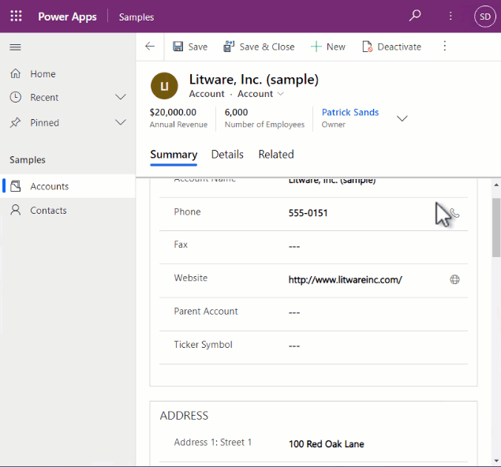

# Tutorial: Creating a model-driven app dataset component

In this tutorial, you will create a dataset code component, deploy it, and configure it inside a model-driven app using Visual Studio Code. The code component displays a paged, scrollable dataset grid that provides sortable and filterable columns. It also allows highlighting specific rows by configuring an indicator column. The dataset code component can be linked to table main grid, view, or subgrid. 

In addition to these requirements, you will also ensure that code component follows the best practice guidance:

1. Use of  [Microsoft Fluent UI](code-components-best-practices.md#use-microsoft-fluent-ui-react) 
2. Allow localization of the code component labels at both design and run-time.
3. Component is responsive and renders at 100% of the height available, apart from where the height is provided by the maker when configuring the code component on the subgrid.
4. Provide support for full-screen mode.

> [!div class="mx-imgBorder"]
> 

From the above, you see that:

1. Selecting record(s) on the grid enables the use of the command bar actions associated with the record(s) selected.
2. The header row stays in place while the records are scrolled when there is not enough vertical height to accommodate the whole page.
3. The code component can be viewed in full-screen mode. This is especially important on small-screen formats. When opening in full-screen, the code component is not reinitialized, but instead, the `allocatedWidth` and `allocatedHeight` are updated, and the component re-rendered via a call to `updateView`.
4. The quick-find search box can be used with the code component to filter records.
5. The footer shows the number of records, current page, and paging controls.

Before you go further, see [Creating a canvas app dataset component tutorial](tutorial-create-canvas-dataset-component.md) article to learn more about prerequisites, techniques used, and how to build and deploy code component. 

## Download and install the model-driven app sample code.

Firstly, download the [sample code]() to a folder called `ModelDrivenGrid`. To install the code component, open the folder that contains the `pcfproj` inside Visual Studio COde, and at the terminal use:

```powershell
npm install
```

Ensure that you have a solution publisher created with the `samples` prefix, described in [Creating a canvas app dataset component tutorial](tutorial-create-canvas-dataset-component.md#deploying-and-configuring). Also, make sure that you have authenticated against Microsoft Dataverse using `pac auth`.

At the terminal use:

```powershell
pac pcf push -pp samples
```

This deploys the code component into Dataverse so that it can be configured. More information: [Creating a canvas app dataset component tutorial](tutorial-create-canvas-dataset-component.md).

### Differences between the model-driven and canvas apps dataset samples

Although the two samples are likely the same, there are a few notable differences that must be considered when building code components for model-driven apps compared to canvas apps:

#### `Grid.tsx` differences

1. The column object provided by model-driven apps gives a [visualSizeFactor](reference\column.md#visualsizefactor ) that is configured by the app maker for a specific view. This is used to control the size of columns and is used by the code when creating the `DetailsList` columns. The columns and their properties supplied to the code component depends on the specific view selected at runtime. This is different from canvas apps. The columns are configured for a particular instance of a code component when added to a screen.

1. When code components are added to a model-driven table main grid or related records grid, `allocatedHeight` will always return -1. The code component must use a CSS style to fill 100% of the available space. When on subgrids, a height must be provided by the maker configuring the code component to define the height it should expand. More information: [`trackContainerResize`](reference\mode\trackcontainerresize.md).

1. Unlike the canvas app grid sample, an overlay message is added when there are no records in the current dataset. This is because in canvas apps, it is recommended to leave as much of the UI to the hosting app as possible, wherein model-driven apps, the dataset code component needs to be self-contained.

1. Unlike canvas apps, the `paging.totalResultCount` is used to display the total number of records in the current dataset. If this value is -1, it means that there are more than 5000 in the current dataset.

1. When sorting a dataset that contains no records, the subsequent call to `updateView` will not contain `dataset` as it does in canvas apps. Since the `isLoading` flag is cleared in `updateView` when new data is received, the sample must not set the `isLoading` component state when sorting empty datasets otherwise, this flag will never be cleared.

#### `index.tsx` differences

1. The initial call to `updateView` will not include dataset in the `updatedProperties` in model-driven apps. For this reason, you must add an additional condition to detect when to update the grid:

   ```typescript
   const initialLoad = !this.sortedRecordsIds && dataset.sortedRecordIds;
   ```

2. Since there is a new input property `SubGridHeight` that is set by the maker when the code component is added to a form subgrid, you add an additional check to use this value for the height if it is defined, and when not in full-screen mode:

   ```typescript
   if (!this.isFullScreen && context.parameters.SubGridHeight.raw) {
       allocatedHeight = context.parameters.SubGridHeight.raw;
   }
   ```

#### `ControlManifest.Input.xml` differences

1. Since there is no need for the `FilteredRecordCount` output property (because you display the 'No Records' message internally to the code component), it is removed. Consequently, we do not need to return a value inside `getOutputs` or call `notifyOutputChanged` when the record count has changed.
2. The property-set `HighlightIndicator` is defined as type `OptionSet` since you are binding it to the `statuscode` column on the dataset, which is then used to control row highlighting. 
3. You add a CSS file to the code component. This provides a workaround for ensuring the Fluent UI `StickyHeader` appears on top of the view selector and other flyout components of model-driven apps.

### Configuring the code component on main grid

To configure the code component to be displayed on the contact table inside a model-driven app:

1. Open the **Contact** table inside the classic solution editor.

2. Navigate to the **Controls tab** and select **Add Control**. 

3. Select the **Model Driven Grid** code component from the list and then select **Add**.

4. Set the **Properties** as follows:

   - **Highlight Indicator Field** - This maps to the `property-set` in the `ControlManifest.Input.xml` and is used to indicate which column to compare against for row highlighting. Set this to be the column `statuscode`.
   - **Highlight Value** - This is the value you compare `statuscode` against to control row highlighting. Set this to be **2**, which is equivalent to **Inactive**.
   - **Highlight Color** - This is the color that rows will be set to if `statuscode` is **Inactive**. Set to a color of your choice for highlighting (for example, `#FDE7E9`  which is light red).
   
   > [!div class="mx-imgBorder"]
   > 

5. You can also set the code component to show as default for Web, Phone, or Tablet by selecting the corresponding radio buttons. 

6. **Save** and **Publish**.

7. You will see the **Model Driven Grid** in the **Show As** command-bar menu on the **Contact** table grid in a model-driven app.

   > [!NOTE]
   > At this time, the new solution explorer experience does not support configuring code components, so you must use the classic solution editor to configure them inside model-driven apps.

### Configuring the code component on a specific view

You can also configure a specific view always to use a code component to show records when selected.

1. Open the **Contact** table inside the classic solution editor.
2. Navigate to **Views** and open an existing view or create a new one.
3. Select **Custom controls** from the right-hand menu.
4. Select **Add Control**.
5. Select **Model Driven Grid** and then **Add**.
6. Configure the properties as before - leave the subgrid height empty as before.
7. Select **OK** and then select **Save and close**.
8. Select **Publish**.

> [!div class="mx-imgBorder"]
> 

### Configuring the code component on a form subgrid

Code components can be configured on a specific subgrid on a form. You'll add the code component to the account form on the contacts subgrid:

1. Open the **Account** form in the classic form editor.

2. Select the **Contacts** subgrid, and then select **Change Properties**.

3. Select the **Controls** tab.

4. Select **Add control** and then select the **Model Driven Grid** code component.

5. Add the same properties as before, except this time provide a **Sub Grid Height** of `230`.  

6. Select the radio button for each form factor (Web/Phone/Tablet) to indicate that the **Model Driven Grid** should be used by default. If you want to use a different height for each of the different form factors, the same control may be added more than once, with different configurations.

   > [!NOTE]
   > On model-driven apps forms, the code component container will have a constrained height based on the row span - but only on larger form factors. On small form factors, it will not be constrained meaning we need to provide a specific height. This is the purpose of the input property **Sub Grid Height**.

   > [!div class="mx-imgBorder"]
   > 

Once configured on a subgrid, it will look similar to the following:

   > [!div class="mx-imgBorder"]
   > 


### Related articles

[Creating a canvas app dataset component tutorial](tutorial-create-canvas-dataset-component.md#deploying-and-configuring)<br/>
[Application lifecycle management (ALM) with Microsoft Power Platform](https://docs.microsoft.com/power-platform/alm/overview-alm)<br/>
[Power Apps component framework API reference](reference/index.md)<br/>
[Create your first component](implementing-controls-using-typescript.md)<br/>
[Debug code components](debugging-custom-controls.md)<br/>

[!INCLUDE[footer-include](../../includes/footer-banner.md)]

