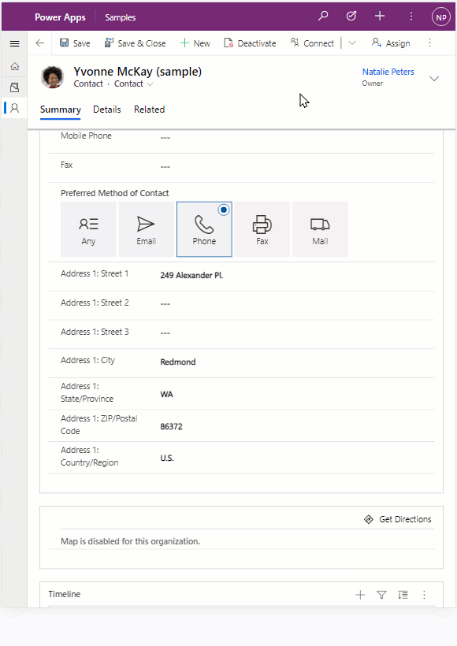
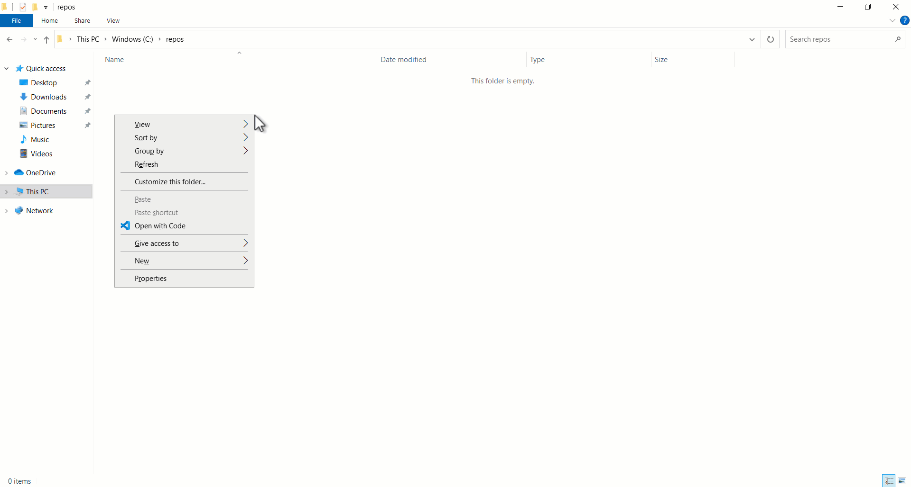
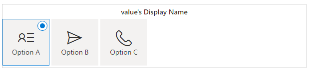
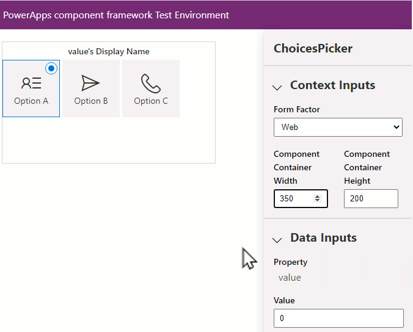
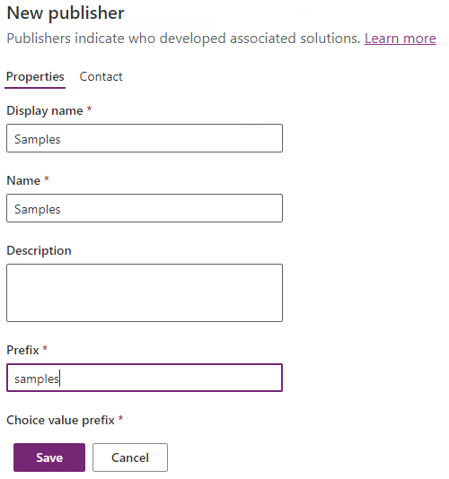
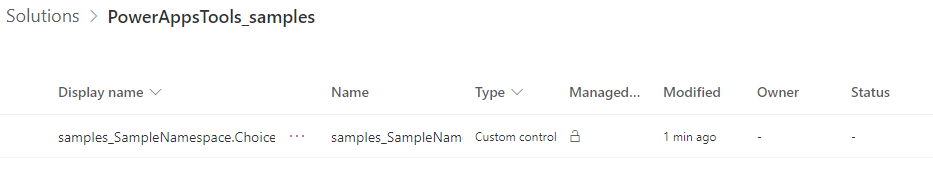
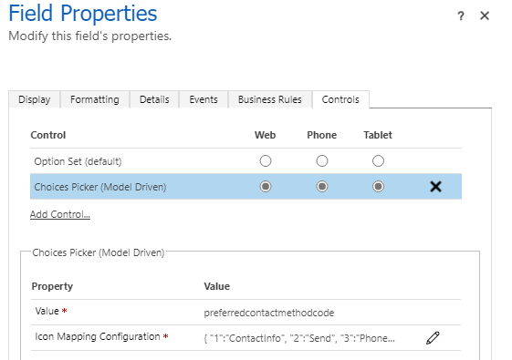

# Tutorial: Creating a model-driven app field component

In this tutorial, you will create a model-driven app `field` component, deploy, configure, and test the component on a form using Visual Studio Code. This code component displays a set of choices on a form, with an icon next to each choice value. The component uses some of the advanced features of model-driven apps, such as choices column definitions and field-level security.

In addition to these, you will also ensure the code component follows the best practice guidance:

1. Use of [Microsoft Fluent UI](code-components-best-practices.md#use-microsoft-fluent-ui-react) for consistency and [accessibility](code-components-best-practices.md#check-accessibility). 
2. Allow localization of the code component labels at both design and runtime.
3. Ensure the code component is metadata-driven for better reusability.
4. Renders according to the form factor and available width, displaying a compact drop-down with icons where space is limited.

>[!div class="mx-imgBorder"]
> 

Before you start, make sure you have installed all the [Prerequisites](implementing-controls-using-typescript.md#prerequisites).

## Create a new `pcfproj` project

To create a new `pcfproj`:

1. Create a new folder to hold your code component. For example, `C:\repos\ChoicesPicker`.

1. Open Visual Studio Code and navigate to **File** > **Open Folder**  and then select the `ChoicesPicker` folder created before. If you have added the windows explorer extensions during the installation of Visual Studio Code, you can also use the **Open with Code** context menu option inside the folder. You may also add any folder into Visual Studio Code using `code .` in the command prompt when the current directory is set to that location.

1. Inside the new Visual Studio Code PowerShell terminal (**Terminal** -> **New Terminal**), use the following command to create a new code component project:

   ```CLI
   pac pcf init --namespace SampleNamespace --name ChoicesPicker --template field
   ```

   or using the short form:

   ```CLI
   pac pcf init -ns SampleNamespace -n ChoicesPicker -t field
   ```

1. This adds a new `pcfproj` and related files to the current folder, including a `packages.json` that defines the required modules needed. To install the necessary modules use:

   ```CLI
   npm install
   ```

   > [!NOTE]
   > If you receive the error `The term 'npm' is not recognized as the name of a cmdlet, function, script file, or operable program.`, make sure you have installed [node.js](https://nodejs.org/en/download/) (LTS version is recommended) and all other prerequisites.

   >[!div class="mx-imgBorder"]
   

You can see that the template includes an `index.ts` file along with various configuration files. This is the starting point of your code component and contains the lifecycle methods described in [component implementation](control-implementation-library.md).


### Install Microsoft Fluent UI

You will be using Microsoft Fluent UI and React for the User Interface, so you need to install these as dependencies. To install the dependencies, use:

```shell
npm install react react-dom @fluentui/react
```

This adds the modules to the `packages.json` and installs them into the `node_modules` folder. You will not commit `node_modules` into source control since all the required modules will be restored later using `npm install`.

One of the advantages of Microsoft Fluent UI is that it provides a consistent and highly [accessible](code-components-best-practices.md#check-accessibility) User Interface.

### Configuring `eslint`

The template used by `pac pcf init` installs the `eslint` module to your project and configures it by adding an `.eslintrc.json` file. `Eslint` requires configuring for TypeScript and React coding styles. More information: [Linting - Best practices and guidance for code components](code-components-best-practices.md#linting).

### Defining the inputs and bound properties of the code component

The `ChoicesPicker\ControlManifest.Input.xml` file defines the metadata that describes the behavior of the code component. The [control](manifest-schema-reference/control.md) attributes will already contain the namespace and name of your component. You should define the following input and output properties:

- **Value** - This is a **bound** [property](manifest-schema-reference\property.md) of type **`OptionSet`** that will be linked to the choice column. The code component receives the current value and then notifies the parent context when the value has changed.
- **Configuration** - This is a **input**  [property](manifest-schema-reference\property.md) of type **Multiple lines of text** that will have its value set when the app maker adds the code component to the form. It contains a JSON string to configure which icons can use for each choice value. More information: [Manifest](manifest-schema-reference/manifest.md).

Open the `ChoicesPicker\ControlManifest.Input.xml` and paste in the following inside the control element (replacing the existing **`sampleProperty`**):

```xml
<property name="value" display-name-key="Value" description-key="Value of the Choices Control" of-type="OptionSet" usage="bound" required="true"/>
<property name="configuration" display-name-key="Icon Mapping" description-key="Configuration that maps the choice value to a fluent ui icon." of-type="Multiple" usage="input" required="true"/>
```

Save the changes you made and then use the following command to build the component:

```shell
npm run build
```

You should now notice two things:

1. An automatically generated file  `ChoicesPicker\generated\ManifestTypes.d.ts` will be added to your project. This is generated as part of the build process from the `ControlManifest.Input.xml` and provides the types for interacting with the input/output properties.

2. The build output is added to the `out` folder. The `bundle.js` is the transpiled JavaScript that runs inside the browser. The `ControlManifest.xml` is a reformatted version of the `ControlManifest.Input.xml` file that will be used during deployment. 

   > [!NOTE]
   > Do not modify the `generated` and `out` folder contents directly. They will always be overwritten as part of the build process.

#### Choices picker Fluent UI React component

When the code component uses React, there must be a single root component that is rendered within the `updateView` method. Inside the `ChoicesPicker` folder, add a new TypeScript file, named `ChoicesPickerComponent.tsx`. Add the following content:

```react
import { ChoiceGroup } from '@fluentui/react/lib/components/ChoiceGroup/ChoiceGroup';
import { IChoiceGroupOption } from '@fluentui/react/lib/components/ChoiceGroup/ChoiceGroup.types';
import * as React from 'react';

export interface ChoicesPickerComponentProps {
    label: string;
    value: number | null;
    options: ComponentFramework.PropertyHelper.OptionMetadata[];
    configuration: string | null;
    onChange: (newValue: number | undefined) => void;
}

export const ChoicesPickerComponent = React.memo((props: ChoicesPickerComponentProps) => {
    const { label, value, options, onChange, configuration } = props;
    const valueKey = value != null ? value.toString() : undefined;
    const items = React.useMemo(() => {
        let iconMapping: Record<number, string> = {};
        let configError: string | undefined;
        if (configuration) {
            try {
                iconMapping = JSON.parse(configuration) as Record<number, string>;
            } catch {
                configError = `Invalid configuration: '${configuration}'`;
            }
        }

        return {
            error: configError,
            choices: options.map((item) => {
                return {
                    key: item.Value.toString(),
                    value: item.Value,
                    text: item.Label,
                    iconProps: { iconName: iconMapping[item.Value] },
                } as IChoiceGroupOption;
            }),
        };
    }, [options, configuration]);

    const onChangeChoiceGroup = React.useCallback(
        (ev?: unknown, option?: IChoiceGroupOption): void => {
            onChange(option ? (option.value as number) : undefined);
        },
        [onChange],
    );

    return (
        <>
            {items.error}
            <ChoiceGroup
                label={label}
                options={items.choices}
                selectedKey={valueKey}
                onChange={onChangeChoiceGroup}
            />
        </>
    );
});
ChoicesPickerComponent.displayName = 'ChoicesPickerComponent';
```

> [!NOTE]
> The file has the extension `tsx`, a TypeScript file that supports XML style syntax used by React. It is compiled into standard JavaScript by the build process.

Notice the following about this code:

1. The `const { label, value, options, onChange, configuration } = props;` is called 'destructuring', where you extract the attributes required to render from the props, rather than prefixing them with `props.` each time they are used.

2. The input props have the following attributes that are provided by `index.ts`.

   - `label` - Used to label the component and is bound to the metadata field label that will always be provided by the parent context, using the user interface language selected inside the model-driven app.

   - `value` - Linked to the input property defined in the manifest. This can be null when the record is new, or the field is not set. TypeScript `null` is used rather than `undefined` when passing/returning property values.

   - `options` - When a code component is bound to a choices column in a model-driven app, the property contains the `OptionMetadata` that describes the choices available. You pass this to the component so it can render each item.

   - `configuration` - The purpose of the component is to show an icon for each choice available. The configuration is provided by the app maker when they add the code component to a form. This property accepts a JSON string that maps each numeric choice value to a [fluent UI  icon name](https://developer.microsoft.com/fluentui#/styles/web/icons#available-icons). For example, `{"0":"ContactInfo","1":"Send","2":"Phone"}`.

   - `onChange` - When the user changes the choices selection, the React component raises the `onChange` event. The code component then calls the `notifyOutputChanged` so that the model-driven app can update the column with the new value. There are two types of React components:

      1. **Uncontrolled** - These components maintain their internal state and use the input props as default values only.
      2. **Controlled** - These components render the value passed by the component props. If the `onChange` event does not update the prop values, the user will not see a change in the UI.

      The `ChoicesPickerComponent` is a controlled component, so once the model-driven app has updated the value (after the `notifyOutputChanged` call), it calls the `updateView` with the new value, which is then passed to the component props, causing a re-render that displays the updated value.

3. Import the `ChoiceGroup` fluent UI components using path-based imports so that your bundle size will be smaller resulting in, lower capacity requirements and better runtime performance. Instead of:

   ```typescript
   import { ChoiceGroup, IChoiceGroupOption } from '@fluentui/react';
   ```

   we instead use:

   ```typescript
   import { ChoiceGroup } from "@fluentui/react/lib/components/ChoiceGroup/ChoiceGroup";
   import { IChoiceGroupOption } from "@fluentui/react/lib/components/ChoiceGroup/ChoiceGroup.types";
   ```

   An alternative would be to use [tree-shaking.](code-components-best-practices.md#use-path-based-imports-from-fluent-to-reduce-bundle-size) 

4. This is a React functional component, but equally, it could be a class component. This is based on your preferred coding style. Class components and functional components can also be mixed in the same project. Both function and class components use the `tsx` XML style syntax used by React.

5. You are using  `React.memo` to wrap our functional component so that it will not render unless any of the input props have changed. 

6. `React.useMemo` is used to ensure that the item array created is only mutated when the input props `options` or `configuration` has changed. This is a best practice of function components that will reduce unnecessary renders of the child components.

7. `React.useCallback` is used to create a callback closure that is called when the fluent UI `ChoiceGroup` value changes. This React hook ensures that the callback closure is only mutated when the input prop `onChange` is changed. This is a performance best practice similar to `useMemo`.

8. If the parsing of the JSON configuration input property fails, the error is rendered using `items.error`.

### Render the React Component from inside `index.ts`

When using React inside a code component, the rendering of the root component is performed inside the [`updateView`](reference\control\updateview.md). All the values needed to render the component are passed into the component such that whey they are changed, and then it is re-rendered. Before you can add the `ChoicesPickerComponent` to the `index.ts`, you  must add the following at the top of the file:

```typescript
import { IInputs, IOutputs } from './generated/ManifestTypes';
import * as React from 'react';
import * as ReactDOM from 'react-dom';
import { initializeIcons } from '@fluentui/react/lib/Icons';
import { ChoicesPickerComponent } from './ChoicesPickerComponent';

initializeIcons(undefined, { disableWarnings: true });
```

> [!NOTE]
> The import of `initializeIcons` is required because you are using the fluent UI icon set. You need to call `initializeIcons` to load the icons inside the test harness - inside model-driven apps they are already initialized. 

The code component will maintain its instance state using attributes (this is different to React component state). Inside the `index.ts` `ChoicesPicker` class, add the following attributes:

```typescript
notifyOutputChanged: () => void;
rootContainer: HTMLDivElement;
context: ComponentFramework.Context<IInputs>;
selectedValue: number | undefined;
```

- `notifyOutputChanged` - this holds a reference to the method used to notify the model-driven app that a user has changed a choice value and the code component is ready to pass it back to the parent context.
- `rootContainer` - this is the HTML DOM element that is created to hold the code component inside the model-driven app.
- `context` - this is the Power Apps component framework context that is used to read the properties defined in the manifest and other runtime properties and access API methods such as `trackContainerResize`.
- `selectedValue` - this holds the state of the choice selected by the user so that it can be returned inside the `getOutputs` method.

To set these attributes, update the `init` method to be:

```typescript
public init(
    context: ComponentFramework.Context<IInputs>,
    notifyOutputChanged: () => void,
    state: ComponentFramework.Dictionary,
    container: HTMLDivElement,
  ): void {
    this.notifyOutputChanged = notifyOutputChanged;
    this.rootContainer = container;
    this.context = context;
  }
```

The `init` is called when the code component is initialized on an app screen. You store a reference to the following:

- `notifyOutputChanged` - this is the callback if you call to notify the canvas app that one of the properties has changed.

- `rootContainer` - this is the DOM element that you add your code component User Interface.


When the user changes the value selected, you must call the `notifyOutputChanged` from the `onChange` event.
Add a function:

```typescript
onChange = (newValue: number | undefined): void => {
     this.selectedValue = newValue;
     this.notifyOutputChanged();
};
```

Update the `getOutputs` method to be:

```typescript
public getOutputs(): IOutputs {
    return { value: this.selectedValue } as IOutputs;
}
```

> [!TIP]
> If you have written client API scripts before in model-driven apps, you may be used to using the form context to update attribute values. Code components should never access this context. Instead, rely on `notifyOutputChanged` and `getOutputs` to provide one or more changed values. You do not need to return all bound properties defined in the `IOutput` interface - only the ones that have changed their value.

Now, update the `updateView` to render the `ChoicesPickerComponent`:

```typescript
public updateView(context: ComponentFramework.Context<IInputs>): void {
    const { value, configuration } = context.parameters;
    if (value && value.attributes && configuration && configuration.raw) {
        ReactDOM.render(
            React.createElement(ChoicesPickerComponent, {
                label: value.attributes.DisplayName,
                options: value.attributes.Options,
                configuration: configuration.raw,
                value: value.raw,
                onChange: this.onChange,
            }),
            this.rootContainer,
        );
    }
}
```

Notice that we are pulling the label and options from `context.parameters.value`, and the `value.raw` provides the numeric choice selected or `null` if no value is selected.

Lastly, we need to tidy up when the code component is destroyed:

```typescript
public destroy(): void {
    ReactDOM.unmountComponentAtNode(this.rootContainer);
}
```

#### Start the test harness

Ensure all the files are saved and at the terminal use:

```shell
npm start watch
```

You should see that the test harness starts with the choices picker rendered inside a new browser window. Initially, it shows an error because the string property `configuration` has the default value `val`. Set the configuration so that it maps the test harness default choices 0,1 & 2 with the following Fluent UI icons:

```json
{"0":"ContactInfo","1":"Send","2":"Phone"}
```

> [!div class="mx-imgBorder"]
> 

When you change the option selected, you will see the value in the **Data Inputs** panel on the right. Additionally, if you change the value, the component shows the associated value updated.

#### Supporting read-only and field-level security

When creating model-driven apps field code components, enterprise applications need to respect the control state when read-only or masked due to field-level security. If the code component does not render a read-only UI when the column is read-only, in some circumstances (for example, when a record is inactive) a column can be updated by a user where it should not. More information: [Field level security in model-driven apps](/power-platform/admin/field-level-security).

Inside the `updateView`, add the following code to get the disabled and masked flags:

```typescript
let disabled = context.mode.isControlDisabled;
let masked = false;
if (value.security) {
    disabled = disabled || !value.security.editable;
    masked = !value.security.readable;
}
```

The `value.security` will be populated only inside a model-driven app if field-level security configuration is applied to the bound column.

These values can then be passed into the React component via its props:

```typescript
ReactDOM.render(
    React.createElement(ChoicesPicker, {
    ... 
    disabled: disabled,
    masked: masked,
```

Inside the `ChoicesPickerComponent` you can accept this by adding them to the `ChoicesPickerProps` interface:

```typescript
export interface ChoicesPickerProps {
  ...
  disabled: boolean;
  masked: boolean;
}
```

Inside the `ChoicesPickerComponent` when returning the React nodes, you can use these new input props to ensure that the picker is disabled or masked:

```react
return (
        <>
            {items.error}
            {masked && '****'}
    
            {!items.error && !masked && (
                <ChoiceGroup
                    label={label}
                    options={items.choices}
                    selectedKey={valueKey}
                    disabled={disabled}
                    onChange={onChangeChoiceGroup}
                />
            )}
        </>
    );
```

You will also need to add `disabled` and `masked` to the 'destructuring' of the props:

```typescript
 const { label, value, options, onChange, configuration, disabled, masked } = props;
```

#### Making the code component responsive

Code components can be rendered in both web, tablet, and mobile apps. It is important to consider the space available. Make the choices component render as a drop-down when the available width is restricted.

First, you update the code component to render differently depending on a new prop `formFactor`. Add the following attribute to the `ChoicesPickerProps` interface:

```typescript
export interface ChoicesPickerProps {
    ...
    formFactor: 'small' | 'large';
```

The component renders the small version using the fluent UI `Dropdown` component, so you add it to the imports:

```typescript
import { Dropdown } from '@fluentui/react/lib/components/Dropdown/Dropdown';
import { IDropdownOption } from '@fluentui/react/lib/components/Dropdown/Dropdown.types';
import { Icon } from '@fluentui/react/lib/components/Icon/Icon';
```

The drop-down component needs some different rendering methods, so above the `ChoicesPickerComponent`, add the following:

```react
const iconStyles = { marginRight: '8px' };

const onRenderOption = (option?: IDropdownOption): JSX.Element => {
    if (option) {
        return (
            <div>
                {option.data && option.data.icon && (
                    <Icon style={iconStyles} iconName={option.data.icon} aria-hidden="true" title={option.data.icon} />
                )}
                <span>{option.text}</span>
            </div>
        );
    }
    return <></>;
};

const onRenderTitle = (options?: IDropdownOption[]): JSX.Element => {
    if (options) {
        return onRenderOption(options[0]);
    }
    return <></>;
};
```

These methods will be used by the `Dropdown` to render the correct icon next to the drop-down value.

You also need an `onChange` method for the `Dropdown` similar to the `ChoiceGroup`  event handler.  Just above the existing `onChangeChoiceGroup`, add the new `Dropdown` version:

```typescript
const onChangeDropDown = React.useCallback(
        (ev: unknown, option?: IDropdownOption): void => {
            onChange(option ? (option.data.value as number) : undefined);
        },
        [onChange],
    );
```

Now you can add these all to the updated render output:

```react
return (
        <>
            {items.error}

            {masked && '****'}

            {formFactor == 'large' && !items.error && !masked && (
                <ChoiceGroup
                    label={label}
                    options={items.choices}
                    selectedKey={valueKey}
                    disabled={disabled}
                    onChange={onChangeChoiceGroup}
                />
            )}

            {formFactor == 'small' && !items.error && !masked && (
                <Dropdown
                    placeholder={'---'}
                    label={label}
                    ariaLabel={label}
                    options={items.options}
                    selectedKey={valueKey}
                    disabled={disabled}
                    onRenderOption={onRenderOption}
                    onRenderTitle={onRenderTitle}
                    onChange={onChangeDropDown}
                />
            )}
        </>
    );
```

You can see that you output the `ChoiceGroup` component when `formFactor` is large and use `Dropdown` when it is small. Again, as above, you will need to add the `formFactor` to the 'destructuring' of the input props:

```typescript
const { label, value, options, onChange, configuration, disabled, masked, formFactor } = props;
```

Lastly, you need to map the options metadata slightly differently to that used by the `ChoicesGroup`, so inside the `items` return block underneath the existing choices: `options.map`, add the following:

```typescript
options: options.map((item) => {
                return {
                    key: item.Value.toString(),
                    data: { value: item.Value, icon: iconMapping[item.Value] },
                    text: item.Label,
                } as IDropdownOption;
            }),
```

Now that the choices component will render differently based on the `formFactor` prop, you must pass the correct value from the render call inside `index.ts`. 

First, add the following just above the `export class ChoicesPicker` class inside `index.ts`.

```typescript
const SmallFormFactorMaxWidth = 350;

const enum FormFactors {
  Unknown = 0,
  Desktop = 1,
  Tablet = 2,
  Phone = 3,
}
```

The `SmallFormFactorMaxWidth` is the width when the component starts to render using the `Dropdown` rather than `ChoiceGroup` component. The `FormFactors` `enum` is used for convenience when calling [`context.client.getFormFactor`](reference\client\getformfactor.md).

Add the following to the `React.createElement` props underneath the existing props:

```typescript
formFactor:
    context.client.getFormFactor() == FormFactors.Phone ||
        context.mode.allocatedWidth < SmallFormFactorMaxWidth
        ? 'small'
    : 'large',
```

Since you are using `allocatedWidth`, you need to let the model-driven app know that you want to receive updates (via a call to `updateView`) when the available width changes. You do this inside the `init` method by adding a call to [`trackContainerResize`](reference\mode\trackcontainerresize.md): 

```typescript
this.context.mode.trackContainerResize(true);
```

Now save all the changes, so they are automatically reflected in the test harness browser window (because you still have `npm start watch` running from earlier). You can now switch the value of **Component Container Width** between **349** and **350** and see the rendering behave differently. You can also swap the **Form Factor** between **Web** and **Phone** and see the same behavior. 

> [!div class="mx-imgBorder"]
> 

#### Localization

If you want to support multiple languages, your code component can hold a resource file that provides translations for both design and runtime strings. 

1. Add a new file at the location `ChoicesPicker\strings\ChoicesPicker.1033.resx`. If you want to add labels for a different locale, change the 1033 (`en-us`) to the locale of your choosing.

2. Add the following content:

   ```xml
   <?xml version="1.0" encoding="utf-8"?>
   <root>
     <xsd:schema id="root" xmlns="" xmlns:xsd="http://www.w3.org/2001/XMLSchema" xmlns:msdata="urn:schemas-microsoft-com:xml-msdata">
       <xsd:import namespace="http://www.w3.org/XML/1998/namespace"/>
       <xsd:element name="root" msdata:IsDataSet="true">
         <xsd:complexType>
           <xsd:choice maxOccurs="unbounded">
             <xsd:element name="metadata">
               <xsd:complexType>
                 <xsd:sequence>
                   <xsd:element name="value" type="xsd:string" minOccurs="0"/>
                 </xsd:sequence>
                 <xsd:attribute name="name" use="required" type="xsd:string"/>
                 <xsd:attribute name="type" type="xsd:string"/>
                 <xsd:attribute name="mimetype" type="xsd:string"/>
                 <xsd:attribute ref="xml:space"/>
               </xsd:complexType>
             </xsd:element>
             <xsd:element name="assembly">
               <xsd:complexType>
                 <xsd:attribute name="alias" type="xsd:string"/>
                 <xsd:attribute name="name" type="xsd:string"/>
               </xsd:complexType>
             </xsd:element>
             <xsd:element name="data">
               <xsd:complexType>
                 <xsd:sequence>
                   <xsd:element name="value" type="xsd:string" minOccurs="0" msdata:Ordinal="1"/>
                   <xsd:element name="comment" type="xsd:string" minOccurs="0" msdata:Ordinal="2"/>
                 </xsd:sequence>
                 <xsd:attribute name="name" type="xsd:string" use="required" msdata:Ordinal="1"/>
                 <xsd:attribute name="type" type="xsd:string" msdata:Ordinal="3"/>
                 <xsd:attribute name="mimetype" type="xsd:string" msdata:Ordinal="4"/>
                 <xsd:attribute ref="xml:space"/>
               </xsd:complexType>
             </xsd:element>
             <xsd:element name="resheader">
               <xsd:complexType>
                 <xsd:sequence>
                   <xsd:element name="value" type="xsd:string" minOccurs="0" msdata:Ordinal="1"/>
                 </xsd:sequence>
                 <xsd:attribute name="name" type="xsd:string" use="required"/>
               </xsd:complexType>
             </xsd:element>
           </xsd:choice>
         </xsd:complexType>
       </xsd:element>
     </xsd:schema>
     <resheader name="resmimetype">
       <value>text/microsoft-resx</value>
     </resheader>
     <resheader name="version">
       <value>2.0</value>
     </resheader>
     <resheader name="reader">
       <value>System.Resources.ResXResourceReader, System.Windows.Forms, Version=4.0.0.0, Culture=neutral, PublicKeyToken=b77a5c561934e089</value>
     </resheader>
     <resheader name="writer">
       <value>System.Resources.ResXResourceWriter, System.Windows.Forms, Version=4.0.0.0, Culture=neutral, PublicKeyToken=b77a5c561934e089</value>
     </resheader>
     <data name="ChoicesPicker_Name" xml:space="preserve">
       <value>Choices Picker (Model Driven)</value>
       <comment/>
     </data>
     <data name="ChoicesPicker_Desc" xml:space="preserve">
       <value>Shows choices as a picker with icons</value>
       <comment/>
     </data>
     <data name="Value_Name" xml:space="preserve">
       <value>Value</value>
       <comment/>
     </data>
     <data name="Value_Desc" xml:space="preserve">
       <value>The choices field to bind the control to</value>
       <comment/>
     </data>
     <data name="Configuration_Name" xml:space="preserve">
       <value>Icon Mapping Configuration</value>
       <comment/>
     </data>
     <data name="Configuration_Desc" xml:space="preserve">
       <value>Configuration that maps the choice value to a fluent ui icon. E.g. {"1":"ContactInfo","2":"Send"}</value>
       <comment/>
     </data>
   </root>
   ```

   > [!TIP]
   > It's not recommended to edit `resx` files directly; instead you can use either Visual Studio Code resource editor or an extension for Visual Studio Code.

   Now that you have the resource strings, you can reference them by updating the `ControlManifest.Input.xml` as follows:

   ```xml
   <?xml version="1.0" encoding="utf-8" ?>
   <manifest>
     <control namespace="SampleNamespace" constructor="ChoicesPicker" version="0.0.1" display-name-key="ChoicesPicker_Name" description-key="ChoicesPicker_Desc" control-type="standard" >
       <property name="value" display-name-key="Value_Name" description-key="Value_Desc" of-type="OptionSet" usage="bound" required="true"/>
       <property name="configuration" display-name-key="Configuration_Name" description-key="Configuration_Desc" of-type="Multiple" usage="input" required="true"/> 
       <resources>
         <code path="index.ts" order="1"/>
         <resx path="strings/ChoicesPicker.1033.resx" version="1.0.0" />
       </resources>
     </control>
   </manifest>
   ```

You can see that:

   1. The `display-name-key` and `description-key` values now point to the corresponding key in the `resx` file.
   2. There is an additional entry in the `resources` element indicating that the code component should load resources from the referenced file.

If you need any additional strings for use in your component, you can add them to the `resx` and then load the strings at runtime using [getString](reference\resources\getstring.md). More information:  [Implementing localization API component](sample-controls\localization-api-control.md).

One of the test harness limitations is that it does not load resource files, so you need to deploy the component to Microsoft Dataverse to fully test your component.

#### Deploying and configuring in a model-driven app

Once you have tested basic functionality with the test harness, you must deploy the component to Microsoft Dataverse so that the code component can be fully tested end-to-end inside a model-driven app.

1. Inside your Dataverse environment, ensure there is a publisher created with a prefix of `samples`:

   >[!div class="mx-imgBorder"]
   > 

   Equally, this could be your publisher, provided you update the publisher prefix parameter in the call to `pac pcf push` below.
   More information: [Create a solution publisher](/powerapps/maker/data-platform/create-solution#solution-publisher).

2. Once you have saved the publisher, you are ready to authorize the Microsoft Power Platform CLI against your environment so that you can push the compiled code component. At the command-line use:

   ```powershell
   pac auth create --url https://myorg.crm.dynamics.com
   ```

   Replace `myorg.crm.dynamics.com` with the URL of your Dataverse environment. Sign in with a system administrator or customizer privileges when prompted. The privileges provided by these roles are needed to deploy any code components to Dataverse.

3. To deploy your code component, use:

   ```powershell
   pac pcf push --publisher-prefix samples
   ```

   > [!NOTE]
   > If you receive the error `Missing required tool: MSBuild.exe/dotnet.exe`. Add `MSBuild.exe/dotnet.exe` in Path environment variable or use `Developer Command Prompt for Visual Studio Code`, you must install either [Visual Studio 2019 for Windows & Mac](https://visualstudio.microsoft.com/downloads/) or [Build Tools for Visual Studio 2019](https://visualstudio.microsoft.com/downloads/#build-tools-for-visual-studio-2019), make sure to select the `.NET build tools` workload as described in the Prerequisites.

4. Once completed, this process creates a temporary solution named **PowerAppTools_samples** in your environment. The `ChoicesPicker` code component will be added to this solution. You can move the code component into your solution later if necessary. More information: [Code Component Application Lifecycle Management (ALM)](code-components-alm.md).

   > [!div class="mx-imgBorder"]
   > 

5. Next, add the code component to the **Contacts** form by navigating to **Main Form** in the **Classic Editor**, select **Preferred Method of Contact**  > **Change Properties** > **Controls Tab**  > **Add Control** > **Select Choices Picker** > **Add**.

   > [!NOTE]
   > In the future, the classic editor will not be needed to configure code components on model-driven apps forms.

6. Set the following properties on the component:

   - Set the Choices Picker as the default for Web, Phone, and Tablet.

   - Enter the following string for the **Icon Mapping Configuration** by selecting the edit icon and selecting **Bind to a static value**.

     ```json
     {
         "1":"ContactInfo",
         "2":"Send", 
         "3":"Phone",
         "4":"Fax",
         "5":"DeliveryTruck"
     }
     ```

     These are the fluent UI icons that will be used for each choice value.

   > [!div class="mx-imgBorder"]
   > 

   - Select the **Display tab** and uncheck **Display label on the form** since you will show the label above the choices picker.

7. **Save** and **Publish** the form.

8. Open a contact record inside the model-driven app with the correct form selected. You will now see the `ChoicesPicker` code component instead of the standard drop-down control (you may need to do a hard reload of the page for the component to show up).

   > [!NOTE]
   > You may see that text alignment is slightly different in the test harness compared to model-driven apps. This is because the test harness has different CSS rules to that of model-driven apps. For this reason, it is recommended that you always fully test your code component after deployment.


#### Debugging after deployed to Dataverse

If you need to make further changes to your component, you do not need to deploy each time, but instead use the technique described in [Debug code components](debugging-custom-controls.md) to create a Fiddler **AutoResponder** to load the file from your local file system while `npm start watch` is running.

> [!NOTE]
> You may not need to debug after deployment to Dataverse if all functionality can be tested using the test harness, but it is recommended to always deploy and test inside Dataverse before distributing your code component.

The **AutoResponder** would look similar to the following:

```shell
REGEX:(.*?)((?'folder'css|html)(%252f|\/))?SampleNamespace\.ChoicesPicker[\.\/](?'fname'[^?]*\.*)(.*?)$
```

```shell
C:\repos\ChoicesPicker\out\controls\ChoicesPicker\${folder}\${fname}
```

>[!div class="mx-imgBorder"]
> 

You need to **Empty cache and hard refresh** on your browser session for the **AutoResponder** file to be picked up. Once loaded, you can refresh the browser since Fiddler will add a cache-control header to the file to prevent it from being cached.

Once you are done with your changes, you can increment the patch version in the manifest and then redeploy using `pac pcf push`.

So far, you have deployed a development build that is not optimized and will run slower at runtime. You can choose to deploy an optimized build using `pac pcf push` by editing the `ChoicesPicker.pcfproj`. Underneath the `OutputPath`, add the following:

```xml
<PcfBuildMode>production</PcfBuildMode>
```

See TODO: [Choice Picker for Model Driven Apps]() for the full code sample. 

### Related articles

[Application lifecycle management (ALM) with Microsoft Power Platform](/power-platform/alm/overview-alm)<br/>
[Power Apps component framework API reference](reference/index.md)<br/>
[Create your first component](implementing-controls-using-typescript.md)<br/>
[Debug code components](debugging-custom-controls.md)<br/>

[!INCLUDE[footer-include](../../includes/footer-banner.md)]

