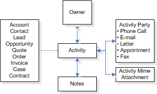

# Activity tables

[!INCLUDE[cc-terminology](includes/cc-terminology.md)]

In Microsoft Dataverse, activities are tasks that you or your teams perform when they contact customers, for example, sending letters or making telephone calls. You  can create activities for yourselves, can assign them to someone else, or can share them with other users or teams. An activity is any action which can be entered  on a calendar  and has time dimensions (start time, stop time, due date, and duration) that help determine when the action occurred or is to occur. Activities has some basic properties that help determine what action the activity represents, for example, subject and description. An activity state can be opened, canceled, or completed. The completed status of an activity will have several sub status values associated with it to clarify the way that the activity was completed.  
  
Activities involve one or more participants, called activity parties in Dataverse. For a meeting activity, the participants are those contacts or users attending the meeting. For a telephone call or fax activity, the parties are the caller and the person who is called. The following diagram shows the entity relationships for activities.  
  
  
  
To support the communication needs of the modern-day business, such as instant messaging (IM) and SMS, you can create custom activities in Dataverse.  

> [!NOTE]
> Activities security is inherited through the [Activity (ActivityPointer) table](reference/entities/activitypointer.md). Each activity record is represented by a single row in the ActivityPointer table, which helps manage permissions and security roles for all activities uniformly. [Learn more about Activities data model and storage](activities-data-model-storage.md)
  
### See also

 [Activities data model and storage](activities-data-model-storage.md)   
 [Custom activities](custom-activities.md)  
 [E-mail activity table](email-activity-entities.md)   
 [Activity tables for tasks, faxes, phone calls, and letters](task-fax-phone-call-letter-activity-entities.md)   
 [Activity Party table](activityparty-entity.md)   
 [Activity Pointer (Activity) table](activitypointer-activity-entity.md)  

 

[!INCLUDE[footer-include](../../includes/footer-banner.md)]
