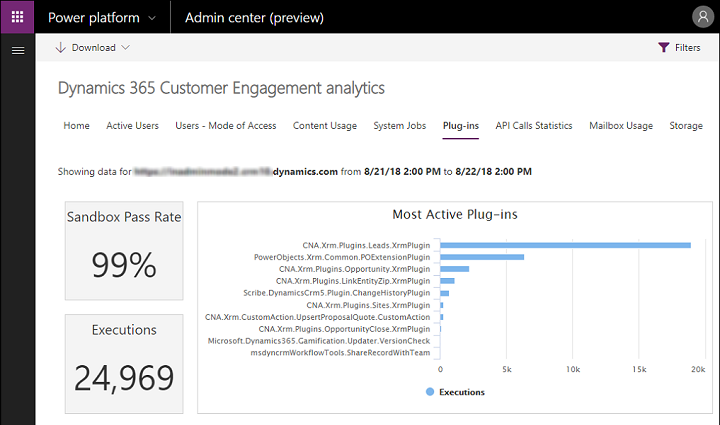

# Analyze plug-in performance

When you add business logic to your plug-in, be aware of the impact your plug-ins have on overall system performance.

## Time and resource constraints

A Dataverse message operation must complete within **2 minutes**. This limit includes executing the intended message operation and all registered synchronous and asynchronous plug-ins. Extensions also have limitations on the amount of CPU and memory resources they can use. If the message operation exceeds these limits, Dataverse throws an exception and cancels (rolls back) the entire message operation.

If the time limit is exceeded, Dataverse throws a <xref:System.TimeoutException>. If any custom extension exceeds threshold CPU, memory, or handle limits or is otherwise unresponsive, Dataverse kills that process. At that point, any current extension in that process fails with exceptions. However, the next time that extension is executed, it runs normally.

> [!IMPORTANT]
> You can't control how long the message operation or other synchronous registered plug-ins take to execute. You can only control how long your plug-in takes to execute based on its design and coding.
>
> Limit the time your plug-in takes to execute to no more than 2 seconds.
>
> If your plug-in requires more than 2 seconds to execute, consider registering your plug-in for asynchronous rather than synchronous execution. In fact, always consider asynchronous execution first when possible as it results in better application responsiveness and system scalability.

More information: [Best practices and guidance regarding plug-in and workflow development](best-practices/business-logic/index.md)

## Monitor performance

> [!IMPORTANT]
> This feature is no longer operational or supported. Don't use it.
>
> This section will be removed in a future article update.

Run-time information about plug-ins and custom workflow extensions is captured and stored in the [PluginTypeStatistic Table](reference/entities/plugintypestatistic.md). Dataverse populates these records within 30 minutes to one hour after the custom code executes.

## Plug-in performance analytics

In addition to using a debugger and profiler to learn how your plug-in is performing at the code level, you can interactively obtain metrics about the overall performance of your registered plug-ins in an organization through [Microsoft Dataverse analytics](/power-platform/admin/analytics-common-data-service).

Through the [Plug-in](/power-platform/admin/analytics-common-data-service#plug-ins) dashboard you can view metrics such as average execution time, failures, most active plug-ins, and more.

To access the dashboard, go to [Power Platform Admin Center](https://admin.powerplatform.microsoft.com/). Select **Analytics** > **Dataverse** > **Plug-ins**.

## See also

[Use plug-ins to extend business processes](plug-ins.md)  
[Write Telemetry to your Application Insights resource using ILogger](application-insights-ilogger.md)  
[Tutorial: Debug a plug-in](tutorial-debug-plug-in.md)  
[Debug Plug-ins](debug-plug-in.md)

[!INCLUDE[footer-include](../../includes/footer-banner.md)]
