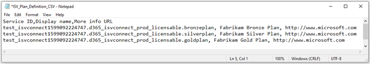
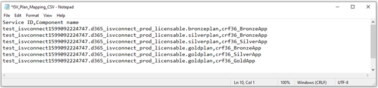

# Appendix: Add licensing information to your solution

This article is related to the license management capability that Microsoft provides for ISVs to manage and enforce licenses for their products. More information: [ISV app license management](/azure/marketplace/isv-app-license) 

This article outlines how to add licensing information to a Microsoft Dataverse solution, package it, and upload the solution zip file to Microsoft AppSource.  More information: [Create an AppSource package for your app](/powerapps/developer/data-platform/create-package-app-appsource).

The following steps are required to add license information to your solution: 

- Clone existing solution.
- Use Microsoft Power Platform CLI to add license information to the solution.  
- Build the solution, package it, and upload the zip file to AppSource. 

## Download the latest version of Microsoft Power Platform CLI  

You can download the latest version of Microsoft Power Platform CLI from [here](/powerapps/developer/data-platform/powerapps-cli). Microsoft Power Platform CLI tool includes commands that are required for adding licensing information to the solution. To verify that you have the latest version of the tool:

1. Open a **Developer Command Prompt for VS 2017** or higher window. 
2. Enter the command `pac install latest`. This will install the latest version of the tooling.
3. Enter the command `pac solution help` and verify that you see the `add-license` option in the list.  
 
## Clone a solution

Use Microsoft Power Platform CLI commands to clone the solution. To clone a solution:
 
1. Create an authentication profile for the environment where you want to add your solution by using the command: 

   ```CLI
    pac auth create --name <name of your choice> --kind Dataverse -–url <your dataverse url> --username <your username> --password <your password>`
   ```
1. Clone the existing solution by using the command:  
    
    ```CLI
    pac solution clone --name <your solution name> --outputDirectory <your chosen output directory>
    ```

## Create licensing files

To add licensing information to your solution, you need to create two `.CSV` files using the text editor of your choice. The following are the two files that you need to create:
 
- **Plan definition file**: Define the details of the plans you created in the Partner Center.
- **Plan mapping file**: Maps those plans to the components of your solution.
 
In this article, we will create these two CSV files for an example solution called F365. This solution contains several model-driven apps for which we want to restrict access to via license management. We will follow a **Russian doll** licensing model for this solution as shown in the following table:

|Plan|Gets access to|
|------|--------|
|Gold plan|Gold App, Silver App, Bronze App|
|Silver plan|Silver App, Bronze App|
|Bronze plan|Bronze App|
|||

> [!div class="mx-imgBorder"]
> 

To add licensing information to your solution, you need to create plans in the Partner Center. More information: [Create plans in Partner Center](/azure/marketplace/dynamics-365-customer-engage-plans). Once you're finished creating the plans, each plan creates a **Service ID** value which is required while creating [Plan definition file](#plan-definition-file).

> [!div class="mx-imgBorder"]
> 

> [!NOTE]
> Currently model-driven apps are the only types of solution components that can be mapped to licenses. In future releases, we plan to add support for other component types such as canvas apps and tables. 

### Plan definition file
 
The plan definition file must include the following columns laid out in the format shown in the example below: 

> [!div class="mx-imgBorder"]
> 

**Service ID:** This is created automatically when you create a plan in the Partner Center as part of the offer creation. Copy it from partner center into the plan definition file. More information: [Create plans in Partner Center](/azure/marketplace/dynamics-365-customer-engage-plans).

**Display Name:** This is a descriptive name for your plan which you can choose. It will be show to users on license check error screens so it should be easily recognizable to your customers.

**More info URL:** This is a URL where you would like to direct users to get more information about your solution, in the event they run into a license check error.


### Plan mapping file
 
The plan mapping file must include the following columns laid out in the format shown in the example below: 

> [!div class="mx-imgBorder"]
> 

**Service ID:** This is created automatically when you create a plan in the Partner Center as part of the offer creation. Copy it from partner center into the plan definition file. More information: [Create plans in Partner Center](/azure/marketplace/dynamics-365-customer-engage-plans).

**Component name:** The solution component that you would like to restrict access to using license management. This name must match the name of the component in the **Name** column in the Power Apps solution viewer (image above).


Once you have created your own licensing CSV files, the next step is to add the information from these files to your solution. 

## Add licensing information

To add the license information from the CSV files (created above) to the solution: 
 
1. Open a **Developer Command Prompt for VS 2017** or higher window. Navigate to the location where you have cloned solution. Enter the following command:

   ```CLI
   pac solution add-license -pd <path to plan definition file> -pm <path to plan mapping file>
   ```
1. To check whether the licensing information is added, navigate to the location where you have cloned your solution zip file, you should see a new folder **ServicePlans** is created with two XML files. 
1. Optional: To determine how the license information from the CSV files was captured, open the XML files in your favorite editor. 
   - The **ServicePlans.xml** file contains the plan definition information from the plan definition file. 
   - The **ServicePlansAppModules.xml** file contains the plan mapping information from the plan mapping file.
 
## Build the solution and create an AppSource package

1. To build a solution, see [Create a managed solution for your app](/powerapps/developer/data-platform/create-solution-app-appsource). 

1. To validate whether the licensing information is included, after the solution is built, look for the licensing information in your solution `customizations.xml` file.
1. To create the AppSource package, see [Create an AppSource package for your app](/powerapps/developer/data-platform/create-package-app-appsource).

## See also

[Appendix: App certification checklist](appendix-app-certification-checklist.md)
