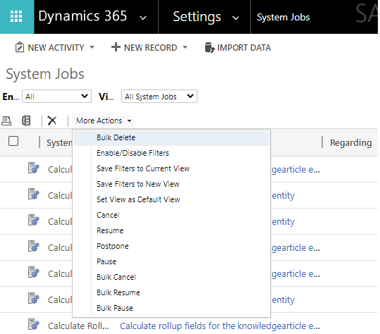

# Asynchronous service

[!INCLUDE[cc-terminology](includes/cc-terminology.md)]

The asynchronous service executes long-running operations independent of the main Microsoft Dataverse core operation. This results in improved overall system performance and improved scalability. The asynchronous service features a managed first-in, first-out (FIFO) queue for the execution of asynchronous registered plug-ins, workflows, and operations such as bulk mail, bulk import, and campaign activity propagation. These operations are registered with the asynchronous service and executed periodically when the service processes its queue.

After an event occurs and any synchronous extensions have been processed, the platform serializes the context for any asynchronous extensions and saves it to the database as a **System Job** in the [AsyncOperation Table](reference/entities/asyncoperation.md). The system job defines and tracks the execution of the asynchronous operation. As resources become available system jobs are processed and the operations they define are executed. Any data operations defined in the extension will again be processed by the event execution pipeline, but this time as a synchronous operation.

## Execution order and dependencies

System jobs are evaluated as a queue using the [CreatedOn](reference/entities/asyncoperation.md#BKMK_CreatedOn) date. If there are no conditions to defer execution they will be executed as soon as resources are available. Execution is not guaranteed to be performed in the order set by the `CreatedOn` date because different types of operations require different resources.

A system job can be dependent on another system job so that it will begin only after the other system job completes. This dependency is established by the [DependencyToken](reference/entities/asyncoperation.md#BKMK_DependencyToken) column value. Dependencies are established when a system job is created. If the `DependencyToken` value is null, the system job has no dependencies. Dependent system jobs will have the same `DependencyToken` value and will be executed in the order they were created. If a system job is postponed, all subsequent dependent system jobs will continue to wait until the postponed system job executes.

> [!NOTE]
> This dependency system cannot be used by plug-ins registered to run asynchronously because the system jobs for them are created by the system.

## Managing system jobs

You can perform the following operations to manage system jobs using the [AsyncOperation Table](reference/entities/asyncoperation.md).

- Retrieve system jobs
- Delete system jobs
- Manage system job states
- Postpone system jobs

> [!NOTE]
> Creating system jobs with code is not supported. Although the `AsyncOperation` table supports several writeable columns and create operations, only the following columns are supported for update:
> - [StateCode](reference/entities/asyncoperation.md#BKMK_StateCode)
> - [StatusCode](reference/entities/asyncoperation.md#BKMK_StatusCode)
> - [PostPoneUntil](reference/entities/asyncoperation.md#BKMK_PostponeUntil)

## Retrieve system jobs

You can view system jobs in the application by navigating to **Settings** > **System** > **System Jobs** and you can also search them using advanced find.

Using code, you can retrieve system jobs like any other table. The following table lists selected columns which are important in understanding system jobs:

|**Column**|**Description**|
|--|--|
|`AsyncOperationId`|Unique identifier of the system job.|
|`CompletedOn`|Date and time when the system job was completed.|
|`CreatedBy`|Unique identifier of the user who created the system job.|
|`CreatedOn`|Date and time when the system job was created.|
|`Data`|Unstructured data associated with the system job.|
|`DependencyToken`|Execution of all operations with the same dependency token is serialized. More information: [Execution order and dependencies](#execution-order-and-dependencies) |
|`Depth`|Number of SDK calls made since the first call.|
|`ErrorCode`|Error code returned from a canceled system job.|
|`ExecutionTimeSpan`|Time that the system job has taken to execute.|
|`FriendlyMessage`|Message provided by the system job.|
|`IsWaitingForEvent`|Indicates that the system job is waiting for an event.|
|`Message`|Message related to the system job.|
|`MessageName`|Name of the message that started this system job.|
|`ModifiedBy`|Unique identifier of the user who last modified the system job.|
|`ModifiedOn`|Date and time when the system job was last modified.|
|`Name`|Name of the system job.|
|`OperationType`|Type of the system job. More information: [Operation Types](#operation-types)|
|`OwnerId`|Unique identifier of the user or team who owns the system job.|
|`OwningBusinessUnit`|Unique identifier of the business unit that owns the system job.|
|`OwningExtensionId`|Unique identifier of the owning extension with which the system job is associated.|
|`OwningTeam`|Unique identifier of the team who owns the record.|
|`OwningUser`|Unique identifier of the user who owns the record.|
|`PostponeUntil`|Indicates whether the system job should run only after the specified date and time. More information: [Postpone system jobs](#postpone-system-jobs)|
|`PrimaryEntityType`|Type of table with which the system job is primarily associated.|
|`RecurrencePattern`|Pattern of the system job's recurrence. More information: [Recurrence start times and patterns](#recurrence-start-times-and-patterns)|
|`RecurrenceStartTime`|Starting time in UTC for the recurrence pattern. More information: [Recurrence start times and patterns](#recurrence-start-times-and-patterns)|
|`RegardingObjectId`|Unique identifier of the object with which the system job is associated.|
|`RetryCount`|Number of times to retry the system job.|
|`Sequence` |Order in which operations were submitted.|
|`StartedOn`|Date and time when the system job was started.|
|`StateCode`|Status of the system job. More information: [Manage system job states](#manage-system-job-states)|
|`StatusCode`|Reason for the status of the system job. More information: [Manage system job states](#manage-system-job-states)|
|`UTCConversionTimeZoneCode` |Time zone code that was in use when the record was created.|
|`WorkflowStageName` |Name of a workflow stage. |

### Examples

You can use the following examples to retrieve System Job data

#### Web API

Use the following Web API Query to retrieve the columns in the table above. More information: [Query Data using the Web API](webapi/query-data-web-api.md)

```
<organization URL>/api/data/v9.0/asyncoperations?
$select=
asyncoperationid,
completedon,
createdon,
data,
dependencytoken,
depth,
errorcode,
executiontimespan,
friendlymessage,
iswaitingforevent,
message,
messagename,
modifiedon,
name,
operationtype,
_ownerid_value,
postponeuntil,
primaryentitytype,
recurrencepattern,
recurrencestarttime,
_regardingobjectid_value,
retrycount,
sequence,
startedon,
statecode,
utcconversiontimezonecode,
workflowstagename
&$expand=
createdby($select=fullname),
modifiedby($select=fullname),
owningbusinessunit($select=name),
owningextensionid($select=name),
owningteam($select=name),
owninguser($select=fullname)

```

> [!NOTE]
> With the Web API there is a single-valued navigation property for each table that supports system jobs. The name of this navigation property follows the pattern `regardingobjectid_<table logical name>`.

#### FetchXml

Use the following FetchXML to retrieve the columns in the table above. More information: [Use FetchXML to construct a query](use-fetchxml-construct-query.md)

```xml
<fetch>
  <entity name="asyncoperation" >
    <attribute name="asyncoperationid" />
    <attribute name="completedon" />
    <attribute name="createdby" />
    <attribute name="createdon" />
    <attribute name="data" />
    <attribute name="dependencytoken" />
    <attribute name="depth" />
    <attribute name="errorcode" />
    <attribute name="executiontimespan" />
    <attribute name="friendlymessage" />
    <attribute name="iswaitingforevent" />
    <attribute name="message" />
    <attribute name="messagename" />
    <attribute name="modifiedby" />
    <attribute name="modifiedon" />
    <attribute name="name" />
    <attribute name="operationtype" />
    <attribute name="ownerid" />
    <attribute name="owningbusinessunit" />
    <attribute name="owningextensionid" />
    <attribute name="owningteam" />
    <attribute name="owninguser" />
    <attribute name="postponeuntil" />
    <attribute name="primaryentitytype" />
    <attribute name="recurrencepattern" />
    <attribute name="recurrencestarttime" />
    <attribute name="regardingobjectid" />
    <attribute name="retrycount" />
    <attribute name="sequence" />
    <attribute name="startedon" />
    <attribute name="statecode" />
    <attribute name="utcconversiontimezonecode" />
    <attribute name="workflowstagename" />
  </entity>
</fetch>
```

> [!NOTE]
> Every table that supports system jobs has a listed Many-to-One relationship with the `AsyncOperation` table via the `RegardingObjectId` lookup column. The name of this relationship follows the pattern `<table schema name>_AsyncOperations`.

### Operation Types

The [OperationType](reference/entities/asyncoperation.md#BKMK_OperationType) column describes categories of system jobs. Many of these types are initiated by the platform to perform maintenance tasks.

> [!NOTE]
> You cannot perform cancel, pause, or resume operations on system jobs generated by the platform.

Some of the types of these platform generated jobs are included in the following table:

|**OperationType Value**|**OperationType Label**|
|--|--|
|9|SQM Data Collection|
|16|Collect Organization Statistics|
|18|Calculate Organization Storage Size|
|19|Collect Organization Database Statistics|
|20|Collection Organization Size Statistics|
|22 |Calculate Organization Maximum Storage Size|
|24|Update Statistic Intervals|
|25 |Organization Full Text Catalog Index|
|27|Update Contract States|
|31|Storage Limit Notification|

### Recurrence start times and patterns

Recurring system jobs require information about when they should start and how often they will recur. These values are stored in the `AsyncOperation` table, `RecurrenceStartTime` and `RecurrencePattern` columns.

Because you will not create `AsyncOperation` tables directly with code, you will just need to interpret these values if you query the data. You will only set these properties indirectly by using messages that will create new system jobs. The `BulkDelete` and `BulkDeleteDuplicates` messages both include parameters or properties in the corresponding Web API actions or organization service request classes. More information: <xref:Microsoft.Crm.Sdk.Messages.BulkDetectDuplicatesRequest> Class, <xref href="Microsoft.Dynamics.CRM.BulkDetectDuplicates?text=BulkDetectDuplicates Action" />, <xref:Microsoft.Crm.Sdk.Messages.BulkDeleteRequest> Class, and <xref href="Microsoft.Dynamics.CRM.BulkDelete?text=BulkDelete Action" />

The `RecurrenceStartTime` is simply a datetime value to indicate when the system job should start. If it isn’t set, the system job was expected to start immediately.

The `RecurrencePattern` column stores information about how frequently recurring system jobs occur. This value may be set by the platform when a new asyncoperation table is created. You may set this value to change the pattern.

The values for this column use parts of the [RFC2445 Internet standard (Internet Calendaring and Scheduling Core Object Specification)](https://www.rfc-editor.org/info/rfc2445).

The following table provides from examples:

|Recurrence pattern|Frequency of job execution|
|--|--|
|`FREQ=MONTHLY;`|Once a month|
|`FREQ=WEEKLY;`|Once a week|
|`FREQ=DAILY;`|Once a day|
|`FREQ=DAILY;INTERVAL=3;`|Every three days|
|`FREQ=HOURLY;`|Once an hour|

If an `INTERVAL` value is not set, it will be interpreted as `1`.

## Delete system jobs

You can delete system jobs in the application or in code just like any other table if you have the necessary privileges to do so.

> [!NOTE]
> When registering asynchronous plug-ins, there is an option to automatically delete successful operations. It is recommended that you use it. More information: [Write a plug-in](write-plug-in.md)

The common practice is to create a recurring bulk deletion job that will delete those jobs which succeeded. More information [Remove a large amount of specific, targeted data with bulk deletion](/dynamics365/customer-engagement/admin/delete-bulk-records)

## Manage system job states

The status of the system job will change multiple times until the operation is completed. The following are the `StateCode` and `StatusCode` options that represent the available state and status reason values:

|StateCode Value|StateCode Label|StatusCode Value|StatusCode Label|
|--|--|--|--|
|`0`|Ready|`0`|Waiting For Resources|
|`1`|Suspended|`10`|Waiting|
|`2`|Locked|`20`|In Progress|
|`2`|Locked|`21`|Pausing|
|`2`|Locked|`22`|Canceling|
|`3`|Completed|`30`|Succeeded|
|`3`|Completed|`31`|Failed|
|`3`|Completed|`32`|Canceled|

You can change the status of system jobs in the application by navigating to **Settings** > **System** > **System Jobs** and using commands available in the **More Actions** menu.



> [!NOTE]
> Any action you can perform via this UI can also be performed using code. You cannot perform cancel, pause, or resume operations on system jobs generated by the platform. More information: [Operation types](#operation-types)

Together with options to manage views, the following options to manage system jobs are available: 

|Option|Description|
|--|--|
|Delete|Using the  command.<br />Deletes a system job|
|Bulk Delete|Using the **More Actions** menu.<br />Opens a wizard to define conditions and create a new Bulk Deletion system job to delete the matching system jobs.|
|Cancel|Using the **More Actions** menu.<br />Cancels the system job.|
|Resume|Using the **More Actions** menu.<br />Resumes a paused system job.|
|Postpone|Using the **More Actions** menu.<br />Reschedules a system job|
|Pause|Using the **More Actions** menu.<br />Pauses a system job.|

Whether the requested operation will occur depends on the state of the system job. For example, you cannot pause a job that has already completed or hasn’t started yet. The table below describes the conditions for each change and what will happen when they are selected.

|Option|Valid StateCode values|Change|
|--|--|--|
|Delete|any|System Job is deleted|
|Cancel|0 (Ready) <br /> 1 (Suspended) <br /> 2 (Locked)|`StateCode` changed to 3 (Completed) and `StatusCode` changed to 32 (Cancelled)|
|Resume|1 (Suspended)|StateCode changed to 0 (Ready)|
|Postpone|0 (Ready) <br />2 (Locked)|Postpone Job dialog prompts user for datetime value to postpone the system job. More information: [Postpone system jobs](#postpone-system-jobs)|
|Pause|2 (Locked)|StateCode changed to 1 (Suspended)|


## Postpone system jobs

The `PostPoneUntil` column contains a datetime value when the system job will change state from 1 (Suspended) to 0 (Ready). Together with the `StateCode` and `StatusCode` columns, these are the only columns supported for update when using the `AsyncOperation` table.

### See also

[Write a plug-in](write-plug-in.md)<br />
[Write plug-ins to extend business processes](plug-ins.md) <br />


[!INCLUDE[footer-include](../../includes/footer-banner.md)]