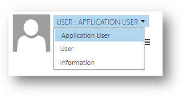

# Use OAuth authentication with Microsoft Dataverse

[OAuth 2.0](https://oauth.net/2/) is the industry-standard protocol for authorization. After application users provide credentials to authenticate, OAuth determines whether they are authorized to access the resources.

Client applications must support the use of OAuth to access data using the Web API. OAuth enables two-factor authentication (2FA) or certificate-based authentication for server-to-server application scenarios.

OAuth requires an identity provider for authentication. For Dataverse, the identity provider is Azure Active Directory (AAD). To authenticate with AAD using a Microsoft work or school account, use the Azure Active Directory Authentication Libraries (ADAL) or Microsoft Authentication Library (MSAL).

> [!NOTE]
> This topic will introduce common concepts related to connecting to Dataverse using OAuth with authentication libraries. This content will focus on how a developer can connect to Dataverse but not on the inner workings of OAuth or the libraries. For complete information related to authentication see the Azure Active Directory documentation. [What is authentication?](/azure/active-directory/develop/authentication-scenarios) is a good place to start.
>
>Samples we provide are pre-configured with appropriate registration values so that you can run them without generating your own app registration. When you publish your own apps, you must use your own registration values.

## App Registration

When you connect using OAuth you must first register an application in your Azure AD tenant. How you should register your app depends on the type of app you want to make.

In all cases, start with basic steps to register an app described in the AAD topic: [Quickstart: Register an app with the Azure Active Directory v1.0 endpoint](/azure/active-directory/develop/quickstart-v1-add-azure-ad-app). For Dataverse specific instructions see [Walkthrough: Register an app with Azure Active Directory > Create an application registration](walkthrough-register-app-azure-active-directory.md#create-an-application-registration).

The decisions you will need to make in this step mostly depend on the Application Type choice (see below).

### Types of app registration

When you register an app with Azure AD one of the decisions you must make is the application type. There are two types of applications you can register:

|Application type|Description|
|--|--|
|Web app /API|**Web client**<br />A type of [client application](/azure/active-directory/develop/developer-glossary#client-application) that executes all code on a web server.<br /><br />**User-agent-based client**<br />A type of [client application](/azure/active-directory/develop/developer-glossary#client-application) that downloads code from a web server and executes within a user-agent (for instance, a web browser), such as a Single Page Application (SPA). 
|
|Native|A type of [client application](/azure/active-directory/develop/developer-glossary#client-application) that is installed natively on a device. |

When you select **Web app /API** you must provide a **Sign-On URL** which is the URL where Azure AD will send the authentication response, including a token if authentication was successful. While you develop an app, this is usually set to `https://localhost/appname:[port]` so you can develop and debug your app locally. When you publish your app, you need to change this value to the published URL of the app.

When you select **Native**, you must provide a Redirect URI. This is a unique identifier to which Azure AD will redirect the user-agent in an OAuth 2.0 request. This is typically a value formatted like so: `app://<guid>`. 

### Giving access to Dataverse

If your app will be a client which allows the authenticated user to perform operations, you must configure the application to have the Access Dynamics 365 as organization users delegated permission.

For specific steps to do this, see [Walkthrough: Register an app with Azure Active Directory > Apply Permissions](walkthrough-register-app-azure-active-directory.md).

<!-- TODO Verify this -->
If your app will use Server-to-Server (S2S) authentication, this step is not required. That configuration requires a specific system user and the operations will be performed by that user account rather than any user that must be authenticated.

### Enable Implicit Flow

If you are configuring an app for a Single Page Application (SPA) you must edit the Manifest to set the `oauth2AllowImplicitFlow` value to `true`. More information: [Walkthrough: Registering and configuring a SPA application with adal.js](walkthrough-registering-configuring-simplespa-application-adal-js.md)

### Use Client Secrets & Certificates

For server to server scenarios there will not be an interactive user account to authenticate. In these cases, you need to provide some means to confirm that the application is trusted. This is done using client secrets or certificates.

For apps that are registered with the **Web app /API** application type, you can configure secrets. These are set using the **Keys** area under **API Access** in the **Settings** for the app registration. 

For either application type, you can upload a certificate.

More information: [Connect as an app](#connect-as-an-app)

## Use authentication libraries to connect

Use one of the Microsoft-supported Azure Active Directory authentication client libraries to connect to Dataverse. There are two such libraries available from Microsoft: [Azure Active Directory Authentication Library (ADAL)](/azure/active-directory/azuread-dev/active-directory-authentication-libraries), and [Microsoft Authentication Library (MSAL)](/azure/active-directory/develop/reference-v2-libraries). These libraries are available for various platforms as described in the provided links.

> [!NOTE]
> Of the two authentication libraries mentioned, ADAL is no longer actively receiving updates and is scheduled to be supported only until June, 2022. MSAL is the recommended authentication library to use for new projects.<p/>
> Currently, all our samples use the .NET client libraries except for [Use OAuth with Cross-Origin Resource Sharing to connect a Single Page Application](oauth-cross-origin-resource-sharing-connect-single-page-application.md) which uses the JavaScript ADAL.js library.

For a code sample that demonstrates use of ADAL and MSAL libraries for authentication with Dataverse see [QuickStart sample](https://github.com/Microsoft/PowerApps-Samples/tree/master/cds/webapi/C%23/QuickStart).

### ADAL .NET client library versions

Dataverse supports application authentication with the Web API endpoint using the OAuth 2.0 protocol. For your custom .NET applications, use ADAL v3.19 or greater for application authentication with the Web API endpoint. When using the XrmTooling APIs (such as [CrmServiceClient](xref:Microsoft.Xrm.Tooling.Connector.CrmServiceClient)) found in the [Microsoft.CrmSdk.XrmTooling.CoreAssembly](https://www.nuget.org/packages/Microsoft.CrmSdk.XrmTooling.CoreAssembly/) NuGet package, the correct version of the ADAL library will be imported automatically into your Visual Studio project. Use XrmTooling APIs from the [v9.1.0.13](https://www.nuget.org/packages/Microsoft.CrmSdk.XrmTooling.CoreAssembly/9.1.0.13) (or greater) NuGet package. Consult the package's release notes for the release history.  

## Use the AccessToken with your requests

The point of using the authentication libraries is to get an access token that you can include with your requests. 
This only requires a few lines of code, and just a few more lines to configure an [HttpClient](xref:System.Net.Http.HttpClient) to execute a request.

### Simple example

The following is the minimum amount of code needed to execute a single Web API request, but it is not the recommended approach. Note that this code uses the ADAL library and is taken from the QuickStart sample mentioned above.

```csharp
string resource = "https://contoso.api.crm.dynamics.com";
var clientId = "51f81489-12ee-4a9e-aaae-a2591f45987d";
var redirectUri = new Uri("app://58145B91-0C36-4500-8554-080854F2AC97");

var authContext = new AuthenticationContext(
    "https://login.microsoftonline.com/common", false);

var token = authContext.AcquireTokenAsync(
    resource, clientId, redirectUri,
    new PlatformParameters(
        PromptBehavior.SelectAccount   // Prompt the user for a logon account.
    ),
    UserIdentifier.AnyUser
).Result;

var client = new HttpClient
{
    BaseAddress = new Uri(resource + "/api/data/v9.2/"),
    Timeout = new TimeSpan(0, 2, 0)
};

HttpRequestHeaders headers = client.DefaultRequestHeaders;
headers.Authorization = new AuthenticationHeaderValue("Bearer", token.AccessToken);
headers.Add("OData-MaxVersion", "4.0");
headers.Add("OData-Version", "4.0");
headers.Accept.Add(
    new MediaTypeWithQualityHeaderValue("application/json"));

var response = client.GetAsync("WhoAmI").Result;
```

This simple approach does not represent a good pattern to follow because the `token` will expire in about an hour. ADAL libraries will cache the token for you and will refresh it each time the `AcquireTokenAsync` method is called. However in this simple example, the token is only acquired once.

### Example demonstrating a delegating message handler

The recommended approach is to implement a class derived from <xref:System.Net.Http.DelegatingHandler> which will be passed to the constructor of the <xref:System.Net.Http.HttpClient>. This handler will allow you to override the <xref:System.Net.Http.HttpClient>.<xref:System.Net.Http.HttpClient.SendAsync*> method so that the access token will be refreshed by the `AcquireToken*` method calls with each request sent by the Http client.

The following is an example of a custom class derived from <xref:System.Net.Http.DelegatingHandler>. This code is taken from the [Enhanced QuickStart](https://github.com/Microsoft/PowerApps-Samples/tree/master/cds/webapi/C%23/EnhancedQuickStart) sample which uses the MSAL authentication library.

```csharp
class OAuthMessageHandler : DelegatingHandler
{
    private AuthenticationHeaderValue authHeader;

    public OAuthMessageHandler(string serviceUrl, string clientId, string redirectUrl, string username, string password,
            HttpMessageHandler innerHandler)
        : base(innerHandler)
    {

        string apiVersion = "9.2";
        string webApiUrl = $"{serviceUrl}/api/data/v{apiVersion}/";

        //Build Microsoft.Identity.Client (MSAL) OAuth Token Request
        var authBuilder = PublicClientApplicationBuilder.Create(clientId)
                        .WithAuthority(AadAuthorityAudience.AzureAdMultipleOrgs)
                        .WithRedirectUri(redirectUrl)
                        .Build();
        var scope = serviceUrl + "//.default";
        string[] scopes = { scope };

        AuthenticationResult authBuilderResult;
        if (username != string.Empty && password != string.Empty)
        {
            //Make silent Microsoft.Identity.Client (MSAL) OAuth Token Request
            var securePassword = new SecureString();
            foreach (char ch in password) securePassword.AppendChar(ch);
            authBuilderResult = authBuilder.AcquireTokenByUsernamePassword(scopes, username, securePassword)
                        .ExecuteAsync().Result;
        }
        else
        {
            //Popup authentication dialog box to get token
            authBuilderResult = authBuilder.AcquireTokenInteractive(scopes)
                        .ExecuteAsync().Result;
        }

        //Note that an Azure AD access token has finite lifetime, default expiration is 60 minutes.
        authHeader = new AuthenticationHeaderValue("Bearer", authBuilderResult.AccessToken);
    }

    protected override Task<HttpResponseMessage> SendAsync(
                HttpRequestMessage request, System.Threading.CancellationToken cancellationToken)
    {
        request.Headers.Authorization = authHeader;
        return base.SendAsync(request, cancellationToken);
    }
}
```

Using this `OAuthMessageHandler` class, the simple `Main` method would look like this. 

```csharp
class Program
{
    static void Main(string[] args)
    {
        try
        {
            //Get configuration data from App.config connectionStrings
            string connectionString = ConfigurationManager.ConnectionStrings["Connect"].ConnectionString;

            using (HttpClient client = SampleHelpers.GetHttpClient(connectionString, SampleHelpers.clientId, 
                SampleHelpers.redirectUrl))
            {
                // Use the WhoAmI function
                var response = client.GetAsync("WhoAmI").Result;

                if (response.IsSuccessStatusCode)
                {
                    //Get the response content and parse it.  
                    JObject body = JObject.Parse(response.Content.ReadAsStringAsync().Result);
                    Guid userId = (Guid)body["UserId"];
                    Console.WriteLine("Your UserId is {0}", userId);
                }
                else
                {
                    Console.WriteLine("The request failed with a status of '{0}'",
                                response.ReasonPhrase);
                }
                Console.WriteLine("Press any key to exit.");
                Console.ReadLine();
            }
        }
        catch (Exception ex)
        {
            SampleHelpers.DisplayException(ex);
            Console.WriteLine("Press any key to exit.");
            Console.ReadLine();
        }
    }
}
```

The configuration string values have been moved into an App.config file connection string, and the Http client is configured in the `GetHttpClient` method.

```csharp
public static HttpClient GetHttpClient(string connectionString, string clientId, string redirectUrl, string version = "v9.2")
{
    string url = GetParameterValueFromConnectionString(connectionString, "Url");
    string username = GetParameterValueFromConnectionString(connectionString, "Username");
    string password = GetParameterValueFromConnectionString(connectionString, "Password");
    try
    {
        HttpMessageHandler messageHandler = new OAuthMessageHandler(url, clientId, redirectUrl, username, password,
                        new HttpClientHandler());

        HttpClient httpClient = new HttpClient(messageHandler)
        {
            BaseAddress = new Uri(string.Format("{0}/api/data/{1}/", url, version)),

            Timeout = new TimeSpan(0, 2, 0)  //2 minutes
        };

        return httpClient;
    }
    catch (Exception)
    {
        throw;
    }
}
```

See the [Enhanced QuickStart](https://github.com/Microsoft/PowerApps-Samples/tree/master/cds/webapi/C%23/EnhancedQuickStart) sample for the complete code.

Even though this example uses <xref:System.Net.Http.HttpClient>.<xref:System.Net.Http.HttpClient.GetAsync*> rather than the overridden <xref:System.Net.Http.HttpClient.SendAsync*>, it will apply for any of the <xref:System.Net.Http.HttpClient> methods that send a request.

### Discover the authority at run time

The authentication authority URL, and the resource URL, can be determined dynamically at run time using the following ADAL code. This is the recommended method to use as compared to the well-known authority URL ("https://login.microsoftonline.com/common") shown previously in a code snippet.  
  
```csharp    
AuthenticationParameters ap = AuthenticationParameters.CreateFromResourceUrlAsync(  
                        new Uri("https://mydomain.crm.dynamics.com/api/data/")).Result;  
  
String authorityUrl = ap.Authority;  
String resourceUrl  = ap.Resource;  
```  
  
For the Web API, another way to obtain the authority URL is to send any message request to the web service specifying no access token. This is known as a *bearer challenge*. The response can be parsed to obtain the authority URL.  
  
```csharp  
httpClient.DefaultRequestHeaders.Authorization = new AuthenticationHeaderValue("Bearer", "");  
```  

## Connect as an app

Some apps you will create are not intended to be run interactively by a user. For example, you may want to make a web client application that can perform operations on Dataverse data, or a console application that performs a scheduled task of some kind. 

While you could achieve these scenarios using credentials for an ordinary user, that user account would need to use a paid license. This isn't the recommended approach.

In these cases you can create a special application user which is bound to an Azure Active Directory registered application and use either a key secret configured for the app or upload a [X.509](https://www.itu.int/rec/T-REC-X.509/en) certificate. Another benefit of this approach is that it doesn't consume a paid license.

### Requirements to connect as an app

To connect as an app you will need:
 - A registered app
 - A Dataverse user bound to the registered app
 - Connect using either the application secret or a certificate thumbprint

#### Register your app

When registering an app you follow many of the same steps described in [Walkthrough: Register an app with Azure Active Directory](walkthrough-register-app-azure-active-directory.md), with the following exceptions:

 - You do not need to grant the **Access Dynamics 365 as organization users** permission.
 
    This application will be bound to a specific user account.

 - You must configure a secret for the app registration OR upload a public key certificate.

While registering the app, select the **Keys** section on the **Settings** page.

To add a certificate:
1. Select **Upload Public Key**.
2. Select the file you'd like to upload. It must be one of the following file types: .cer, .pem, .crt.

To add a password:

1. Add a description for your key.
2. Select a duration.
3. Select **Save**. 

  The right-most column will contain the key value, after you save the configuration changes. Be sure to copy the key for use in your client application code, as it is not accessible once you leave this page.

#### Dataverse user account bound to the registered app


The first thing you must do is create a custom security role that will define what access and privileges this account will have within the Dataverse organization. More information: [Create or configure a custom security role](/power-platform/admin/database-security#create-or-configure-a-custom-security-role)

After you have created the custom security role, you must create the user account which will use it.

<!-- Almost exactly the same intructions below can be found in powerapps-docs\developer\data-platform\use-multi-tenant-server-server-authentication.md -->

#### Manually create a Dataverse application user  

 The procedure to create this user is different from creating a licensed user. Use the following steps:  
  
1. Navigate to **Settings** > **Security** > **Users**  
  
2. In the view drop-down, select **Application Users**.  
  
3. Click **New**. Then verify that you are using the **Application user** form.  
  
    If you do not see the **Application ID**, **Application ID URI** and **Azure AD Object ID** fields in the form, you must select the **Application User** form from the list:  
  
     
  
4. Add the appropriate values to the fields:  
  
   |Field|Value|  
   |-----------|-----------|
   |**User Name**| A name for the user|
   |**Application ID**|The Application ID value for the application registered with Azure AD.|  
   |**Full Name**|The name of your application.|  
   |**Primary Email**|The email address for the user.|  
  
    The **Application ID URI** and **Azure AD Object ID** fields are locked and you cannot set values for these fields.  
  
    When you create this user the values for these fields will be retrieved from Azure AD based on the **Application ID** value when you save the user.  
  
5. Associate the application user with the custom security role you created.

#### Connect using the application secret

If you are connecting using an secret configured for the application, you will use the <xref:Microsoft.IdentityModel.Clients.ActiveDirectory.ClientCredential> class passing in the `clientId` and `clientSecret` rather than a <xref:Microsoft.IdentityModel.Clients.ActiveDirectory.UserCredential> with `userName` and `password` parameters.
```csharp
string serviceUrl = "https://yourorg.crm.dynamics.com";
string clientId = "<your app id>";
string secret = "<your app secret>";

AuthenticationContext authContext = new AuthenticationContext("https://login.microsoftonline.com/<Tenant-ID-here>");
ClientCredential credential = new ClientCredential(clientId, secret);

AuthenticationResult result = authContext.AcquireToken(serviceUrl, credential);

string accessToken = result.AccessToken;
```
#### Connect using a certificate thumbprint

If you are connecting using a certificate and using the <xref:Microsoft.Xrm.Tooling.Connector>.<xref:Microsoft.Xrm.Tooling.Connector.CrmServiceClient> you can use code like the following:

```csharp
string CertThumbPrintId = "DC6C689022C905EA5F812B51F1574ED10F256FF6";
string AppID = "545ce4df-95a6-4115-ac2f-e8e5546e79af";
string InstanceUri = "https://yourorg.crm.dynamics.com";

string ConnectionStr = $@"AuthType=Certificate;
                        SkipDiscovery=true;url={InstanceUri};
                        thumbprint={CertThumbPrintId};
                        ClientId={AppID};
                        RequireNewInstance=true";
using (CrmServiceClient svc = new CrmServiceClient(ConnectionStr))
{
    if (svc.IsReady)
    {
    //your code goes here
    }

}
```

### See also

[Authentication with Microsoft Dataverse web services](authentication.md)<br />
[Authenticating .NET Framework applications](authenticate-dot-net-framework.md)<br/>
[Overview of the Microsoft Authentication Library](/azure/active-directory/develop/msal-overview)


[!INCLUDE[footer-include](../../includes/footer-banner.md)]
