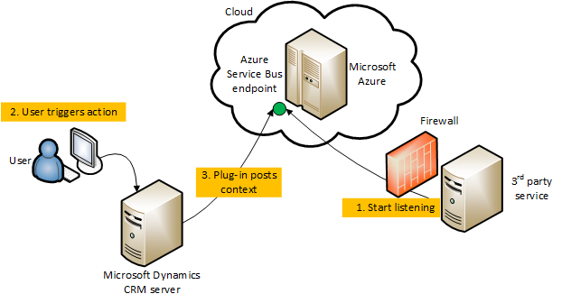

# Azure integration

[!INCLUDE[cc-terminology](includes/cc-terminology.md)]

Microsoft Dataverse supports integration with Azure. Developers can register plug-ins with Dataverse that can pass runtime message data, known as the execution context, to one or more Azure solutions in the cloud. This is especially important because Azure is one of two supported solutions for communicating runtime context obtained in a plug-in to external line-of-business (LOB) applications. The other solution is the external custom endpoint access capability from a plug-in registered in the sandbox.

The Azure Service Bus provides a secure and reliable communication channel between Dataverse runtime data and external cloud-based line-of-business (LOB) applications. This capability is especially useful in keeping disparate Dataverse systems or other Dataverse servers synchronized with business data changes.

## Key elements of the connection  

 The key elements that implement the connection between Dataverse and the Azure Service Bus are described later. A diagram in the next section shows these elements in operation.  
  
### Data Context

 The *data context* contains the business data that is being processed as part of the current Dataverse operation. This processing was initiated when a request to perform a certain operation was made by a user, workflow, or application, to the Dynamics 365 platform. The data context is passed to any plug-ins or custom workflow activities that are registered with the event pipeline to execute on the specific request and table combination that is currently being processed. The data context is of type <xref:Microsoft.Xrm.Sdk.IPluginExecutionContext> when it is being passed along the event execution pipeline and <xref:Microsoft.Xrm.Sdk.RemoteExecutionContext> when it is posted to the Service Bus.  
  
 The data context contained within the message that is posted to the Azure Service Bus can be formatted in XML or JSON in addition to the default .NET binary format. This allows for cross-platform interoperability where Azure hosted non-.NET clients can read Dataverse data from the service bus.

> [!IMPORTANT]
> When the size of the entire HTTP payload exceeds 192Kb, the following properties will be removed:
>
> - <xref:Microsoft.Xrm.Sdk.RemoteExecutionContext.ParentContext>
> - <xref:Microsoft.Xrm.Sdk.RemoteExecutionContext.InputParameters>
> - <xref:Microsoft.Xrm.Sdk.RemoteExecutionContext.PreEntityImages>
> - <xref:Microsoft.Xrm.Sdk.RemoteExecutionContext.PostEntityImages>
>
> Some operations do not include these properties.
>
> - If the size of the payload is below 192Kb after the additional data is removed, an additional `MessageMaxSizeExceeded` property is added to the [BrokeredMessage](/dotnet/api/microsoft.servicebus.messaging.brokeredmessage) sent by the system. This indicates that some of the data has been truncated.
> - If the size of the payload exceeds 192Kb after the  additional data is removed, an error occurs and the message is not sent.
  
 For more information about the technologies described earlier, see:
 - [Event execution pipeline](event-framework.md#event-execution-pipeline)
 - [Write a listener application for a Microsoft Azure solution](write-listener-application-azure-solution.md).  
  
### Plug-ins

Plug-ins are one of two methods used to initiate posting the message containing the data context to the Azure Service Bus, the other method being a custom workflow activity. There are two kinds of plug-ins supported by the Dataverse-Azure connection feature: out-of-box (OOB), and custom. In either case, it is recommended that you register the plug-in to run asynchronously for best system performance.  
  
An Azure-aware OOB plug-in is provided with Dataverse and can be registered using the Plug-in Registration tool. This plug-in executes in full trust with the Dataverse platform. You must register a plug-in 'step' in the event execution pipeline that identifies the message and table combination that triggers the plug-in to execute and perform the posting notification. When executed, the plug-in  notifies the asynchronous service, through a service endpoint notification service (<xref:Microsoft.Xrm.Sdk.IServiceEndpointNotificationService>), to post the current request data context to the Azure Service Bus.  
  
You can also write your own custom plug-in that is “Azure-aware”. The custom plug-in executes in partial trust mode in the sandbox. A custom plug-in can initiate posting of the data context to the service bus through the service endpoint notification service. Adding code to invoke this service makes the plug-in “Azure-aware”.

For more information about plug-ins in general, see [Writing a Plug-in](write-plug-in.md). For more information about Azure-aware plug-ins, see [Write a Custom Azure-aware Plug-in](write-custom-azure-aware-plugin.md).  
  
### Custom workflow activities

Similarly to plug-ins, custom workflow activities can be written to initiate posting the current request message data context to the Azure Service Bus by using the service endpoint notification service. More information: [Workflow extensions](workflow/workflow-extensions.md) 
  
### Asynchronous service

Once notified by the service endpoint notification service, the asynchronous service handles posting the  data context of the request message currently being processed by the event execution pipeline to the Azure Service Bus. Each post is performed by a system job of the asynchronous service. A user can view the status of each system job by using the **System Jobs** view of the Power Apps web application.  
  
For more information about the asynchronous service see [Asynchronous service](asynchronous-service.md).  
  
### Microsoft Azure Service Bus

The service bus relays the request message data context between Dataverse and Azure Service Bus solution listener applications. The service bus also provides data security so that only authorized applications can access the posted Dynamics 365 data.  Authorization of Dataverse to post the data context to the service bus and for listener applications to read it is managed by  Azure Shared Access Signatures (SAS).  

 For more information about service bus, see [Service Bus](https://azure.microsoft.com/services/service-bus/). For more information about service bus authorization, see [Service Bus authentication and authorization](https://azure.microsoft.com/documentation/articles/service-bus-authentication-and-authorization/).  
  
### Microsoft Azure solution

For the Dataverse and Azure connection to work, there must be at least one solution in an Azure Service Bus solution account, where the solution contains one or more service endpoints. For a relay endpoint contract, a listener application that is “Dataverse-aware” must be actively listening on the endpoint for the Dataverse request on the Service Bus. For a queue endpoint contract, a listener doesn’t have to be actively listening. A listener is made Dataverse-aware by linking it to the <xref:Microsoft.Xrm.Sdk> assembly so that type <xref:Microsoft.Xrm.Sdk.RemoteExecutionContext> is defined. More information: [Write a Listener for a Microsoft Azure Solution](write-listener-application-azure-solution.md)  
  
Dataverse supports sending event data to an Azure Event Hubs solution. More information about event hubs, see [Work with event data in your Azure Event Hub solution](work-event-data-azure-event-hub-solution.md).  
  
  

## Dataverse to Service Bus scenario

Let us now identify a scenario that implements the previously mentioned connection components. As a prerequisite, SAS has been configured to recognize Dataverse as the supported issuer and the Azure Service Bus solution configured with rules to allow Dataverse to post to the endpoint where the listener is.  
  
The following diagram shows the physical elements that make up the scenario.  
  
  
  
The sequence of events as identified in this diagram are as follows:  
  
1. A listener application is registered on a Azure Service Bus solution endpoint, and begins actively listening for the Dataverse remote execution context on the Service Bus.  

2. A user performs some operation in Dataverse that triggers execution of the registered OOB plug-in or a custom Azure-aware plug-in. The plug-in initiates a post, through an asynchronous service system job, of the current request data context to the Service Bus.  
3. The claims posted by Dataverse are authenticated. The Service Bus then relays the remote execution context to the listener. The listener processes the context information and performs some business-related task with that information. The Service Bus notifies the asynchronous service of a successful post and sets the related system job to a completed status.  
  
  

## Establish a contract between Dataverse and an Azure solution

For each solution endpoint, you configure a contract that defines the handling of these remote execution context “messages” on the Service Bus and the security that should be used on that endpoint. Service Bus messages are received at an endpoint using one of the supported contracts listed here.  
  
### Queue

A queue contract provides a message queue in the cloud. With a queue contract, a listener doesn’t have to be actively listening for messages on the endpoint. For queues, there is a destructive read and a non-destructive read. A destructive read reads an available message from the queue and the message is removed. A non-destructive read doesn’t remove a message from the queue.  
  
The type of queue supported by Dataverse is called a persistent queue. Persistent queues have a long but finite message availability duration that can be specified in code.  
  
### One-way

A one-way contract requires an active listener. If there is no active listener on an endpoint, the post to the Service Bus fails. Dataverse will retry the post in exponentially larger and larger time spans until the asynchronous system job that is posting the request is eventually aborted and its status is set to “Failed.”  
  
### Two-way

A two-way contract is similar to a one-way contract except that a string value can be returned from the listener to the Dataverse plug-in or custom workflow activity that initiated the post.  
  
### REST

A REST contract is similar to a two-way contract on a REST endpoint.  
  
### Topic

Similar to a queue except that one or more listeners can subscribe to receive messages from the topic.  
  
### Event Hub

This contract type applies to Azure Event Hub solutions.  
  
> [!IMPORTANT]
> To use these contracts, you must write your listener applications using the [Azure SDK](https://www.windowsazure.com/develop/downloads/) v1.7 or later.  
  
Identifying the kind of security a contract uses is part of the contract’s configuration. A contract can use Transport security, which uses Transport Layer Security (TLS) or Secure Sockets Layer (SSL) (https).  
  
Claims authentication is used for secure access to the Service Bus. The claim used to authenticate to the Service Bus is generated in Dataverse and signed by the AppFabricIssuer certificate specified in the Dataverse configuration database.  
  

## Manage run-time errors  

If an error occurred after a post was attempted to the Service Bus, check the status of the related system job in the web application for more information on the error. If the Service Bus is down or a listener/endpoint isn’t available, the current message being processed in Dataverse will not be posted to the bus. The asynchronous service will continue to try to post the message in an exponential pattern where it will try to post frequently at first and then at longer and longer intervals. For an internal Dataverse error, message posts are not attempted. For an external service bus or network error, the related system job will be in a “Wait” state.

[!INCLUDE[footer-include](../../includes/footer-banner.md)]