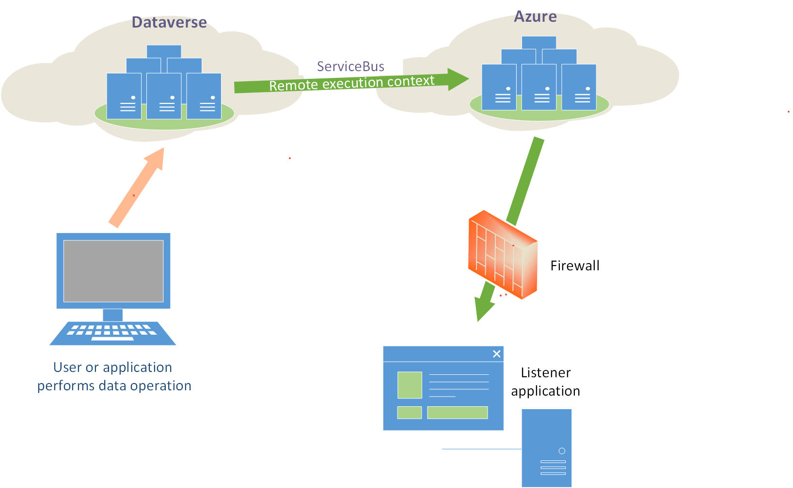

# Azure Service Bus integration

[!INCLUDE[cc-terminology](includes/cc-terminology.md)]

Microsoft Dataverse supports integration with Azure. Developers can register plug-ins with Dataverse that pass runtime message data, known as the execution context, to one or more Azure solutions in the cloud. This capability is especially important because Azure is one of a few supported solutions for communicating runtime context to external line-of-business (LOB) applications.

The Azure Service Bus provides a secure and reliable communication channel between Dataverse runtime data and external cloud-based line-of-business (LOB) applications. This capability is especially useful in keeping disparate Dataverse systems or other Dataverse servers synchronized with business data changes.

## Key elements of the connection  

 The key elements that implement the connection between Dataverse and the Azure Service Bus are described later. A diagram in the next section shows these elements in operation.  
  
### Data context

 The *data context* contains the business data that the current Dataverse operation processes. A user, workflow, or application initiates this processing when they request a certain Dataverse operation. The event pipeline passes the data context to any plug-ins or custom workflow activities that are registered to execute on the specific request and table combination that the pipeline is currently processing. The data context is of type <xref:Microsoft.Xrm.Sdk.IPluginExecutionContext> when passed along the event execution pipeline and <xref:Microsoft.Xrm.Sdk.RemoteExecutionContext> when posted to the Service Bus.  
  
 The data context contained within the message that is posted to the Azure Service Bus can be formatted in XML or JSON in addition to the default .NET binary format. Support for such data formats allows for cross-platform interoperability where Azure hosted non-.NET clients can read Dataverse data from the service bus.

> [!IMPORTANT]
> When the size of the entire HTTP payload exceeds 192 KB, the following properties are removed:
>
> <xref:Microsoft.Xrm.Sdk.RemoteExecutionContext.ParentContext>,
> <xref:Microsoft.Xrm.Sdk.RemoteExecutionContext.InputParameters>,
> <xref:Microsoft.Xrm.Sdk.RemoteExecutionContext.PreEntityImages>,
> <xref:Microsoft.Xrm.Sdk.RemoteExecutionContext.PostEntityImages>
>
> Some operations don't include these properties.
>
> - If the size of the payload is less than 192 KB after the additional data is removed, the system adds an extra `MessageMaxSizeExceeded` property to the [BrokeredMessage](/dotnet/api/microsoft.servicebus.messaging.brokeredmessage). This property indicates that some of the data is truncated.
> - If the size of the payload exceeds 192 KB after the  additional data is removed, an error occurs and the message isn't sent.
  
 For more information about the earlier described technologies, see:

- [Event execution pipeline](event-framework.md#event-execution-pipeline)
- [Write a listener application for a Microsoft Azure solution](write-listener-application-azure-solution.md).  
  
### Plug-ins

Plug-ins are one of two methods you can use to initiate posting the message containing the data context to the Azure Service Bus. The other method is a custom workflow activity. The Dataverse-Azure connection feature supports two kinds of plug-ins: out-of-box (OOB) and custom. In either case, register the plug-in to run asynchronously for best system performance.  
  
An Azure-aware default (OOB) plug-in is available. Register it with Dataverse by registering a service endpoint by using the Plug-in Registration tool. You must register a plug-in 'step' in the event execution pipeline that identifies the message and table combination that triggers the plug-in to execute and perform the posting notification. When executed, the plug-in notifies the asynchronous service, through a service endpoint notification service (<xref:Microsoft.Xrm.Sdk.IServiceEndpointNotificationService>), to post the current request data context to the Azure Service Bus.  
  
You can also write your own custom plug-in that is Azure-aware. The custom plug-in executes in the sandbox. A custom plug-in can initiate posting of the data context to the service bus through the service endpoint notification service. Adding code to invoke this service makes the plug-in Azure-aware.

For more information about plug-ins in general, see [Writing a Plug-in](write-plug-in.md). For more information about Azure-aware plug-ins, see [Write a Custom Azure-aware Plug-in](write-custom-azure-aware-plugin.md).  
  
### Custom workflow activities

Similarly to plug-ins, you can write custom workflow activities to initiate posting the current request message data context to the Azure Service Bus by using the service endpoint notification service. For more information, see [Workflow extensions](workflow/workflow-extensions.md).
  
### Asynchronous service

Once the service endpoint notification service notifies it, the asynchronous service handles posting the data context of the request message currently being processed by the event execution pipeline to the Azure Service Bus. Each post is performed by a system job of the asynchronous service. A user can view the status of each system job by using the **System Jobs** view of the Power Apps web application. In the web application, choose **Advanced settings** to display the legacy Dynamics 365 interface. Next, select **Settings** > **System jobs**.
  
For more information about the asynchronous service, see [Asynchronous service](asynchronous-service.md).  
  
### Microsoft Azure Service Bus

The service bus relays the request message data context between Dataverse and Azure Service Bus solution listener applications. The service bus also provides data security so that only authorized applications can access the posted Dataverse data.  Authorization of Dataverse to post the data context to the service bus and for listener applications to read it is managed by Azure Shared Access Signatures (SAS).  

 For more information about service bus, see [Service Bus](https://azure.microsoft.com/services/service-bus/). For more information about service bus authorization, see [Service Bus authentication and authorization](/azure/service-bus-messaging/service-bus-authentication-and-authorization).  
  
### Microsoft Azure solution

For the Dataverse and Azure connection to work, an Azure Service Bus solution account must contain at least one solution, and that solution must contain one or more service endpoints. For a relay endpoint contract, a listener application that is "Dataverse-aware" must actively listen on the endpoint for the Dataverse request on the Service Bus. For a queue endpoint contract, a listener doesn't have to actively listen. You make a listener Dataverse-aware by linking it to the <xref:Microsoft.Xrm.Sdk> assembly so that it defines the <xref:Microsoft.Xrm.Sdk.RemoteExecutionContext> type. For more information, see [Write a Listener for a Microsoft Azure Solution](write-listener-application-azure-solution.md).  
  
Dataverse supports sending event data to an Azure Event Hubs solution. For more information about event hubs, see [Work with event data in your Azure Event Hubs solution](work-event-data-azure-event-hub-solution.md).  
  
  

## Dataverse to Service Bus scenario

This scenario implements the previously mentioned connection components. As a prerequisite, configure SAS to recognize Dataverse as the supported issuer and configure the Azure Service Bus solution with rules to allow Dataverse to post to the endpoint where the listener is.  
  
The following diagram shows the physical elements that make up the scenario.  
  
  
  
The sequence of events as identified in this diagram are as follows:  
  
1. Register a listener application on an Azure Service Bus solution endpoint. The listener begins actively listening for the Dataverse remote execution context on the Service Bus.  

1. A user performs some operation in Dataverse that triggers execution of the registered OOB plug-in or a custom Azure-aware plug-in. The plug-in initiates a post, through an asynchronous service system job, of the current request data context to the Service Bus.  
1. The claims posted by Dataverse are authenticated. The Service Bus then relays the remote execution context to the listener. The listener processes the context information and performs some business-related task with that information. The Service Bus notifies the asynchronous service of a successful post and sets the related system job to a completed status.  
  
  

## Establish a contract between Dataverse and an Azure solution

For each solution endpoint, you configure a contract that defines the handling of these remote execution context "messages" on the Service Bus and the security that the endpoint should use. An endpoint receives Service Bus messages by using one of the supported contracts listed here.  
  
### Queue

A queue contract provides a message queue in the cloud. When you use a queue contract, a listener doesn't need to actively listen for messages on the endpoint. For queues, there's a destructive read and a nondestructive read. A destructive read reads an available message from the queue and removes the message. A nondestructive read doesn't remove a message from the queue.  
  
Dataverse supports a persistent queue. Persistent queues have a long but finite message availability duration that you can specify in code.  
  
### One-way

A one-way contract requires an active listener. If there's no active listener on an endpoint, the post to the Service Bus fails. Dataverse retries the post in exponentially larger and larger time spans until the asynchronous system job that is posting the request is eventually aborted and its status is set to **Failed**.  
  
### Two-way

A two-way contract is similar to a one-way contract except that a string value can be returned from the listener to the Dataverse plug-in or custom workflow activity that initiated the post.  
  
### REST

A REST contract is similar to a two-way contract on a REST endpoint.
  
### Topic

A topic is similar to a queue except that one or more listeners can subscribe to receive messages from the topic.  
  
### Event Hubs

This contract type applies to Azure Event Hubs solutions.
  
Identifying the kind of security a contract uses is part of the contract’s configuration. A contract can use Transport security, which uses Transport Layer Security (TLS) or Secure Sockets Layer (SSL) (https).  
  
Claims authentication is used for secure access to the Service Bus. The claim used to authenticate to the Service Bus is generated in Dataverse and signed by the AppFabricIssuer certificate specified in the Dataverse configuration database.  
  

## Manage run-time errors  

If an error occurs after a post attempt to the Service Bus, check the status of the related system job in the web application for more information about the error. If the Service Bus is down or a listener or endpoint isn't available, the current message being processed in Dataverse isn't posted to the bus. The asynchronous service continues to try to post the message in an exponential pattern where it tries to post frequently at first and then at longer and longer intervals. For an internal Dataverse error, message posts aren't attempted. For an external service bus or network error, the related system job is in a **Wait** state.

[!INCLUDE[footer-include](../../includes/footer-banner.md)]
