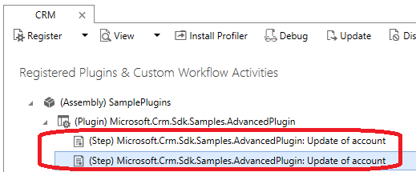

# Do not duplicate plug-in step registration

[!INCLUDE[cc-data-platform-banner](../../../../includes/cc-data-platform-banner.md)]

**Category**: Performance

**Impact potential**: High

## Symptoms

Duplicate plug-in step registration will cause the plug-in to fire multiple times on the same message/event. This could lead to:

- Delayed processing of asynchronous jobs when registered as an asynchronous execution mode.
- Degraded user performance experience when registered as a synchronous execution mode. Experiences include:
    - Unresponsive model-driven apps
    - Slow client interactions
    - The browser stops responding

## Guidance

Ensure you are updating existing plug-in registration steps rather than deleting and re-creating them.  Additionally, only create and update plug-in registration steps in a supported manner.

## Problematic patterns

> [!WARNING]
> These patterns should be avoided.

Deleting and recreating a step in the source instance (test, dev, preprod) will also create a duplicate step being registered in the target environment if that step had been registered before.

Manually creating the `SDKMessageProcessingSteps` with a new GUID or updating the existing GUID within the `customizations.xml` file will result in a duplicate step being registered. These types of tasks are unsupported as outlined in [When to edit the customizations file](/power-platform/alm/when-edit-customization-file).

## Additional information

Duplicate plug-in step registration could cause SQL deadlocking when the events are registered on an update message. When issuing an update on a record, SQL will create a row lock on that record. If another transaction tries to update that same record, it will have to wait until the lock is released before it's able to make the update. If a timeout occurs, the transaction is rolled back and the update is not committed to the SQL database.

### See also

[Register a plug-in](../../register-plug-in.md)
[Deadlocking](/previous-versions/sql/sql-server-2008-r2/ms177433(v=sql.105)) 

[!INCLUDE[footer-include](../../../../includes/footer-banner.md)]