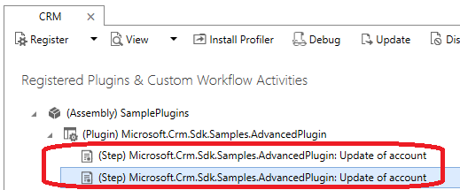

# Don't duplicate plug-in step registration

**Category**: Performance

**Impact potential**: High

## Symptoms

If you register a plug-in step more than once, the plug-in runs multiple times for the same message or event. Duplicate plug-in step registration can cause problems such as:

- Delayed processing of asynchronous jobs when you register the step as an asynchronous execution mode.
- Degraded user performance experience when you register the step as a synchronous execution mode. Experiences include:
   
   - Unresponsive model-driven apps
   - Slow client interactions
   - The browser stops responding

## Guidance

Make sure you update existing plug-in registration steps instead of deleting and re-creating them. Also, create and update plug-in registration steps only in supported ways.

## Problematic patterns

> [!WARNING]
> Avoid these patterns.

If you delete and recreate a step in the source instance (test, dev, preprod), you register a duplicate step in the target environment if the step was previously registered.

If you manually create the `SDKMessageProcessingSteps` with a new GUID or update the existing GUID in the `customizations.xml` file, you register a duplicate step. These types of tasks are unsupported as outlined in [When to edit the customizations file](/power-platform/alm/when-edit-customization-file).

## Additional information

Duplicate plug-in step registration can cause SQL deadlocking when you register the events on an update message. When you issue an update on a record, SQL creates a row lock on that record. If another transaction tries to update that same record, it waits until the lock is released before it can make the update. If a timeout occurs, the transaction rolls back and the update isn't committed to the SQL database.

### See also

[Register a plug-in](../../register-plug-in.md)
[Deadlocking](/previous-versions/sql/sql-server-2008-r2/ms177433(v=sql.105)) 

[!INCLUDE[footer-include](../../../../includes/footer-banner.md)]
