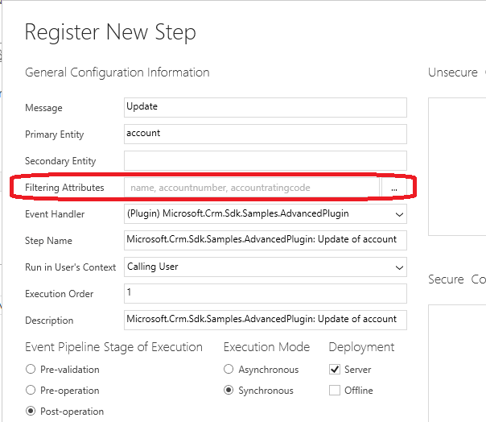

# Include filtering attributes with plug-in registration

**Category**: Performance

**Impact potential**: Medium

## Symptoms

If no filtering attributes are set for a plug-in registration step, then the plug-in executes every time an update message occurs for that event. A combination of no filtering attributes and auto-save functionality could lead to unnecessary plug-in executions causing undesirable behavior and degrade performance.

## Guidance

Most plug-ins registered for an entity's update message don't need to execute on all updates. Usually, there's only a need to process certain logic when a specific attribute or attributes change. In order to prevent extra processing in the environment, minimize the logic needed in a plug-in and allow the update to complete as quickly as possible. Including filtering attributes for all update step registrations is highly recommended.

## Additional information

Filtering attributes are a list of entity column values that cause the plug-in to execute when included in the payload of the update request. Whether the values are actually changed isn't relevant. Only changed values should be included in the payload of update requests.

Set filtering attributes when registering plug-ins using the Plug-in Registration tool. You can also set the **Select columns** parameter when you use the Microsoft Dataverse connector [When a row is added, modified or deleted](/connectors/commondataserviceforapps/#when-a-row-is-added,-modified-or-deleted) trigger. The sets the filtered attributes property for the event that triggers the flow.

If no attributes are set, then the plug-in executes every time an update message occurs. Updates can occur for various reasons. When auto-save is turned on in the environment, it can occur multiple times during the session of user when on an entity form. If filtering attributes aren't specified, then the plug-in executes for any attribute change to the designed entity.

### See also

[Register a plug-in](../../register-plug-in.md) 
[Disable auto-save in a model-driven app](../../../../maker/model-driven-apps/manage-auto-save.md) 

[!INCLUDE[footer-include](../../../../includes/footer-banner.md)]
