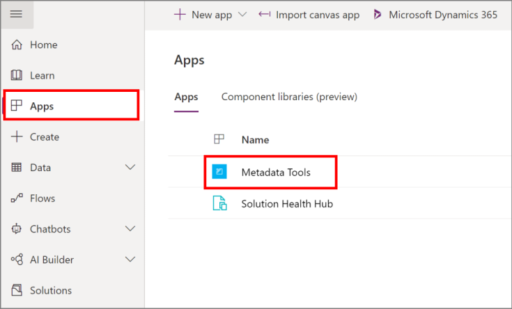
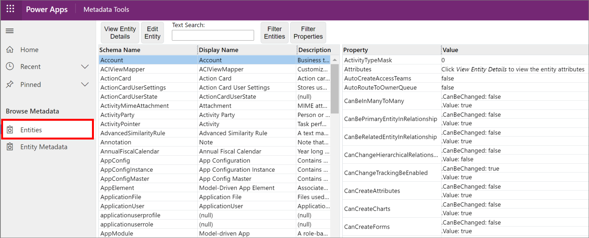
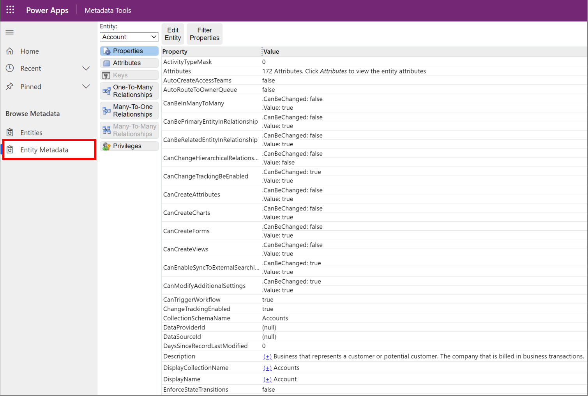

# Browse table definitions in your environment

You can use the Table definition browser to view information for all the tables your Dataverse environment. The Table definition browser is a managed solution you can download here: [Microsoft Downloads: MetadataBrowser_3_0_0_5_managed.zip](https://download.microsoft.com/download/8/E/3/8E3279FE-7915-48FE-A68B-ACAFB86DA69C/MetadataBrowser_3_0_0_5_managed.zip)

[!INCLUDE[cc-terminology](includes/cc-terminology.md)]

## Import the solution

After you download the solution, you must import it to be able to use it.

1. Sign in to [Power Apps](https://make.powerapps.com).

1. In the left navigation pane, select **Solutions**, and then select **Import** on the command bar. 

1. On the **Import a solution** page, select **Browse** to locate the solution file (.zip) you downloaded, and select it.

1. Select **Next**. Information about the solution is displayed.

1. Select **Import**, and then finish the import process.
  

## Use the app

After you import the solution successfully, locate the app by selecting **Apps** in the left navigation pane; the app is listed as **Metadata Tools**.

## Entities view

On opening the app, **Entities** is the default view that lets you view all the tables.

You can perform the following actions:

- **View Entity Details**: Select a table to view using the [**Entity Metadata** view](#entity-metadata-view).
- **Edit Entity**: Open the selected form in the default organization, if the table supports this.
- **Text Search**: Perform a text search to filter displayed tables using the following table properties: <xref:Microsoft.Xrm.Sdk.Metadata.EntityMetadata.SchemaName>, <xref:Microsoft.Xrm.Sdk.Metadata.EntityMetadata.LogicalName>, <xref:Microsoft.Xrm.Sdk.Metadata.EntityMetadata.DisplayName>, <xref:Microsoft.Xrm.Sdk.Metadata.EntityMetadata.ObjectTypeCode>, or <xref:Microsoft.Xrm.Sdk.Metadata.MetadataBase.MetadataId>.
- **Filter Entities**: Set simple criteria to view a sub-set of tables. All criteria are evaluated using AND logic.
- **Filter Properties**: Filter the properties displayed for any selected table. There are nearly 100 properties in the list. Use this to select just the ones you are interested in.

## Entity Metadata view

Select **Entity Metadata** to inspect individual tables. 

You can perform the following actions for a single table:

- **Entity**: Select the table from the drop-down list that you want to view.
- **Properties**: View all the properties for the table and filter the properties displayed.

    - **Edit Entity**: Open the selected table edit form in the default organization, if the table supports this.
    - **Filter Properties**: Filter the properties displayed for any selected table. There are nearly 100 properties in the list. Use this to select just the ones you are interested in.

- **Attributes**: View the table columns in a master/detail view. With this view you can:

    - **Edit Attribute**: Open the selected attribute form in the default organization, if the attribute supports this.
    - **Text Search**: Perform a text search to filter displayed columns using the following attribute properties: <xref:Microsoft.Xrm.Sdk.Metadata.AttributeMetadata.SchemaName>, <xref:Microsoft.Xrm.Sdk.Metadata.AttributeMetadata.LogicalName>, <xref:Microsoft.Xrm.Sdk.Metadata.AttributeMetadata.DisplayName>, or <xref:Microsoft.Xrm.Sdk.Metadata.MetadataBase.MetadataId>.
    - **Filter Attributes**: Filter columns by any attribute property values.
    - **Filter Properties**: Filter the properties displayed for the selected attribute.

- **Keys**: If alternate keys are enabled for a table you can examine how they are configured.

- **Relationships**: View the three types of table relationships: One-To-Many, Many-To-One, and Many-To-Many. With these views you can:  
    - **Edit Relationship**: Open the selected relationship form in the default organization, if the relationship supports this.  
    - **Text Search**: Perform a text search to filter displayed relationships using values relevant to the type of relationship.  
    - **Filter Properties**: Filter the relationship by any relationship property value.

- **Privileges**: View table privileges. With this view you can:  
    - Filter the displayed privilege using the `PrivilegeId`.

> [!NOTE]
> When viewing the table detail properties, you'll see that many complex properties are expandable. The most useful value is displayed with a link that allows toggling to a more detailed view. The detailed view reflects the structure of the data if you were to retrieve it programmatically. The detailed view also reveals other relevant data that can be retrieved in the same area, for example, if any localized labels are present for **Display Name** properties.

> [!TIP]
> To copy text from the page, simply select the text and use the Ctrl+C keyboard shortcut or the context menu **Copy** command.

## Community tools

**Metadata Browser** is a tool that XrmToolbox community developed for Dataverse. Please see the [Developer tools](developer-tools.md) topic for community developed tools.

> [!NOTE]
> The community tools are not a product of Dataverse and Microsoft does not provide support for the community tools. 
> If you have questions pertaining to the tool, please contact the publisher. More Information: [XrmToolBox](https://www.xrmtoolbox.com).

### See also

 [Developer tools for Dataverse](developer-tools.md) 
 [Customize table definitions](customize-entity-metadata.md) 
  

[!INCLUDE[footer-include](../../includes/footer-banner.md)]
