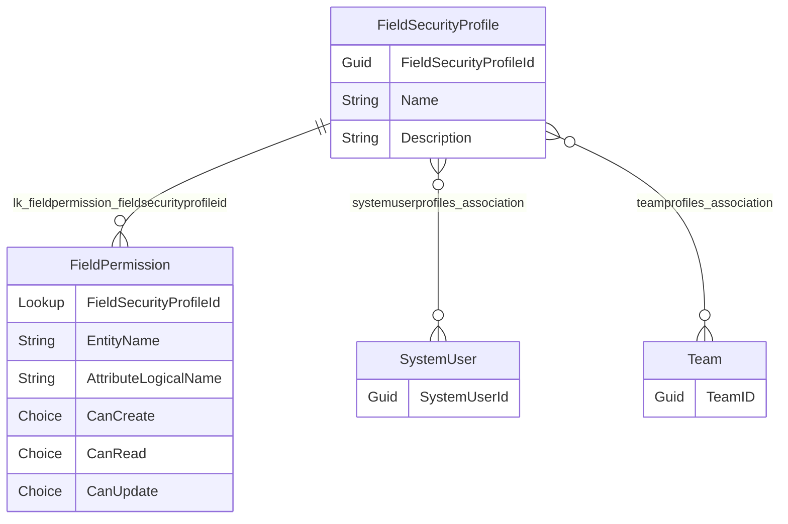

# Column-level security with code

You can manage access to data in specific Dataverse columns without writing code. [Learn how to configure column-level security to control access](/power-platform/admin/field-level-security). This article provides information for developers to work with column-level security capabilities using code and the Dataverse SDK for .NET or Web API.

Column-level security is applied for columns that contain particularly sensitive information. Passwords, bank account numbers, government ID, telephone numbers or email addresses can be secured at the column level.

## Discover which columns are secured

You can detect which columns are secured by retrieving the definition of the column and examining the boolean [AttributeMetadata.IsSecured property](/dotnet/api/microsoft.xrm.sdk.metadata.attributemetadata.issecured). The following query returns all the secured columns for an environment:

### [SDK for .NET](#tab/sdk)

This option queries the schema definitions to test the value of the `IsSecured` column. Everyone has access to view this data. [Learn how to Query schema definitions](query-schema-definitions.md)

```csharp
/// <summary>
/// Writes a file containing data about secured columns in a Dataverse environment
/// </summary>
/// <param name="service">The authenticated IOrganization service instance.</param>
/// <param name="filepath">Where to save the file.</param>
/// <param name="filename">The name for the file. Defaults to "SecuredColumns.csv"</param>
static internal void GetSecuredColumns(IOrganizationService service,
    string filepath, string filename = "SecuredColumns.csv")
{
    EntityQueryExpression query = new()
    {
        Properties = new MetadataPropertiesExpression("SchemaName", "Attributes"),
        Criteria = new MetadataFilterExpression(),
        AttributeQuery = new()
        {
            Properties = new MetadataPropertiesExpression(
                "SchemaName",
                "AttributeTypeName"),
            Criteria = new MetadataFilterExpression()
            {
                Conditions = {
                    { 
                        new MetadataConditionExpression(
                            "IsSecured", 
                            MetadataConditionOperator.Equals, 
                            true) 
                    }
                }
            }
        }
    };

    RetrieveMetadataChangesRequest request = new()
    {
        Query = query
    };

    var response = (RetrieveMetadataChangesResponse)service.Execute(request);


    // Create a StringBuilder to hold the CSV data
    StringBuilder csvContent = new();

    string[] columns = {
        "Table",
        "Column" };

    // Add headers
    csvContent.AppendLine(string.Join(",", columns));

    foreach (var table in response.EntityMetadata)
    {
        foreach (var column in table.Attributes)
        {
            string[] values = {
                table.SchemaName,
                column.SchemaName
            };

            // Add values
            csvContent.AppendLine(string.Join(",", values));
        }
    }

    File.WriteAllText(
        Path.Combine(filepath, filename),
        csvContent.ToString());
}
```

This option depends on a special system [Field Security Profile (FieldSecurityProfile)](reference/entities/fieldsecurityprofile.md) record that manages access to secured columns for system administrators. When a user has the access to view the this data they can return a list of columns that are secured. Typically only system administrators have the `prvReadFieldPermission` privilege to retrieve this data.

```csharp
/// <summary>
/// Returns a list of the secured columns in the environment
/// </summary>
/// <param name="service">The authenticated IOrganization service instance.</param>
/// <returns>List of secured column names</returns>
static internal List<string> GetSecuredColumnList(IOrganizationService service)
{
    QueryExpression query = new("fieldpermission")
    {
        ColumnSet = new ColumnSet("entityname", "attributelogicalname"),
        Criteria = new FilterExpression(LogicalOperator.And)
        {
            Conditions =
            {
              // Field security profile with ID '572329c1-a042-4e22-be47-367c6374ea45' 
              // manages access for system administrators. It always contains
              // references to each secured column

                new ConditionExpression("fieldsecurityprofileid", ConditionOperator.Equal,
                    new Guid("572329c1-a042-4e22-be47-367c6374ea45"))
            }
        }
    };

    EntityCollection fieldPermissions;

    try
    {
        fieldPermissions = service.RetrieveMultiple(query);
    }
    catch (FaultException<OrganizationServiceFault> ex)
    {

        if (ex.Detail.ErrorCode.Equals(-2147220960))
        {
            string message = "The calling user doesn't have read access to the fieldpermission table";

            throw new Exception(message);
        }

        else
        {
            throw new Exception($"Dataverse error retrieving field permissions: {ex.Message}");
        }
    }
    catch (Exception ex)
    {
        throw new Exception($"Error retrieving field permissions: {ex.Message}", ex);
    }

    List<string> values = [];
    foreach (var fieldpermission in fieldPermissions.Entities)
    {
        string tableName = fieldpermission.GetAttributeValue<string>("entityname");
        string columnName = fieldpermission.GetAttributeValue<string>("attributelogicalname");
        values.Add($"{tableName}.{columnName}");
    }
    values.Sort();
    return values;
}
```


### [Web API](#tab/webapi)

```json
TODO
```

**Request**:

```http
TODO
```

**Response**:

```http
TODO
```

---

## Discover which columns can be secured

You can't secure all columns. When you [enable column security](/power-platform/admin/field-level-security#enable-column-security) using [Power Apps](https://make.powerapps.com/), the **Enable column security** checkbox is disabled for certain fields. The good news is that you don't need to manually check each column to find out if you can secure it.

Three boolean [AttributeMetadata](/dotnet/api/microsoft.xrm.sdk.metadata.attributemetadata) properties control whether you can secure any column:

- [CanBeSecuredForCreate](/dotnet/api/microsoft.xrm.sdk.metadata.attributemetadata.canbesecuredforcreate)
- [CanBeSecuredForRead](/dotnet/api/microsoft.xrm.sdk.metadata.attributemetadata.canbesecuredforread)
- [CanBeSecuredForUpdate](/dotnet/api/microsoft.xrm.sdk.metadata.attributemetadata.canbesecuredforupdate)

When all of these properties are false, the column can't be secured. Some columns may only be secured for one or two of the three operations: Create, Read, and Update.

The following queries return this data so you can discover which columns in your environment can be secured:

### [SDK for .NET](#tab/sdk)

This static `DumpColumnSecurityInfo` method creates a CSV file that contains data about columns that can be secured.

```csharp
/// <summary>
/// Retrieves column-level security information about all columns in a Dataverse environment
/// </summary>
/// <param name="service">The authenticated IOrganization service instance.</param>
/// <param name="filepath">Where to save the file.</param>
/// <param name="filename">The name for the file. Defaults to "ColumnSecurityInfo.csv"</param>
static internal void DumpColumnSecurityInfo(IOrganizationService service,
    string filepath, string filename = "ColumnSecurityInfo.csv")
{

    EntityQueryExpression query = new()
    {
        Properties = new MetadataPropertiesExpression("SchemaName", "Attributes"),
        Criteria = new MetadataFilterExpression
        {
            FilterOperator = LogicalOperator.And,
            Conditions =
             {
                 new MetadataConditionExpression(
                     "IsPrivate",
                     MetadataConditionOperator.Equals,
                     false),
             }
        },
        AttributeQuery = new()
        {
            Properties = new MetadataPropertiesExpression(
                "SchemaName",
                "AttributeTypeName",
                "IsPrimaryName",
                "IsSecured",
                "CanBeSecuredForCreate",
                "CanBeSecuredForUpdate",
                "CanBeSecuredForRead"),
            Criteria = new MetadataFilterExpression()
            {
                Conditions = {
                    { // Exclude Virtual columns
                        new MetadataConditionExpression(
                        "AttributeTypeName",
                        MetadataConditionOperator.NotEquals,
                        AttributeTypeDisplayName.VirtualType)
                    }
                }
            }
        }
    };

    RetrieveMetadataChangesRequest request = new()
    {
        Query = query
    };

    var response = (RetrieveMetadataChangesResponse)service.Execute(request);


    // Create a StringBuilder to hold the CSV data
    StringBuilder csvContent = new();

    string[] columns = {
        "Column",
        "Type",
        "IsPrimaryName",
        "IsSecured",
        "CanBeSecuredForCreate",
        "CanBeSecuredForUpdate",
        "CanBeSecuredForRead" };

    // Add headers
    csvContent.AppendLine(string.Join(",", columns));

    foreach (var table in response.EntityMetadata)
    {
        foreach (var column in table.Attributes)
        {
            string[] values = {
                $"{table.SchemaName}.{column.SchemaName}",
                column.AttributeTypeName.Value,
                column.IsPrimaryName.ToString(),
                column.IsSecured.ToString(),
                column.CanBeSecuredForCreate.ToString(),
                column.CanBeSecuredForUpdate.ToString(),
                column.CanBeSecuredForRead.ToString()
            };

            // Add values
            csvContent.AppendLine(string.Join(",", values));
        }
    }

    File.WriteAllText(
        Path.Combine(filepath, filename),
        csvContent.ToString());
}
```

[Learn how to Query schema definitions](query-schema-definitions.md)


### [Web API](#tab/webapi)

```json
TODO
```

**Request**:

```http
TODO
```

**Response**:

```http
TODO
```

---

### Making a column secured with code

[Securing a column](/power-platform/admin/field-level-security#enable-column-securit) is usually easiest to do using [Power Apps](https://make.powerapps.com/), but you can use code to update the column definition to set the [AttributeMetadata.IsSecured property](/dotnet/api/microsoft.xrm.sdk.metadata.attributemetadata.issecured) property as shown in the following examples:


### [SDK for .NET](#tab/sdk)

```csharp
/// <summary>
/// Sets the column IsSecured property.
/// </summary>
/// <param name="service">The authenticated IOrganization service instance.</param>
/// <param name="tableLogicalName">The LogicalName of the table that contains the column.</param>
/// <param name="columnLogicalName">The LogicalName of the column to update.</param>
/// <param name="value">The value to set.</param>
/// <param name="solutionUniqueName">The Unique Name of the solution applying the change.</param>
/// <exception cref="Exception">Thrown when there is an error retrieving or updating the column definition.</exception>
static internal void SetColumnIsSecured(
    IOrganizationService service,
    string tableLogicalName,
    string columnLogicalName,
    bool value,
    string solutionUniqueName)
{

    // Update request requires the entire column definition,
    // So retrieving that first

    RetrieveAttributeRequest retrieveRequest = new()
    {
        EntityLogicalName = tableLogicalName,
        LogicalName = columnLogicalName
    };

    AttributeMetadata columnDefinition;

    try
    {
        var retrieveResponse = (RetrieveAttributeResponse)service.Execute(retrieveRequest);

        columnDefinition = retrieveResponse.AttributeMetadata;
    }
    catch (Exception ex)
    {
        throw new Exception($"Error retrieving column definition: {ex.Message}", ex);
    }

    if (!columnDefinition.IsSecured.HasValue || columnDefinition.IsSecured.Value != value)
    {
        // Set the IsSecured property to value
        columnDefinition.IsSecured = value;

        UpdateAttributeRequest updateRequest = new()
        {
            EntityName = tableLogicalName,
            Attribute = columnDefinition,
            MergeLabels = true,
            SolutionUniqueName = solutionUniqueName
        };

        try
        {
            service.Execute(updateRequest);
        }
        catch (Exception ex)
        {
            throw new Exception($"Error updating column definition: {ex.Message}", ex);
        }
    }
    else
    {
        //Don't send a request to set the value to what it already is.
    }
}
```

[Learn how to update a column using the SDK for .NET](org-service/metadata-attributemetadata.md#update-a-column)

### [Web API](#tab/webapi)

```powershell
TODO
```

[Learn how to update a column using the Web API](webapi/create-update-column-definitions-using-web-api.md#update-a-column)

---

## Provide access to secured columns

When a column is secured, only people who have the system administrator security role can read or set the value. A system administrator can provide other users access to secured columns in two ways:

- [Manage access using field security profiles](#manage-access-using-field-security-profiles): Use field security profiles to give access to column data for all records to groups.
- [Share data in secured fields](#share-data-in-secured-fields): Use field sharing to give a specific principal or team access to data in a secure column for a specific record.

## Manage access using field security profiles

This is the most common approach when you have different groups of users who require different levels of access.  See the [Column-level security example](/power-platform/admin/column-level-security-example) that describes how to secure fields for different users using the Power Platform admin center.

To do this using code, create [Field Security Profile (FieldSecurityProfile)](reference/entities/fieldsecurityprofile.md) records that associate principals (users and teams) with [Field Permission (FieldPermission)](reference/entities/fieldpermission.md) records that controls which data operations can be performed on any that column for any record.  

You can associate system users and teams and to your field security profile using the [systemuserprofiles_association](/power-apps/developer/data-platform/reference/entities/fieldsecurityprofile#BKMK_systemuserprofiles_association) and [teamprofiles_association](/power-apps/developer/data-platform/reference/entities/fieldsecurityprofile#BKMK_teamprofiles_association) many-to-many relationships respectively.

The field permissions are associated to the field security profiles via using the [`lk_fieldpermission_fieldsecurityprofileid` one to many relationship](/developer/data-platform/reference/entities/fieldsecurityprofile#BKMK_lk_fieldpermission_fieldsecurityprofileid). The following table describes important field permission columns:

<!-- 
Mermaid markdown used to generate ERD after installing:
https://marketplace.visualstudio.com/items?itemName=bierner.markdown-mermaid

-->

:::image type="content" source="media/fieldsecurityprofile-erd.png" alt-text="entity relationship diagram for the fieldsecurityprofile table and related tables":::


|Column |Type |Description  |
|---------|---------|---------|
|`FieldSecurityProfileId`|Lookup|Refers to the field security profile this field permission applies to.|
|`EntityName`|String|The table that contains the secured column.|
|`AttributeLogicalName`|String|The logical name of the secured column.|
|`CanCreate`|Choice|Whether Create access is allowed.|
|`CanRead`|Choice|Whether Read access is allowed.|
|`CanUpdate`|Choice|Whether Update access is allowed.|

Each of the choice columns use these values defined by the `field_security_permission_type` global choice: 

- `0` **Not Allowed**
- `4` **Allowed**

When `CanRead` is **Allowed**, you can also set a `CanReadUnmasked` column, but not unless the column has an [Secured Masking Column (AttributeMaskingRule)](reference/entities/attributemaskingrule.md) record associated with it.  If you don't set this, the default value is `0` **Not Allowed**.  [Learn more about using this column in Display Masked data](#display-masked-data).


## Share data in secured fields

Create records using the [Field Sharing (PrincipalObjectAttributeAccess)](reference/entities/principalobjectattributeaccess.md) table to share access to a secured field for a specific record with someone else.

> [!NOTE]
> Conceptually, this is similar to the [PrincipalObjectAccess](reference/entities/principalobjectaccess.md) table that manages sharing of records. The difference is that with record sharing the you use the `GrantAccess`, `ModifyAccess`, and `RevokeAccess` messages to add, modify, and remove records from the `PrincipalObjectAccess` table. [Learn more about sharing records](security-sharing-assigning.md#sharing-records)
>
> With the `PrincipalObjectAttributeAccess` table, grant, modify, and revoke field access using create, update, and delete operations on the table.  

The `PrincipalObjectAttributeAccess` table has these columns:


|Column  |Type  |Description  |
|---------|---------|---------|
|`AttributeId`|Guid|The [AttributeMetadata.MetadataId](/dotnet/api/microsoft.xrm.sdk.metadata.metadatabase.metadataid) of the secured column. You will need to retrieve this from the metadata.|
|`ObjectId`|Guid|A reference to the record that contains the secured column.|
|`PrincipalId`|Guid|A reference to the principal (user or team) you are granting access to.|
|`ReadAccess`|Bool|Whether to grant read access to the field data|
|`UpdateAccess`|Bool|Whether to grant update access to the field data|


### [SDK for .NET](#tab/sdk)

Content for SDK...

### [Web API](#tab/webapi)

Content for Web API...

---

## Display Masked data

### [SDK for .NET](#tab/sdk)

Content for SDK...

### [Web API](#tab/webapi)

Content for Web API...

---

### Related articles

[Security and data access](security-model.md)