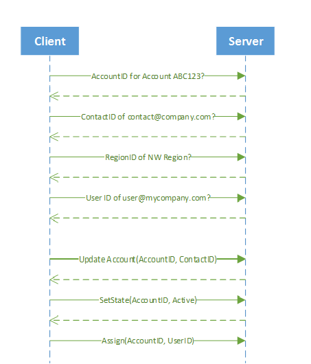
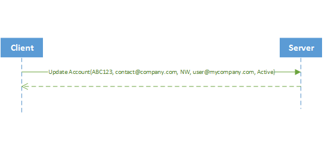

# Data Synchronization

Sometimes you'll need to synchronize and integrate Microsoft Dataverse data with data that is stored in other systems. The common data integration patterns include taking data from an external system and pushing it into Dataverse, taking data from Dataverse and synchronizing it to some external data store, or updating Dataverse with external data. Dataverse provides several capabilities to make it easier to write code to achieve these scenarios.  

These features can be used separately as needed in any situation, but together they address common issues related to synchronizing and integrating data with external data.

## Enable all operations with Update

Dataverse has a number of specialized messages for specific operations that update records. These messages were deprecated and you should now simply use `Update` to perform the same operations. The deprecated messages are:

- `Assign`
- `SetParentSystemUser`
- `SetParentTeam`
- `SetParentBusinessUnit`
- `SetBusinessEquipment`
- `SetBusinessUnit`
- `SetState`

Simply updating the record is much simpler than using these messages and should streamline your development for data integration and synchronization scenarios. 

More information: [Behavior of specialized update operations](special-update-operation-behavior.md)

## Alternate Keys

In enterprise deployments of Dataverse, it's common for data from external systems to be loaded into Dataverse so that it can be presented to users. These external systems often can't be extended to store the Dataverse record GUID primary key identifiers to synchronize data effciently between the systems. A common solution is to add a custom column to a table in Dataverse that can be used to store the identifier of the related record in the external system. Sometimes multiple columns must be created to establish a unique reference.

When you build data load processes that update records in Dataverse and assign references to related records, you first have to make an extra Dataverse web service call to retrieve the target record based on this external identifier. This lookup can be slow if an appropriate index is not in place for the custom column, and in Dataverse scenarios, each of these lookups requires a costly round-trip. These extra round trips can increase by an order of magnitude the time it takes to update each record and can reduce overall throughput drastically.

Using alternate keys, web service operations can target a Dataverse record using one or more alternate keys instead of a GUID primary key. In addition, table references to related records can be specified using one or more alternate keys. Because alternate keys are indexed, lookup operations show increased performance as compared to adding a custom column as an identifier. If something goes wrong, the system will throw an error and roll back all the changes. 

More information:

- [Using Power Apps: Define alternate keys to reference rows](../../maker/data-platform/define-alternate-keys-reference-records.md)
- [Using Code: Work with alternate keys](define-alternate-keys-entity.md)

## Upsert

When loading data into Dataverse from an external system, you may not know if a record already exists in Dataverse and should be updated, or whether you must create a new record. *Upsert* is a combination of *Update* or *Insert* which enables the server to detect whether a record exists or not and apply the appropriate `Update` or `Create` operation in Dataverse. More information: [Use Upsert to insert or update a record](use-upsert-insert-update-record.md) 

The following table compares the complexity of synchronizing data with and without these features.  

|   Before    |        Description  |
|----------------------|----------------------------|
|  | For each record:   1.  Query Dataverse to see if the account exists. If it exists, get its account ID (for example, ABC123) 2.  Query the contacts to verify that the contact exists. If it exists, get the email ID of the contact (for example, contact@company.com). 3.  Query to get or set the region ID (for example, NW). 4.  Query to get the user ID to set the owner (for example, user@mycompany.com) 5.  Update the account. 6.  Set the state of the account by calling the `SetState` API. 7.  Assign the owner by calling the `Assign` API. |

With these features, it just takes one call to the server to perform the same operations as previously shown.  

|After  |     Description   |
|-----------------------|------------------------------|
|  | Just one call to verify that there is an account with the unique ID ABC123, set the primary contact to contact@company.com, set the region to NW, set the owner to user@mycompany.com and the status to active. |

## Change tracking

The change tracking feature in Microsoft Dataverse provides a way to keep the data synchronized in an efficient manner by detecting what data has changed since the data was initially extracted or last synchronized. Change tracking is not only used to synchronize data with external systems, it is also a prerequisite for several Power Platform and Dataverse capabilities such as Azure Synapse Link for Dataverse and Mobile offline.

More information: 

- [Create and edit tables using Power Apps](../../maker/data-platform/create-edit-entities-portal.md) (See the **Track changes** property)
- [Use change tracking to synchronize data with external systems](use-change-tracking-synchronize-data-external-systems.md)

## In This Section

[Use an alternate key to reference a record](use-alternate-key-reference-record.md) 
[Use Upsert to Create or Update a record](use-upsert-insert-update-record.md) 
[Use change tracking to synchronize data with external systems](use-change-tracking-synchronize-data-external-systems.md)

## Sample code

[Sample: Insert or update a record using Upsert](org-service/samples/insert-update-record-upsert.md) 
[Sample: Synchronize data with external systems using change tracking](org-service/samples/synchronize-data-external-systems-using-change-tracking.md)

## Related Sections

[Define alternate keys for the table](define-alternate-keys-entity.md) 
[Behavior of specialized update operations](special-update-operation-behavior.md)

[!INCLUDE[footer-include](../../includes/footer-banner.md)]
