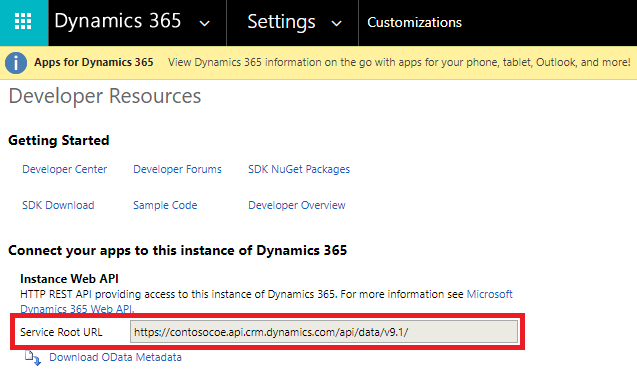
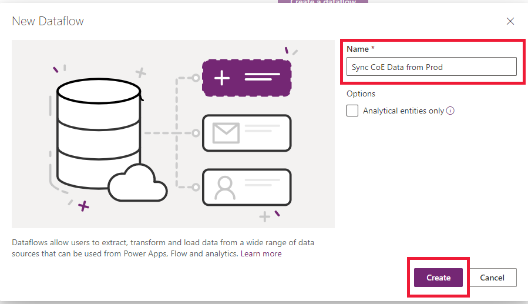
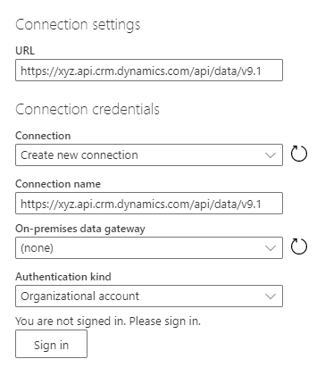
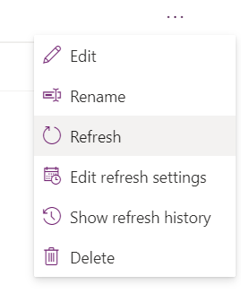

# Migrate data between Microsoft Dataverse environments using the dataflows OData connector

[!INCLUDE[cc-data-platform-banner](../../includes/cc-data-platform-banner.md)]

Dataverse [Web API](./webapi/overview.md) works with any technology that supports OData and OAuth. There are many options available to move data in and out of Dataverse. OData connector is one of the dataflows, which is designed to support migration and synchronization of large datasets in Dataverse. 

In this article, we walk you through how to migrate data between Dataverse environments using the dataflows OData connector. 

## Prerequisites

- System Administrator or System Customizer security role permission on both the source and target environments.

- Power Apps, Power Automate, or Dataverse license (per app or per user).

- Two Dataverse [environments with database](/power-platform/admin/create-environment#create-an-environment-with-a-database).

## Scenarios

 - A one-time cross-environment or cross-tenant migration is needed (for example, geo-migration).

 - A developer needs to update an app that is being used in production. Test data is needed in their development environment to easily build out changes. 

## Step 1: Plan out the dataflow

1. Identify the source and target environments.

    - The **source environment** is where the data is migrated from. 

    - The **target environment** is where the data is migrated to. 

1. Ensure that the tables are already defined in the target environment. Ideally both environments should have the same tables defined with the same solution.

1. When importing relationships, multiple dataflows are required.

    Tables that are one (parent/independent) to many (children/dependent) require separate dataflows. Configure the parent dataflow to run before any child tables, since the data in the parent needs to be loaded first to correctly map to the columns in the corresponding child tables.

## Step 2: Get the OData endpoint 

Dataverse provides an OData endpoint that does not require additional configuration to authenticate with the dataflows' connector. It is relatively easy to connect to the source environment. 

This article will walk through how to set up a new dataflow with the OData connector. For information on connecting to all data sources supported by dataflows, see [Create and use dataflows](../../maker/data-platform/create-and-use-dataflows.md). 

From the **source** environment, get the [OData endpoint](./view-download-developer-resources.md) for that environment:

1. Sign in to [Power Apps](https://make.powerapps.com).

1. Select the required source environment from the upper-right corner.

1. Select the **Settings** (gear) icon in the upper-right corner, and then select **Advanced Settings**.

1. On the **Settings** page, select the drop-down arrow next to **Settings**, and select **Customizations**.

1. On the **Customizations** page, select **Developer Resources**.

1. Copy the **Service Root URL** to Notepad.

    > [!div class="mx-imgBorder"]
    > 
 
## Step 3: Create a new OData dataflow

In the **target** environment, create a new dataflow with the OData connector.

1. Sign in to [Power Apps](https://make.powerapps.com).

1. Select the required target environment from the upper-right corner.

1. In the left navigation pane, expand the **Data** menu, and then select **Dataflows**.

1. Select **New dataflow** to create a new dataflow. Provide a meaningful name for the dataflow. Select **Create**.
   > [!div class="mx-imgBorder"]
   > 

1. Select the **OData** connector.

    > [!div class="mx-imgBorder"]
    > 

1. In the **Connection settings** dialog box, type the column values:

    > [!div class="mx-imgBorder"]
    > 

    | Column | Description |
    |--|--|
    | URL | Provide the Service Root URL in the URL column of the connection settings. |
    | Connection | Create new connection. This will be automatically chosen if you have not made an OData connection in dataflows before. |
    | Connection name | Optionally, rename the connection name, but a value is automatically populated. |  |
    | On-premises data gateway | None. An on-premises data gateway is not needed for connections to this cloud service. |
    | Authentication kind | Organizational account. Select **Sign in** to open the sign-in dialog that authenticates the account associated with the connection. |     

    > [!IMPORTANT] 
    > Disable pop-up and cookies blockers in your browser in order to configure the Azure AD authentication. This is similar to the fact that you are using the Dataverse OData endpoint or any other OAuth-based authentication data source. 
    
1. Select **Next** in the lower right.

## Step 4: Select and transform data with Power Query 

Use Power Query to select the tables and also transform data as per your requirement.

First, select the tables that need to be transferred. You can browse all tables in the source environment and preview some of the data in each table.

> [!div class="mx-imgBorder"]
> 

1. Select one or multiple tables as needed, and then select **Transform data**.

    > [!NOTE]
    > When importing relationships, remember that the parent table dataflow needs to be imported before the child ones. The data for the child dataflow will require data to be in the parent table for it to correctly map, otherwise it might throw an error.
 
1. In the **Power Query - Edit queries** window, you can transform the query before import.

    - If you are only migrating data, there should not be a need to modify anything here. 

    - Reducing the number of unnecessary columns will improve the dataflow performance for larger data sets.

    > [!TIP]
    > You can go back to choose more tables in the **Get data** ribbon option for the same OData connector.

1. Select **Next** in the lower right.

## Step 5: Configure target environment settings

This section describes how to define the target environment settings.

### Step 5.1: Map tables 

For each table chosen, select the behavior for importing that table in these settings and then select **Next**.

> [!div class="mx-imgBorder"]
> 

- **Load to existing table (recommended)**

    - The dataflow syncs data from the source environment's table to the target environment, and the same table schema is already defined in the target environment.

    - Ideally, use the same solution in both target and source environments to make data transfer seamless. Another advantage to having a predefined tables is more control over which solution the tables is defined in and the prefix.
    
    - Choose **Delete rows that no longer exist in the query output**. This ensures that the relationships will map correctly because it maintains the values for the lookups.
    
    - If the schema is identical in both source and target tables, you can select **Auto map** to quickly map the columns.

    - Requires a key configuration in the target environment (as the unique identifier columns are not available to modify).

- **Load to new table (not recommended)**

    - Ideally there should be a table predefined in the target environment from the same solution import as the source environment. However, there are cases where this might not be feasible, so this is an option if there is no existing table to load to. 

    - It creates a new custom table in the target environment's default solution.

- There is an option to **Do not load**, but do not include tables in the dataflow that are not being loaded. You can select **Back** from this menu to return to the Power Query menu and remove the tables that are not needed.

### Step 5.2: Refresh settings

Select **Refresh manually** since this is a one-time migration and then select **Create**. 

## Step 6: Run the dataflow

The initial dataflow load initiates when you select **Create**. 

> [!div class="mx-imgBorder"]
> 

You can manually initiate a dataflow by selecting **(...)** in the dataflows list. Make sure to run dependent dataflows after the parent flows have completed.

> [!div class="mx-imgBorder"]
>  

## Tips

- Try out one table first to walk through the steps, then build out all the dataflows.

- If there are more tables that contain larger amounts of data, consider configuring multiple separate dataflows for individual tables.

- One-to-many relationships will require separate dataflows for each table. Configure and run the parent (aka one, or independently) table dataflow before the child table.

- If there are errors with the dataflow refresh, you can view the refresh history in the **(...)** menu in the dataflows list and download each refresh log.

## Limitations

- Many-to-many relationship data imports are not supported.

- Parent dataflows must be manually configured to run before child dataflows.

[!INCLUDE[footer-include](../../includes/footer-banner.md)]