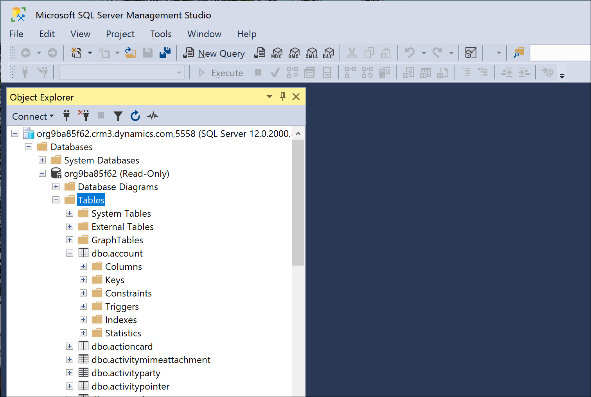
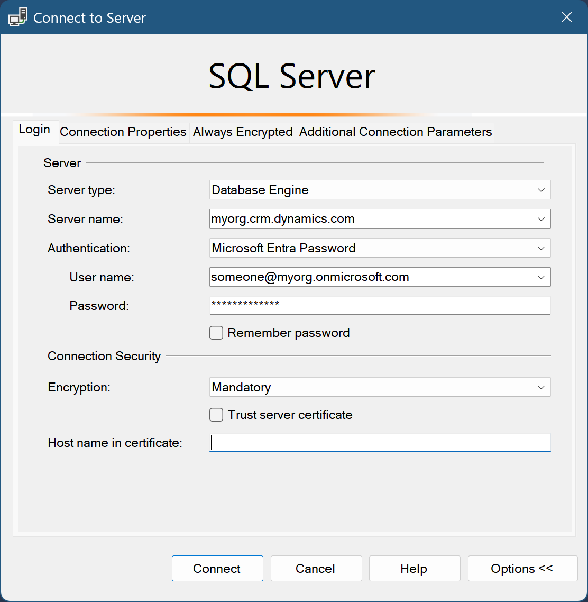
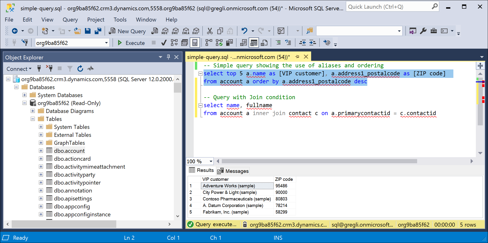
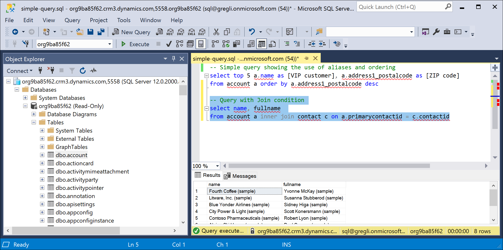
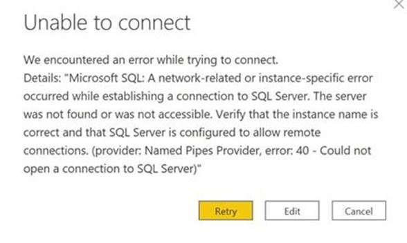

# Use SQL to query data

[This topic is pre-release documentation and is subject to change. Note that only the SQL data connection through SQL Server Management Studio and .NET libraries is in preview. Power BI is General Availability (GA)]

The Microsoft Dataverse business layer provides a Tabular Data Stream (TDS) endpoint that emulates a SQL data connection. The SQL connection provides read-only access to the table data of the target Dataverse environment thereby allowing you to execute SQL queries against the Dataverse data tables. No custom views of the data have been provided. The Dataverse endpoint SQL connection uses the Dataverse security model for data access. Data can be obtained for all Dataverse tables to which a user has access.

## Prerequisites

The **Enable TDS endpoint** setting must be enabled in your environment. It is enabled by default. More information: [Manage feature settings](/power-platform/admin/settings-features)

## Applications support

TDS (SQL) endpoint applications support for Power BI and SQL Server Management Studio is described below.

### SQL Server Management Studio (Preview)

> [!NOTE]
> A compatibility issue has been found with the SQL Server Management Studio 19.0.1 build. A fix is being investigated. Until the fix is available please use build [18.12.1 of SQL Server Management Studio](/sql/ssms/release-notes-ssms?view=sql-server-ver15#1891).
> This note will be updated once a fix is available.

You can also use [SQL Server Management Studio](/sql/ssms/download-sql-server-management-studio-ssms) (SSMS) version 18.12.1 or later with the Dataverse endpoint SQL connection. Examples of using SSMS with the SQL data connection are provided below.



#### Security and authentication

Only Azure Active Directory authentication is supported. SQL authentication and Windows authentication aren't supported. Below is an example of how to logon to the SQL connection in SSMS. Notice the server name is the organization address URL. 



> [!NOTE]
> Ports 1433 and/or 5558 need to be enabled to use the TDS endpoint from a client application such as SSMS. If you only enable port 5558, the user must append that port number to the server name in the **Connect to Server** dialog of SSMS - for example: myorgname.crm.dynamics.com,5558.

Information on endpoint encryption: [In-transit data protection](/power-platform/admin/about-encryption#in-transit-data-protection)

#### Example table data queries

Below are a couple of example queries composed in SSMS. The first image shows a simple query using aliases and result ordering.

```tsql
select top 5 a.name as [VIP customer], a.address1_postalcode as [ZIP code] from account a order by a.address1_postalcode desc
```



This next query shows a JOIN.

```tsql
select name, fullname from account a inner join contact c on a.primarycontactid = c.contactid
```



### Power BI (General Availability)

You can use the **Analyze in Power BI** option (**Data** > **Tables** > **Analyze in Power BI**) in Power Apps (https://make.powerapps.com) to use the Dataverse connector to analyze data in Power BI Desktop. More information: [View table data in Power BI Desktop](/powerapps/maker/data-platform/view-entity-data-power-bi)

> [!NOTE]
> To enable this feature, see the TDS endpoint setting in [Manage feature settings](/power-platform/admin/settings-features). Once enabled you should see a button **Analyze in Power BI** in the command bar of Power Apps.

## Supported operations and data types

Any operation that attempts to modify data (that is, INSERT, UPDATE) will not work with this read-only SQL data connection. For a detailed list of supported SQL operations on the Dataverse endpoint, see [How Dataverse SQL differs from Transact-SQL](how-dataverse-sql-differs-from-transact-sql.md).

The following Dataverse datatypes are not supported with the SQL connection: `binary`, `image`, `sql_variant`, `varbinary`, `virtual`, `HierarchyId`, `managedproperty`, `file`, `xml`, `partylist`, `timestamp`, `choices`. In addition, tables types 'virtual' and 'audit' are not supported at this time.

> [!TIP]
> `partylist` attributes can instead be queried by joining to the `activityparty` table as shown below.
> 
> ```tsql
> select act.activityid, act.subject, string_agg([to].partyidname, ', ')
> from activitypointer as act
> left outer join activityparty as [to] on act.activityid = [to].activityid and [to].participationtypemask = 2
> group by act.activityid, act.subject
> ```

### Lookup column type behaviors
Dataverse lookup columns are represented as \<lookup\>id and \<lookup\>name in a result set.

### Choice column type behaviors
Dataverse choice columns are represented as \<choice\>Name and \<choice\>Label in a result set.
>[!TIP]
> After making changes to labels for a choice column, the table needs to have customizations published. 

> [!NOTE]
> Including a large number of choice lables in your query will have significant impact on performance. It is best to use less than 10 labels if possible. Because choice lables are localized, the localized string is more expensive to return. 

### Reported SQL version
The Dataverse TDS endpoint emulates Microsoft SQL Server read-only query capabilities over the Dataverse business logic. Dataverse returns the current SQL Azure version 12.0.2000.8 for `select @@version`.

## Performance guidance

When retrieving data through through the TDS endpoint, there are a few key query patterns that should be used. Described below, these query patterns will manage performance and size of result sets.

### Only necessary columns

When building a query, only return the necessary columns. This helps both execution of the query and also transferring the results back to the client application. In general keeping a query under 100 columns is recommended. 

### Choice columns

Choice columns have been flattened into two columns which helps usability. However, it is important to do any aggregates and filters against the value portion of the choice column. The value portion can have indexes and is stored in the base table. However, the label portion ('choicecolumn' name) is stored separately which cost more to retrieve and can't be indexed. Using a significant number of choice label columns may generate a very slow query. 

### Use Top X

It is very important to use a top clause in your queries to prevent trying to return the whole table of data. For example, use `Select Top 1000 accountid,name From account Where revenue > 50000` limits the results to the first 1000 accounts. 

### Do not use NOLOCK

When building queries do not use the table hint NOLOCK. This will prevent Dataverse from optimizing queries. 
  
## Limitations

There is an 80-MB maximum size limit for query results returned from the Dataverse endpoint. Consider using data integration tools such as [Azure Synapse Link for Dataverse](../../maker/data-platform/export-to-data-lake.md) and [dataflows](/power-bi/transform-model/dataflows/dataflows-introduction-self-service) for large data queries that return over 80 MB of data. More information: [Importing and exporting data](../../maker/data-platform/import-export-data.md)

> [!TIP]
> To help keep the size of the returned data within acceptable limits, use as few multi-line text columns and choice columns as possible.

Dates returned in query results are formatted as Universal Time Coordinated (UTC). Previously, dates were returned in local time.

Querying data using SQL does not trigger any plug-ins registered on the <xref:Microsoft.Xrm.Sdk.Messages.RetrieveMultipleRequest> or <xref:Microsoft.Xrm.Sdk.Messages.RetrieveRequest> messages. Any rewriting of the query or results that would normally be performed by such a plug-in will therefore not take effect for a SQL query.

Queries using the TDS endpoint execute under the service protection API limits.

The TDS endpoint can't be used with elastic tables. More information: [Elastic tables (Preview)](elastic-tables.md)

## Troubleshooting connection problems

Below are some know error conditions and how to resolve them.

> [!NOTE]
> Ports 1433 and/or 5558 need to be enabled to use the TDS endpoint from a client application such as SSMS. If you only enable port 5558, the user must append that port number to the server name in the **Connect to Server** dialog of SSMS - for example: myorgname.crm.dynamics.com,5558.

### Authentication

Only Azure Active Directory authentication is supported on the Dataverse endpoint SQL connection. The preferred authentication mechanism is "Azure Active Directory – Universal" with multi-factor authentication (MFA). However, "Azure Active Directory – Password" will work if MFA is not configured. If you try to use other forms of authentication, you will see errors like the following.

- Error returned when using **Azure Active Directory – Integrated** authentication.

"Login failed: The HTTP request was forbidden with client authentication scheme 'Anonymous'.
RequestId: TDS;81d8a4f7-0d49-4d21-8f50-04364bddd370;2
Time: 2020-12-17T01:10:59.8628578Z (.Net SqlClient Data Provider)"

- Error returned when using **SQL Server** authentication.

"Login failed: Request is not authenticated.
RequestId: TDS;918aa372-ccc4-438a-813e-91b086355343;1
Time: 2020-12-17T01:13:14.4986739Z (.Net SqlClient Data Provider)"

- Error returned when using **Windows** authentication.

"Login failed: Request is not authenticated.
RequestId: TDS;fda17c60-93f7-4d5a-ad79-7ddfbb917979;1
Time: 2020-12-17T01:15:01.0497703Z (.Net SqlClient Data Provider)"

### Blocked ports

A blocked port error may look something like the following.



The solution is to verify the TCP ports 1433 or 5558 from the client are unblocked. Use one of the following methods to do that is described below.

#### Use PowerShell to validate connection with TDS endpoint

1. Open a PowerShell command window.
2. Run the Test-connection command. <br> `Test-NetConnection -ComputerName <environment>.crm.dynamics.com -port 1433`

If the connection is successful a line "TcpTestSucceeded : True" will be returned.

In some cases traffic may be blocked directly at the IP level. To validate the IP address is also working, take the IP address returned from the above domain test connection and replace the ComputerName parameter value with the IP address.

3. Take the address returned from the above command as "RemoteAddress"
4. Run the Test-NetConnection -ComputerName \<RemoteAddress> -port 1433
  
This should return "TcpTestSucceeded : True"

#### Establish a telnet session to the TDS endpoint

1. On a Microsoft Windows computer, install/enable telnet.
    1. Choose **Start**.
    1. Select **Control Panel**.
    1. Choose **Programs and features**.
    1. Select **Turn Windows features on or off**.
    1. Choose the **Telnet Client** option.
    1. Select **OK**. A dialog box appears to confirm the installation. The telnet command should now be available.
1. Run a telnet command in a Command window.<br/> `telnet <environmentname>.crm.dynamics.com 1433`

If the connection is successful, you will be in an active telnet session. If unsuccessful, you will receive the error:

"Connecting to \<environmentname>.crm.dynamics.com… Could not open connection to the host, on port 1433: connect failed". 

This means the port has been blocked at the client.

### See also

[How Dataverse SQL differs from Transact-SQL](./how-dataverse-sql-differs-from-transact-sql.md)
[Get started with virtual tables (entities)](./virtual-entities/get-started-ve.md)  
[Use FetchXML to construct a query](./use-fetchxml-construct-query.md)  
[Service Protection API Limits](api-limits.md)

[!INCLUDE[footer-include](../../includes/footer-banner.md)]
