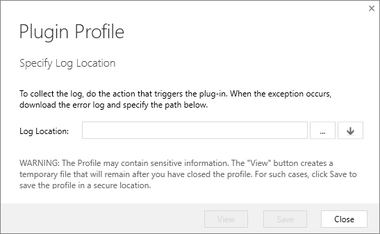
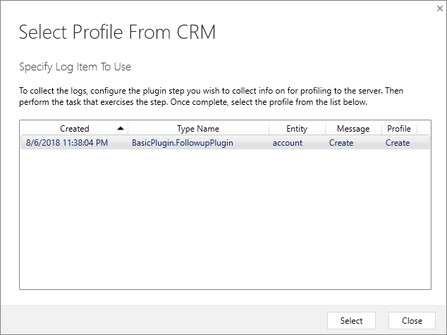
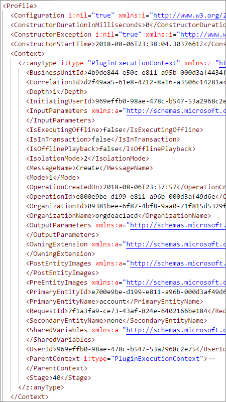

# Debug Plug-ins

[!INCLUDE[cc-terminology](includes/cc-terminology.md)]

The process of writing, registering, and debugging a plug-in is:

1. Create a .NET Framework Class library project in Visual Studio
1. Add the `Microsoft.CrmSdk.CoreAssemblies` NuGet package to the project
1. Implement the <xref:Microsoft.Xrm.Sdk.IPlugin> interface on classes that will be registered as steps.
1. Add your code to the <xref:Microsoft.Xrm.Sdk.IPlugin.Execute*> method required by the interface
    1. Get references to services you need
    1. Add your business logic
1. Sign & build the assembly
1. Test the assembly
    1. Register the assembly in a test environment
    1. Add your registered assembly and steps to an unmanaged solution
    1. **Test the behavior of the assembly**
    1. **Verify expected trace logs are written**
    1. **Debug the assembly as needed**

Content in this topic coverts the steps **in bold** above and supports the following tutorials:

- [Tutorial: Write and register a plug-in](tutorial-write-plug-in.md)
- [Tutorial: Debug a plug-in](tutorial-debug-plug-in.md)
- [Tutorial: Update a plug-in](tutorial-update-plug-in.md)

## Test your assembly

The simplest way to test your assembly may simply be to manually perform the operation using the app. But you should also be aware that events that cause plug-ins to execute can be initiated in multiple ways, such as a table created from a workflow, or from the web services.

Execution context information may be different depending on how the action is performed. When writing your plug-in, make sure you practice defensive programming practices and don't assume that every value you expect will always be there.

You may want to write a program that will automate performing the operations that will cause your plug-in to fire and include a number of possible variations.

If you want to use a test automation framework, you will find that the community has created some tools for this. More information: [Testing tools for server-side development](testing-tools-server.md)


## Use Tracing

As described in [Use the tracing service](write-plug-in.md#use-the-tracing-service), you can write messages to the [PluginTraceLog Table](reference/entities/plugintracelog.md) within the code of your plug-in by using the <xref:Microsoft.Xrm.Sdk.ITracingService>.<xref:Microsoft.Xrm.Sdk.ITracingService.Trace*> method.

Before you will be able to use this service, you must enable tracing in your Microsoft Dataverse environment. The process is described in  [View trace logs](tutorial-write-plug-in.md#view-trace-logs).

> [!NOTE]
> Trace logging takes up organization storage space especially when many traces and exceptions are generated. You should only turn trace logging on for debugging and troubleshooting, and turn it off after your investigation is completed.

While debugging, you can easily query the trace logs for a given plug-in class using the Web API in your browser. If your assembly is named `BasicPlugin.FollowUpPlugin`, you can use this query in your browser address field:

`GET <your org uri>/api/data/v9.0/plugintracelogs?$select=messageblock&$filter=typename eq 'BasicPlugin.FollowUpPlugin'`

The JSON results will be returned to your browser like so:


```json
{
    "@odata.context": "<your org uri>/api/data/v9.0/$metadata#plugintracelogs(messageblock)",
    "value": [{
        "messageblock": "FollowupPlugin: Creating the task activity.",
        "plugintracelogid": "f0c221d1-7f84-4f89-acdb-bbf8f7ce9f6c"
    }]
}
```

> [!TIP]
> This works best if you install a browser plug-in that will format the returned JSON. Or you may want to use Postman. More information: [Use Postman with Web API](/dynamics365/customer-engagement/developer/webapi/use-postman-web-api)
> 
> You may prefer to use the [XrmToolbox Plugin Trace Viewer](https://www.xrmtoolbox.com/plugins/Cinteros.XrmToolBox.PluginTraceViewer/). This community tool is not supported by Microsoft. If you have questions pertaining to this tool, contact the publisher.

Tracing messages can also be found in the log file that can be downloaded when a synchronous plug-in or custom workflow assembly throws an error that results in an error dialog that is displayed to the user. The user can select the **Download Log File** button to view the log containing details of the exception and the trace output.

For asynchronous registered plug-ins and workflow assemblies that return an exception, the tracing information is shown in the details area of the **System Job** form in the web application.

> [!NOTE]
> If your custom code executes within a database transaction, and an exception occurs that causes a transaction rollback, all table data changes by your code will be undone. However, the `PluginTraceLog` table records will remain after the rollback completes.

## Use Plug-in profiler

Plug-in profiler is a solution that you can install on your environment that enables you to capture the execution context of a plug-in and then use that data to re-play the event within Visual Studio while debugging.

You can find instructions to install and use Plug-in profiler in the [Tutorial: Debug a plug-in](tutorial-debug-plug-in.md). See [Install plug-in profiler](tutorial-debug-plug-in.md#install-plug-in-profiler) and [Debug your plug-in](tutorial-debug-plug-in.md#debug-your-plug-in)

### View Plug-in Profile data

After you have installed the Plug-in profiler and captured some profiles, you can view the event context and replay data that is used when you debug. Viewing this data can help you understand the execution context data that your plug-in can use.

You can view this data using the Plug-in Registration tool by selecting the **View Plug-in Profile** command. This will open the Plugin Profile dialog



Select the  icon and in the **Select Profile from CRM** dialog, specify the log item to use.



And then select **View** in the **Plugin Profile** dialog.

This will download an open an XML file with the profile information. The `Context` element represents the execution context passed to the plug-in.



### More information

[Testing tools for server-side development](testing-tools-server.md)


[!INCLUDE[footer-include](../../includes/footer-banner.md)]