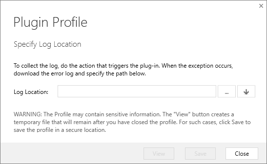
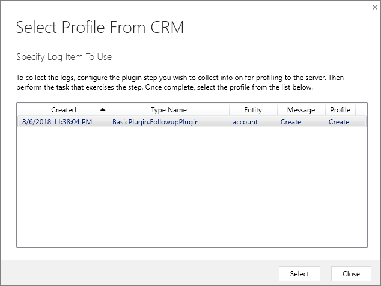
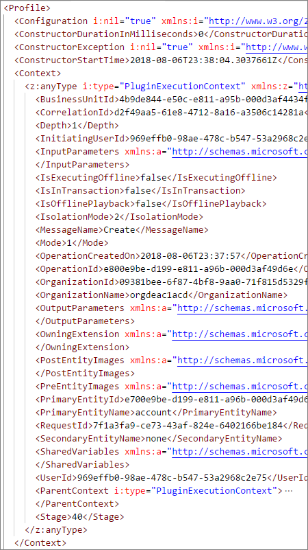

# Debug plug-ins

[!INCLUDE[cc-terminology](includes/cc-terminology.md)]

The process of writing, registering, and debugging a plug-in is:

1. Create a .NET Framework Class library project in Visual Studio
1. Add the `Microsoft.CrmSdk.CoreAssemblies` NuGet package to the project
1. Implement the <xref:Microsoft.Xrm.Sdk.IPlugin> interface on classes that you register as steps.
1. Add your code to the <xref:Microsoft.Xrm.Sdk.IPlugin.Execute*> method required by the interface
    1. Get references to services you need
    1. Add your business logic
1. Sign and build the assembly
1. Test the assembly
    1. Register the assembly in a test environment
    1. Add your registered assembly and steps to an unmanaged solution
    1. **Test the behavior of the assembly**
    1. **Verify expected trace logs are written**
    1. **Debug the assembly as needed**

Content in this article covers the previous steps **in bold** and supports the following tutorials:

- [Tutorial: Write and register a plug-in](tutorial-write-plug-in.md)
- [Tutorial: Debug a plug-in](tutorial-debug-plug-in.md)
- [Tutorial: Update a plug-in](tutorial-update-plug-in.md)

## Test your assembly

The simplest way to test your assembly might be to manually perform the operation by using the web app. But you can also initiate events that cause plug-ins to execute in multiple ways, such as creating a table from a workflow or using the web services.

Execution context information might be different depending on how you perform the action. When you write your plug-in, ensure you follow defensive programming practices and don't assume that every value you expect is always present.

You might want to write a program that automates performing the operations that cause your plug-in to fire and includes many possible variations.

If you want to use a test automation framework, you'll find that the community created some tools for automated testing. For more information, see [Testing tools for server-side development](testing-tools-server.md).


## Use tracing

As described in [Tracing service](write-plug-in.md#tracing-service), you can write messages to the [PluginTraceLog Table](reference/entities/plugintracelog.md) within the code of your plug-in by using the <xref:Microsoft.Xrm.Sdk.ITracingService>.<xref:Microsoft.Xrm.Sdk.ITracingService.Trace*> method.

Before you can use this service, you must enable tracing in your Microsoft Dataverse environment. The process is described in  [View trace logs](tutorial-write-plug-in.md#view-trace-logs).

> [!NOTE]
> Trace logging takes up organization storage space, especially when it generates many traces and exceptions. Only turn on trace logging for debugging and troubleshooting, and turn it off when you're done.

While debugging, you can easily query the trace logs for a given plug-in class by using the Web API in your browser. If your assembly is named `BasicPlugin.FollowUpPlugin`, you can use this query in your browser address field:

`GET <your org uri>/api/data/v9.0/plugintracelogs?$select=messageblock&$filter=startswith(typename,'BasicPlugin.FollowUpPlugin')`

The JSON results are returned to your browser like so:


```json
{
    "@odata.context": "<your org uri>/api/data/v9.0/$metadata#plugintracelogs(messageblock)",
    "value": [{
        "messageblock": "FollowupPlugin: Creating the task activity.",
        "plugintracelogid": "f0c221d1-7f84-4f89-acdb-bbf8f7ce9f6c"
    }]
}
```

> [!TIP]
> This works best if you install a browser extension that formats the returned JSON. Or you might want to use an API client like Postman or [Insomnia](webapi/insomnia.md), or you might want to use [VS Code with PowerShell](webapi/quick-start-ps.md).
> 
> You might prefer to use the [XrmToolbox Plugin Trace Viewer](https://www.xrmtoolbox.com/plugins/Cinteros.XrmToolBox.PluginTraceViewer/). This community tool isn't supported by Microsoft. If you have questions about this tool, contact the publisher.

You can also find tracing messages in the log file that you can download when a synchronous plug-in or custom workflow assembly throws an error that results in an error dialog that is displayed to the user. The user can select the **Download Log File** button to view the log containing details of the exception and the trace output.

For asynchronously registered plug-ins and workflow assemblies that return an exception, the tracing information is shown in the details area of the **System Job** form in the web application.

> [!NOTE]
> If your custom code executes within a database transaction, and an exception occurs that causes a transaction rollback, all table data changes by your code are undone. However, the `PluginTraceLog` table records remain after the rollback completes.

## Use plug-in profiler

Plug-in profiler is a solution that you can install on your environment that enables you to capture the execution context of a plug-in. Use that data to replay the event within Visual Studio while debugging.

For instructions to install and use plug-in profiler, see [Tutorial: Debug a plug-in](tutorial-debug-plug-in.md). See [Install plug-in profiler](tutorial-debug-plug-in.md#install-plug-in-profiler) and [Debug your plug-in](tutorial-debug-plug-in.md#debug-your-plug-in).

### View plug-in profile data

After you install the plug-in profiler and capture some profiles, you can view the event context and replay data that is used when you debug. Viewing this data can help you understand the execution context data that your plug-in can use.

Use the Plug-in Registration tool to view this data. Select the **View Plug-in Profile** command. This command opens the Plugin Profile dialog.



Select the  icon. In the **Select Profile from CRM** dialog, specify the log item to use.



Select **View** in the **Plugin Profile** dialog.

This action downloads and opens an XML file with the profile information. The `Context` element represents the execution context passed to the plug-in.



### More information

[Testing tools for server-side development](testing-tools-server.md)


[!INCLUDE[footer-include](../../includes/footer-banner.md)]
