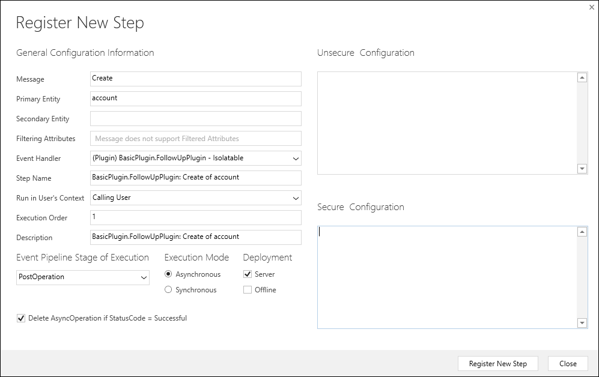

# Event framework

[!INCLUDE[cc-terminology](includes/cc-terminology.md)]

The capability to extend the default behavior of Microsoft Dataverse depends on detecting when events occur on the server. The *Event Framework* provides the capability to register custom code to be run in response to specific events.

All capabilities to extend the default behavior of the platform depend on the event framework. When you configure a workflow to respond to an event using the workflow designer without writing code, that event is provided by the event framework.

As a developer, you will use the *Plug-in Registration tool* to configure plug-ins, Azure integrations, virtual table data providers, and Webhooks to respond to events that are provided by the event framework. When events occur and an extension is registered to respond to them, contextual information about the data involved in the operation is passed to the extension. Depending on how the registration for the event is configured, the extension can modify the data passed into it, initiate some automated process to be applied immediately, or define that an action is added to a queue to be performed later.

To leverage the event framework for your custom extensions you must understand:

 - What events are available
 - How the event is processed
 - What kind of data is available to your custom extension when the event occurs
 - What time and resource constraints apply
 - How to monitor performance

## Available events

As described in [Use messages with the Organization service](org-service/use-messages.md), data operations in the Dataverse platform are based on messages and every message has a name. There are `Create`, `Retrieve`, `RetrieveMultiple`, `Update`, `Delete`, `Associate` and `Disassociate` messages that cover the basic data operations that happen with tables. There are also specialized messages for more complex operations, and custom actions add new messages.

When you use the Plug-in Registration tool to associate an extension with a particular message, you will register it as a *step*. The screenshot below is the **Register New Step** dialog used when registering a plug-in.



A step provides the information about which message the extensions should respond to as well as a number of other configuration choices. Use the **Message** field to choose the message your extension will respond to.

Generally, you can expect to find a message for most of the **Request* classes in the <xref:Microsoft.Crm.Sdk.Messages> or <xref:Microsoft.Xrm.Sdk.Messages> namespaces, but you will also find messages for any custom actions that have been created in the organization. Any operations involving table definitions are not available.

Data about messages is stored in the [SdkMessage](reference/entities/sdkmessage.md) and [SdkMessageFilter](reference/entities/sdkmessagefilter.md) tables. The Plug-in registration tool will filter this information to only show valid messages.

To verify if a message and table combination supports execution of plug-ins using a database query, you can use the following Web API query:

```
[Organization URI]/api/data/v9.1/sdkmessages?$select=name
&$filter=isprivate eq false 
and (name ne 'SetStateDynamicEntity' 
and name ne 'RemoveRelated' 
and name ne 'SetRelated' and 
name ne 'Execute') 
and sdkmessageid_sdkmessagefilter/any(s:s/iscustomprocessingstepallowed eq true 
and s/isvisible eq true)
&$expand=sdkmessageid_sdkmessagefilter($select=primaryobjecttypecode;
$filter=iscustomprocessingstepallowed eq true and isvisible eq true)
&$orderby=name
```

> [!TIP]
> You can export this data to an Excel worksheet using this query and the instructions provided in this blog post: [Find Messages and tables eligible for plug-ins using the Dataverse](https://powerapps.microsoft.com/blog/find-messages-and-entities-eligible-for-plug-ins-using-the-data-platform/)


You can also use the following FetchXML to retrieve this information. The [FetchXML Builder](https://fxb.xrmtoolbox.com) is a useful tool to execute this kind of query.

```xml
<fetch>
  <entity name='sdkmessage' >
    <attribute name='name' />
    <link-entity name='sdkmessagefilter' alias='filter' to='sdkmessageid' from='sdkmessageid' link-type='inner' >
      <filter type='and' >
        <condition attribute='iscustomprocessingstepallowed' operator='eq' value='1' />
        <condition attribute='isvisible' operator='eq' value='1' />
      </filter>
      <attribute name='primaryobjecttypecode' />
    </link-entity>
    <filter>
      <condition attribute='isprivate' operator='eq' value='0' />
      <condition attribute='name' operator='not-in' >
        <value>SetStateDynamicEntity</value>
        <value>RemoveRelated</value>
        <value>SetRelated</value>
	      <value>Execute</value>
      </condition>
    </filter>
    <order attribute='name' />
  </entity>
</fetch>
```

> [!CAUTION]
> The `Execute` message is available, but you should not register extensions for it since it is called by every operation.

> [!NOTE]
> There are certain cases where plug-ins and workflows that are registered for the Update event can be called twice. More information: [Behavior of specialized update operations](special-update-operation-behavior.md)

## Event execution pipeline

When you register a step using the Plug-in Registration tool you must also choose the **Event Pipeline Stage of Execution**.  Each message is processed in a series of 4 stages as described in the following table:

|Name|Description|
|--|--|
|**PreValidation**|[!INCLUDE [cc-prevalidation-description](../../includes/cc-prevalidation-description.md)]|
|**PreOperation**|[!INCLUDE [cc-preoperation-description](../../includes/cc-preoperation-description.md)]|
|**MainOperation**|[!INCLUDE [cc-mainoperation-description](../../includes/cc-mainoperation-description.md)]|
|**PostOperation**|[!INCLUDE [cc-postoperation-description](../../includes/cc-postoperation-description.md)]|


The stage you should choose depends on the purpose of the extension. You don't need to apply all your business logic within a single step. You can apply multiple steps so that your logic about whether to allow a operation to proceed can be in the **PreValidation** stage and your logic to make modifications to the message properties can occur in the **PostOperation** stage.

> [!IMPORTANT]
> An exception thrown by your code at any synchronous stage within the database transaction will cause the entire transaction to be rolled back. You should be careful to ensure that any possible exception cases are handled by your code. If you want to cancel the operation, you should detect this in the **PreValidation** stage and only throw a <xref:Microsoft.Xrm.Sdk.InvalidPluginExecutionException> containing an appropriate message describing why the operation was cancelled.

Multiple extensions can be registered for the same message and stage. Within the step registration the **Execution Order** value determines the order in which multiple extensions should be processed for a given stage.

Information about registered steps is stored in the [SdkMessageProcessingStep table](reference/entities/sdkmessageprocessingstep.md).

### Asynchronous plug-in steps

When registering for the **PostOperation** stage, you have the option to register the step to run in **Asynchronous Execution Mode**. These plug-ins will run after the record operation is completed.

This is often required when working with records that are associated with the current record but created in a different process. For example, `UserSettings` related to a specific a `SystemUser` won't be created until the `SystemUser` row is created.

More information: [Asynchronous service](asynchronous-service.md)


## Event context

If your extension is a plug-in, it will receive a parameter that implements the <xref:Microsoft.Xrm.Sdk.IPluginExecutionContext> interface. This class provides some information about the <xref:Microsoft.Xrm.Sdk.IPluginExecutionContext.Stage> that the plug-in is registered for as well as information about the <xref:Microsoft.Xrm.Sdk.IPluginExecutionContext.ParentContext>, which provides information about any operation within another plug-in that triggered the current operation.

If your extension is an an Azure Service bus endpoint, Azure EventHub topic, or a Web hook, the data that will be posted to the registered endpoint will be in form of a <xref:Microsoft.Xrm.Sdk.RemoteExecutionContext> which implements both <xref:Microsoft.Xrm.Sdk.IPluginExecutionContext> and <xref:Microsoft.Xrm.Sdk.IExecutionContext>

For more information about the execution context, read [Understand the execution context](understand-the-data-context.md).


[!INCLUDE[footer-include](../../includes/footer-banner.md)]