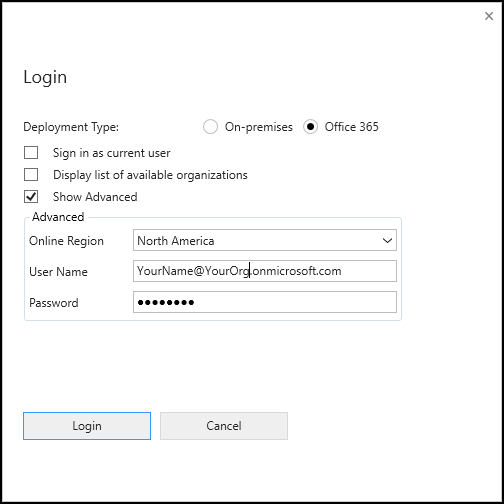
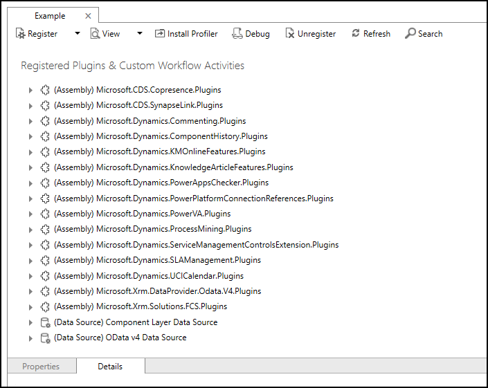

### Connect using the Plug-in Registration tool

1. After you have downloaded the Plug-in registration tool, click the `PluginRegistration.exe` to open it.
1. Click **Create new Connection** to connect to your instance.
1. Make sure **Office 365** is selected. If you are connecting using a Microsoft account other than one you are currently using, click **Show Advanced**.

    

1. Enter your credentials and click **Login**.
1. If your Microsoft Account provides access to multiple environments, you will need to choose an environment.
1. After you are connected, you will see any existing registered plug-ins & custom workflow activities

    
