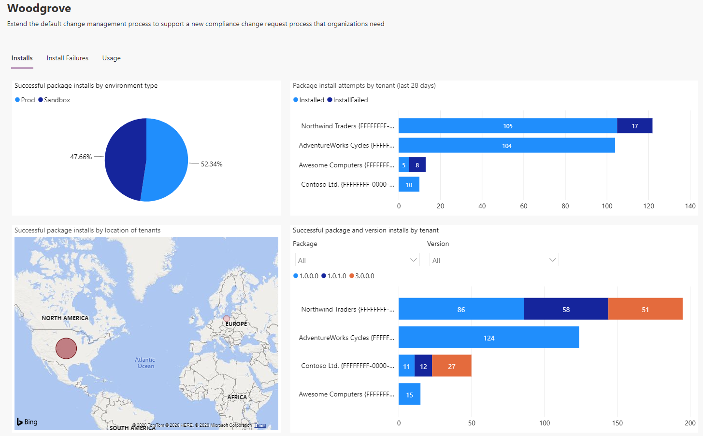
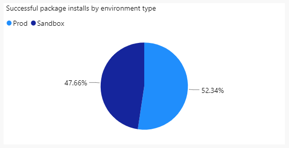
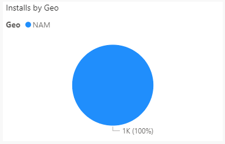
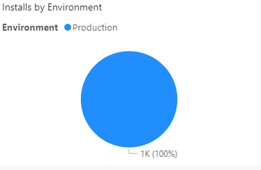
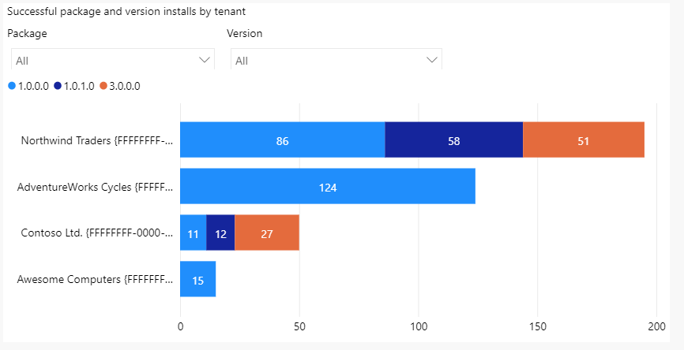

# The App page

After the user selects an app, the user is navigated to the app's detail page, which provides a view to analyze the install history across tenants for that particular app. The app description is from [AppSource](https://appsource.microsoft.com/).

[!INCLUDE[cc-terminology](includes/cc-terminology.md)]

> [!div class="mx-imgBorder"]
> 

The app detail page contains the following graphs and metrics.

## Installs by date

The line chart shown below illustrates the number of app installations occurred by date. 

When hovering over the graph, the following information is shown:

Install Count: Number of app installations happened on a particular date.

> [!div class="mx-imgBorder"]
> 

## Installs by geo

The pie chart shown below illustrates the number of app installations occurred by Geo.

When hovering over the graph, the following information is shown:

1. Geo
2. Install Count

> [!div class="mx-imgBorder"]
> 

## Installs by environment

The pie chart shown below illustrates the ratio of production vs. sandbox app installs across the install base.

When hovering over the graph, the following information is shown:

1. Environment
2. Install Count

> [!div class="mx-imgBorder"]
> 

## Installs by tenant

The column chart shown below displays the package unique names where versions of the selected app are displayed. All packages are selected by default, and all installed versions of all package (by tenant) are displayed on the graph. The user can select one or more packages and versions for further slicing and dicing. When the user selects a package, the version drop-down is updated to have the corresponding version of the selected package.

When hovering over any item of the graph, the following information is shown:

1. Tenant 
1. Count
1. Package 
1. Version 
1. Environment

> [!div class="mx-imgBorder"]
> 

## Filtering the app page

ISVs can filter the app page using the filters available. For example, an ISV can filter to see the metrics at Package & Solution version, Geo, and Date range level.

### See also

[Introduction to ISV Studio for the Power Platform](isv-app-management.md)  
[Home page](isv-app-management-homepage.md) 
[Tenant page](isv-app-management-tenantpage.md) 
[AppSource checker](isv-app-management-appsource-checker.md) 
[Connector Certification](isv-app-management-certification.md)

[!INCLUDE[footer-include](../../includes/footer-banner.md)]