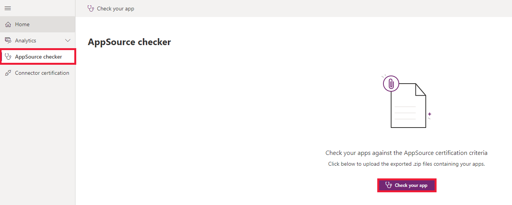
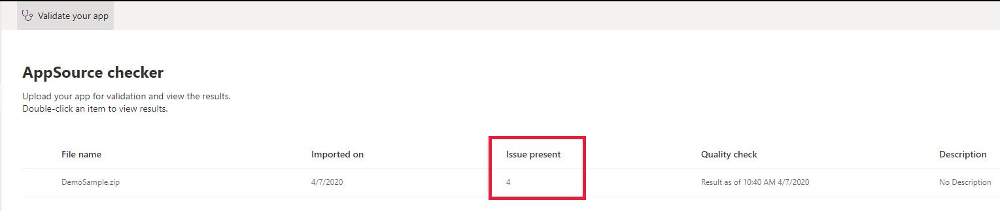
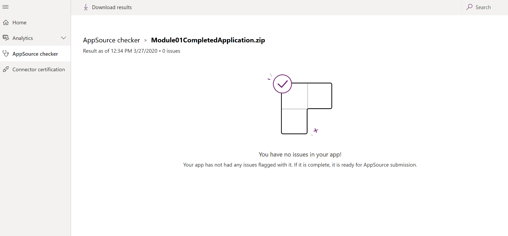

# AppSource checker

[!INCLUDE [cc-beta-prerelease-disclaimer](../../includes/cc-beta-prerelease-disclaimer.md)]

You can use the AppSource checker to verify whether your app has met certification criteria before you submit it to [AppSource](https://appsource.microsoft.com/). The checker lets you know whether your solution file has errors that need to be corrected and verifies whether AppSource certification criteria have been met. 

In ISV Studio, you can upload either a full [package](/power-platform/alm/package-deployer-tool) or solution(s). You'll be notified whether any issues need to be remediated.

[!INCLUDE[cc-terminology](includes/cc-terminology.md)]

**To run AppSource checker**

1. In ISV Studio, select **AppSource checker** in the leftmost pane, and then select **Validate your app**.

    > [!div class="mx-imgBorder"]
    > 

2. Select **Browse** to upload a solution file from your local machine, and then select **Run Check**.
   
   > [!div class="mx-imgBorder"]
   > 
 
   > [!NOTE]
   > If you've previously uploaded a solution for validation, you'll see a history of submissions instead of the screenshot above.

3. After the validation check is complete, a summary of results is displayed with the number of issues found (if any). Double-click to select the solution file to see the issues in detail.

   > [!div class="mx-imgBorder"]
   > 

4. If the submission has no errors, you'll see the following message:
 
   > [!div class="mx-imgBorder"]
   > 
   
Now you can download the validation report for your app and include it with your AppSource submission. 

### See also

[Home page](isv-app-management-homepage.md) 
[App page](isv-app-management-apppage.md) 
[Tenant page](isv-app-management-tenantpage.md) 
[Connector certification](isv-app-management-certification.md)

[!INCLUDE[footer-include](../../includes/footer-banner.md)]