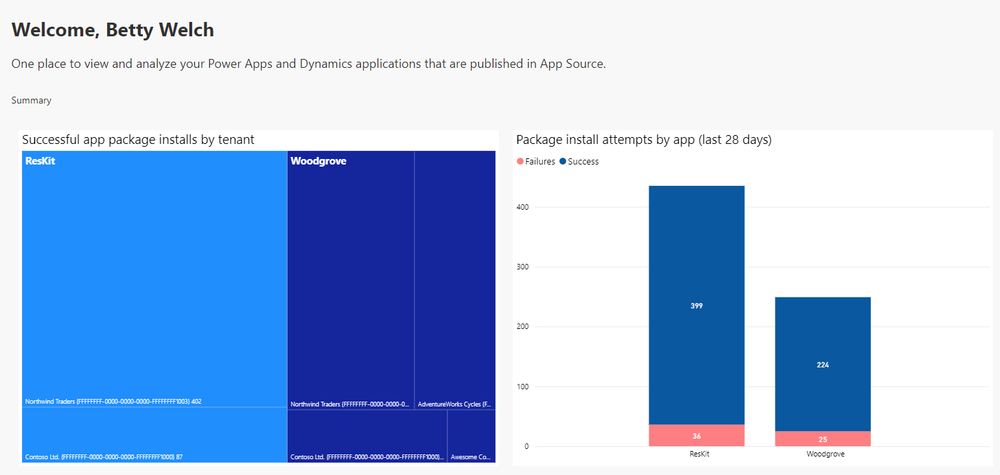
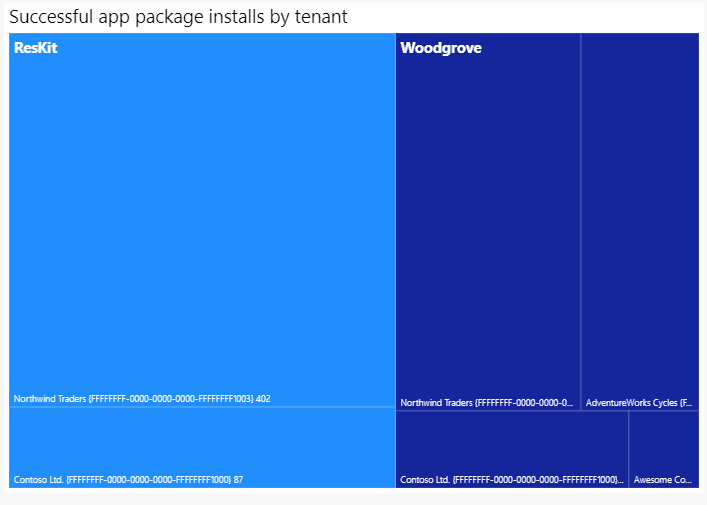
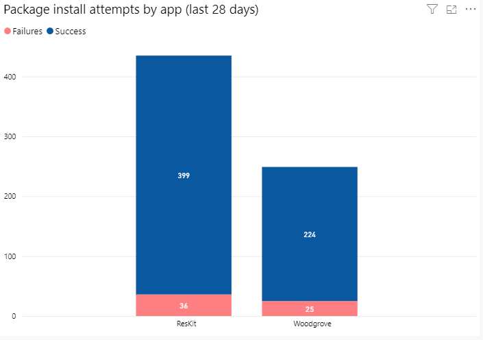
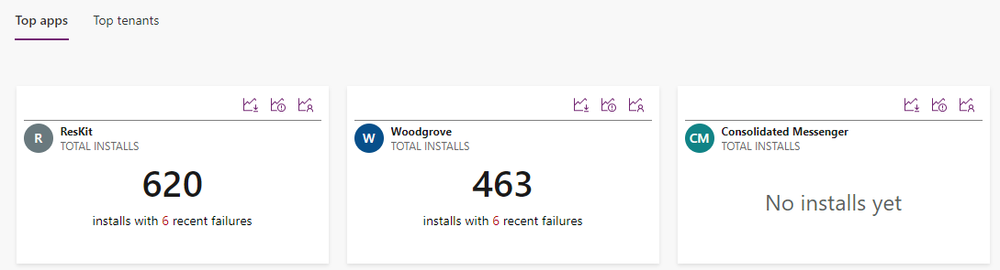

# The Home page

[!INCLUDE [cc-beta-prerelease-disclaimer](../../includes/cc-beta-prerelease-disclaimer.md)]

After a user logs into the ISV Studio, they are presented with the landing page known as the *Home* page. A welcome message is displayed which defines the objective of this page.

[!INCLUDE[cc-terminology](includes/cc-terminology.md)]

If a user is associated with multiple publishers, all publishers are displayed and the first publisher is selected by default. All the metrics on this page are specific to the selected publisher. The user can toggle to a different publisher name to see the corresponding metrics for that publisher.

The Home page summary section contains the following graphs and metrics.

## Successful app package installs by tenant

The first graph visualizes the published apps and the tenants that the app's packages are installed into, and they are displayed in descending order based on the number of package installs.

When hovering over a tenant tile in the graph, the following information is shown:

1. App Name
2. Tenant Name and Tenant ID
3. Number of package installs of the app in the tenant

## Package install attempts by app (last 28 days)

This bar chart visualizes published apps and the number of successful vs. failed installations across all production environments over the last 28 days.

When hovering over an app in the graph, the following information is shown:

1. App Name
2. Status of package installation (Success vs Failures)
3. Count of package install attempts

## Additional insights

Below the summary section the user can access additional insights and can choose to further drill down into their install history through the lens of Certified Apps or Tenants.

**Top Certified Apps** and **Top Tenants** are visible on the page by default. The user can also select **See all** to show all the apps.

The App names and icons are from AppSource.

### See also

[Introduction to ISV Studio for the Power Platform](isv-app-management.md)  
[App page](isv-app-management-apppage.md)   
[Tenant page](isv-app-management-tenantpage.md)  
[AppSource checker](isv-app-management-appsource-checker.md)  
[Connector Certification](isv-app-management-certification.md)

[!INCLUDE[footer-include](../../includes/footer-banner.md)]