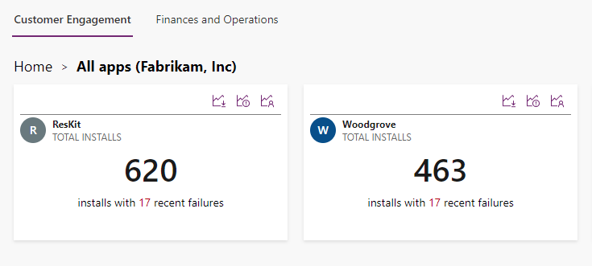
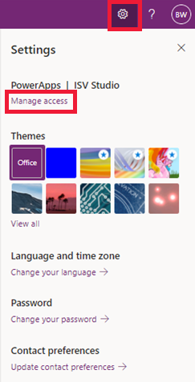
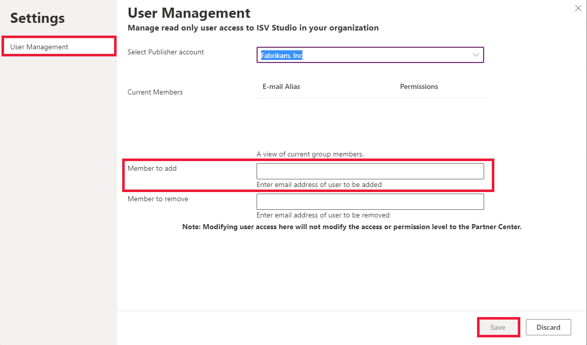

# Microsoft Power Platform ISV Studio

[!INCLUDE [cc-beta-prerelease-disclaimer](../../includes/cc-beta-prerelease-disclaimer.md)]

ISV Studio is designed to become the go-to Power Platform destination for Independent Software Vendors (ISV) to monitor and manage their applications. ISV Studio provides a consolidated cross tenant view of all the applications an ISV is distributing to customers.

> [!div class="mx-imgBorder"]
> 

[!INCLUDE[cc-terminology](includes/cc-terminology.md)]

> [!IMPORTANT]
>
> - ISV Studio is a preview feature.
> - [!INCLUDE[cc_preview_features_definition](../../includes/cc-preview-features-definition.md)]

ISV Studio supports applications built on the Microsoft Dataverse that are published to and deployed through [AppSource](https://appsource.microsoft.com/). No telemetry will be provided on side loaded solutions not deployed through AppSource.

The applications currently available on the Dataverse includes Power Apps and Dynamics 365 for Sales, Marketing, Service, and Talent. ISV Studio now provides telemetry features in Dynamics 365 Finance and Operations.

When end user installs an application from AppSource, a consent dialog will be displayed requesting the user to acknowledge that contact, usage, and transactional information may be shared with the application provider. This information is used by the provider to support billing and other transactional activities and to enable telemetry in ISV Studio for the ISV to learn from and act on.

A customer can request that data not be shared with the provider, in which case Microsoft will remove all data from that particular tenant within ISV Studio.

To access the public preview of ISV Studio, navigate your browser to [https://aka.ms/ISVStudio](https://aka.ms/ISVStudio/).

## Pre-requisites for Microsoft Dataverse

The ISV must be associated with a Microsoft registered Partner organization [ISV] that has one or more supported apps published in [AppSource](https://appsource.microsoft.com/). Supported apps include model-driven apps created using Power Apps and Dynamics 365 apps such as Dynamics 365 Sales and Dynamics 365 Customer Service.

## Pre-requisites for Dynamics 365 Finance and Operations

- For Dynamics 365 Finance and Operations, update the `SolutionID` in the descriptors with the `ProductId` of their offer in Partner Center. The `ProductId` of their offer can be found in the URL in Partner Center.
- Ask customers to install the latest solution with the above. They need to be on version `10.0.16` or above to see the telemetry feature in ISV Studio. More information: [ISV Studio solutions](/dynamics365/fin-ops-core/dev-itpro/dev-tools/isv-studio-solutions)

### Admin access to ISV Studio

To be an admin in ISV Studio,  your Azure Active Directory account must be configured as an app owner in Partner Center for their publisher account. Once you get the admin access, you'll be able to give more users access to ISV Studio from the studio directly.  

### Grant read access to users

If you want more users within your tenant/organization to get,  read-only access to ISV Studio, you must have [admin access](#admin-access-to-isv-studio). Once you are an admin for your publisher account, follow these steps below to give more users read-only access: 

1. In ISV Studio, select **Settings** gear icon on the top right. Select **Manage access**.

   > [!div class="mx-imgBorder"]
   > 

1. Search for a **Publisher account** in the organization. Select a user within your organization to give access. Select **Save**.

   > [!div class="mx-imgBorder"]
   > 

   > [!NOTE]
   > You can only search and add users within your tenant/organization.

1. After giving access to the user, a confirmation email is sent to the user with access details.  

### Remove read access to users

You can follow the same steps to remove read-only access from a user to ISV Studio in the same window.

<!--If you do not have permissions to give additional users access to ISV Studio. Please visit our documentation to learn more about user access.  
If you want additional users to get access to ISV Studio, they can be added as app contributors in Partner Center.  Instructions can be found at
[Managing users on cloud partner portal](/azure/marketplace/cloud-partner-portal-orig/cloud-partner-portal-manage-users).-->

Continue reading the [App](isv-app-management-apppage.md) and [Tenant](isv-app-management-tenantpage.md) page articles listed below to learn about the capabilities of ISV Studio.

### How to provide feedback

Please send an email to [ISVFeedback@microsoft.com](mailto:ISVFeedback@microsoft.com) with any feedback or questions. Your feedback is important for us to shape the experiences moving forward.

## In this Section

[Home page](isv-app-management-homepage.md)  
[App page](isv-app-management-apppage.md)  
[Tenant page](isv-app-management-tenantpage.md) 
[AppSource checker](isv-app-management-appsource-checker.md) 
[Connector Certification](isv-app-management-certification.md)

### See also

[Introduction to solutions](introduction-solutions.md)  
[Publish your app on AppSource](publish-app-appsource.md)

[!INCLUDE[footer-include](../../includes/footer-banner.md)]
